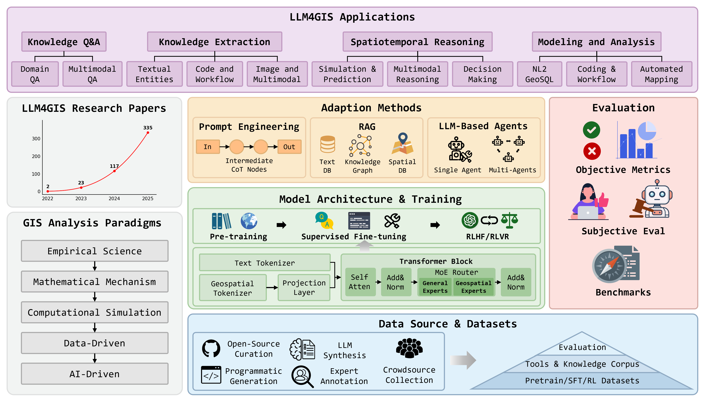
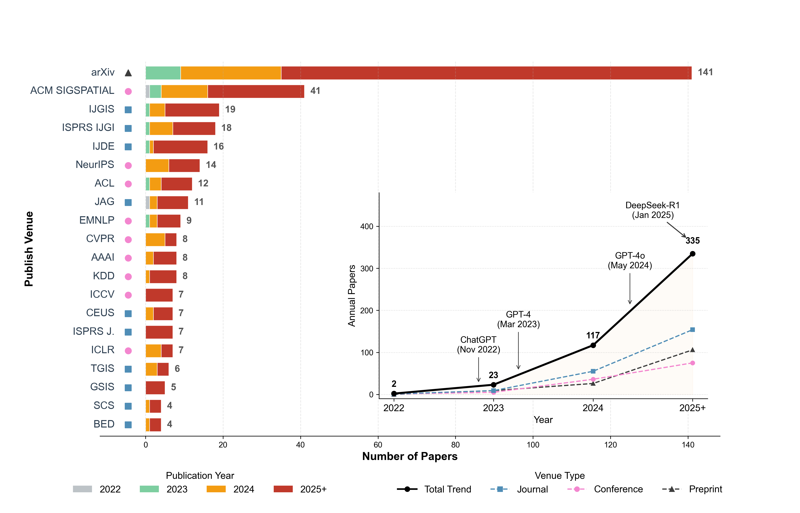
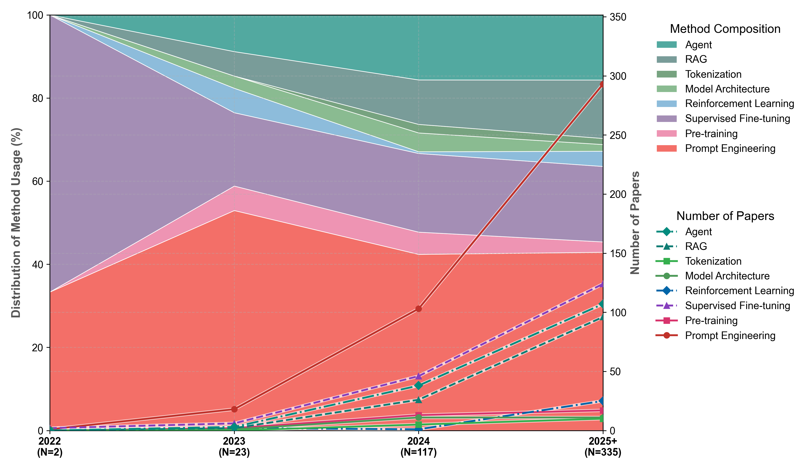
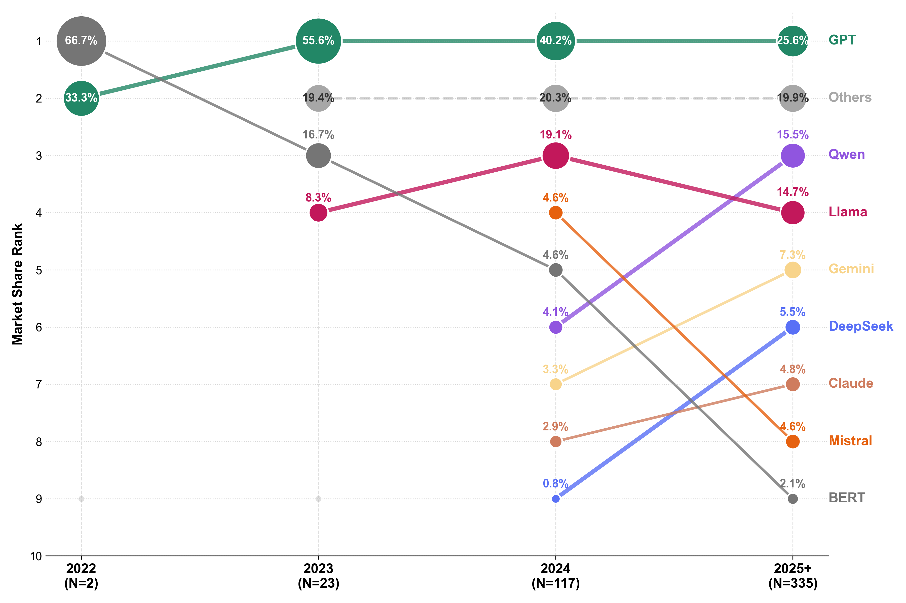
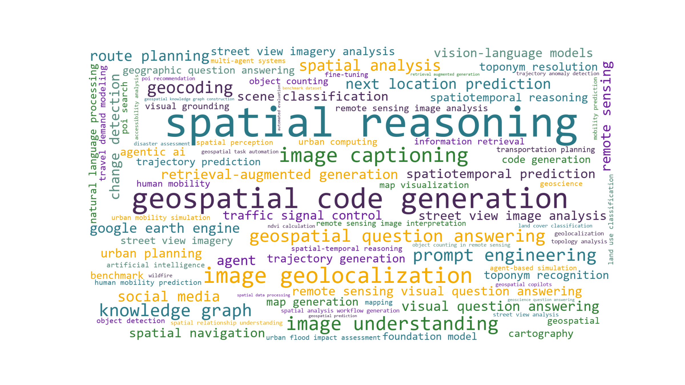

<div align="center">

# LLM4GIS: methods, applications, and prospects

<!-- 徽章区域 -->
[](https://github.com/YourUsername/Awesome-LLM4GIS) 
[](https://doi.org/10.11947/j.AGCS.2025.20240468.)
[](https://github.com/YourUsername/Awesome-LLM4GIS/commits/main)

</div>

> We welcome everyone to open an issue for any related work we haven’t discussed, and we’ll try to address it in the next release!

<div align="center">

</div>

## 🎉 News
- **[2026-03-18]** 🔥 This Awesome LLM4GIS page is released! Our new survey paper is coming soon!
- **[2025-03-25]** 🔥 Our survey paper is accepted by Acta Geodaeticaet Cartographica Sinica!

## 📖 Contents

- [📊 Bibliometric Analysis](#-bibliometric-analysis)
- [🧩 Selected Papers](#-selected-papers-by-taxonomy)
- [🗂️ Full Paper List](#%EF%B8%8F-full-paper-list-all-477-papers)
- [🎈 Citation](#-citation)

## 🎈 Citation

If you find this surbey or repository helpful, please cite it as follows:

```bibtex
@article{Wu2025LLMGIS,
  author  = {Wu, Huayi and Shen, Zhangxiao and Hou, Shuyang and others},
  title   = {Large Language Model-Driven GIS Analysis: Methods, Applications, and Prospects},
  journal = {Acta Geodaetica et Cartographica Sinica},
  year    = {2025},
  volume  = {54},
  number  = {4},
  pages   = {621--635},
  doi     = {10.11947/j.AGCS.2025.20240468}
}
```

## 📊 Bibliometric Analysis

In our survey (Section 2.3), we conducted a quantitative analysis of 477 papers. The key findings are summarized in the figures below.

<div align="center">
<br>
Number of Papers and Top-20 Publish Venues<br>
<br>
Distribution of Method Usage in LLM4GIS Research<br>
<br>
Rank and Distribution of Base LLM Selection<br>
<br>
Word Cloud of Keywords in LLM4GIS Research Papers<br>
</div>

## 🧩 Taxonomy and Selected Papers

- 1. Introduction
- 2. LLM4GIS
- 3. LLM Architecture and Training
  - 3.1 Model Architecture
  - 3.2 Tokenization
  - 3.3 Pretraining
  - 3.4 Supervised Fine-tuning
  - 3.5 Reinforcement Learning
- 4. LLM Adaption
  - 4.1 Prompt Engineering
  - 4.2 Retrieval Augmented Generation
  - 4.3 LLM-based Agents
- 5. Datasets
  - 5.1 Dataset Construction
  - 5.2 Dataset Types
- 6. Evaluation Methods
  - 6.1 Objective Evaluation
  - 6.2 Subjective Evaluation
  - 6.3 Benchmarks
- 7. Applications
  - 7.1 Knowledge Q&A
  - 7.2 Knowledge Extraction
  - 7.3 Spatiotemporal Reasoning
  - 7.4 Analysis and Modeling
- 8. Challenges and Prospects
- 9. Conclusion

Only representative papers discussed in the survey are listed here:
<!-- AUTOMATED_TAXONOMY_START -->

#### 3.1 Model Architecture

|  Year  | Title                                                        |    Venue     |   Code   |
| :----: | :----------------------------------------------------------- | :----------: | :------: |
|  2025  | **[RSGPT: A Remote Sensing Vision Language Model and Benchmark](https://doi.org/10.1016/j.isprsjprs.2025.03.028)** |    ISPRS     | [](https://github.com/Lavender105/RSGPT) |
|  2025  | **[SkyMoE: A Vision-Language Foundation Model for Enhancing Geospatial Interpretation with Mixture of Experts](https://arxiv.org/abs/2512.02517)** |    arxiv     |          |
|  2025  | **[TourismMinds: A Geo-augmented LLM Framework for Semantic-aware Trajectory Analytics and Generation](https://doi.org/10.1145/3770697)** | Proceedings of the ACM on Interactive, Mobile, Wearable and Ubiquitous Technologies |          |
|  2025  | **[GeoProspect: A domain-specific geological large language model with enhanced continual learning](https://doi.org/10.2139/ssrn.5242692)** | Neurocomputing |          |
|  2024  | **[EarthGPT: A Universal Multimodal Large Language Model for Multisensor Image Comprehension in Remote Sensing Domain](https://doi.org/10.1109/tgrs.2024.3409624)** |     TGRS     | [](https://github.com/wivizhang/EarthGPT) |
|  2024  | **[LHRS-Bot: Empowering Remote Sensing with VGI-Enhanced Large Multimodal Language Model](https://doi.org/10.1007/978-3-031-72904-1_26)** |     ECCV     | [](https://github.com/NJU-LHRS/LHRS-Bot) |
|  2024  | **[DriveGPT4: Interpretable End-to-End Autonomous Driving Via Large Language Model](https://doi.org/10.1109/lra.2024.3440097)** | IEEE Robotics and Automation Letters |          |

#### 3.2 Tokenization

|  Year  | Title                                                        |    Venue     |   Code   |
| :----: | :----------------------------------------------------------- | :----------: | :------: |
|  2026  | **[LLM-Aligned Geographic Item Tokenization for Local-Life Recommendation](http://arxiv.org/abs/2511.14221v1)** |     AAAI     | [](https://github.com/JiangHaoPG11/LGSID) |
|  2025  | **[JiuZhou:  open foundation language models and effective pre-training framework for geoscience](https://doi.org/10.1080/17538947.2025.2449708)** |     IJDE     | [](https://github.com/THU-ESIS/JiuZhou) |
|  2025  | **[SPOK: tokenizing geographic space for enhanced spatial reasoning in GeoAI](https://doi.org/10.1080/13658816.2025.2497810)** |    IJGIS     | [](https://doi.org/10.6084/m9.figshare.27968085) |
|  2025  | **[Enhancing Large Language Models for Mobility Analytics with Semantic Location Tokenization](https://doi.org/10.1145/3711896.3736937)** |     KDD      | [](https://github.com/shadowfall09/QT-Mob) |
|  2025  | **[LandGPT: a multimodal large language model for parcel-level land use classification with multi-source data](https://doi.org/10.1080/13658816.2025.2506533)** |    IJGIS     | [](https://doi.org/10.6084/m9.figshare.28143191) |
|  2025  | **[EarthMind: Leveraging Cross-Sensor Data for Advanced Earth Observation Interpretation with a Unified Multimodal LLM](https://arxiv.org/abs/2506.01667)** |    arxiv     | [](https://github.com/shuyansy/EarthMind) |
|  2025  | **[SafeTraffic Copilot: adapting large language models for trustworthy traffic safety assessments and decision interventions](https://doi.org/10.1038/s41467-025-64574-w)** | Nature Communications |          |
|  2025  | **[TourismMinds: A Geo-augmented LLM Framework for Semantic-aware Trajectory Analytics and Generation](https://doi.org/10.1145/3770697)** | Proceedings of the ACM on Interactive, Mobile, Wearable and Ubiquitous Technologies |          |
|  2025  | **[Traj-MLLM Can Multimodal Large Language Models Reform Trajectory Data Mining?](http://arxiv.org/abs/2509.00053v1)** |    arxiv     |          |
|  2025  | **[GeoLLaVA-8K: Scaling Remote-Sensing Multimodal Large Language Models to 8K Resolution](http://arxiv.org/abs/2505.21375v2)** |   NeurIPS    |          |
|  2024  | **[K2: A Foundation Language Model for Geoscience Knowledge Understanding and Utilization](https://doi.org/10.1145/3616855.3635772)** |     WSDM     | [](https://github.com/davendw49/k2) |
|  2024  | **[PreparedLLM: effective pre-pretraining framework fordomain-specific large language models](https://doi.org/10.1080/20964471.2024.2396159)** |     BED      | [](https://github.com/THU-ESIS/Chinese-Mistral) |

#### 3.3 Pretraining

|  Year  | Title                                                        |    Venue     |   Code   |
| :----: | :----------------------------------------------------------- | :----------: | :------: |
|  2025  | **[GeoCode-GPT: A large language model for geospatial code generation](https://doi.org/10.1016/j.jag.2025.104456)** |     JAG      | [](https://github.com/whuhsy/GeoCode-GPT) |
|  2025  | **[LHRS-Bot-Nova: Improved multimodal large language model for remote sensing vision-language interpretation](https://doi.org/10.1016/j.isprsjprs.2025.06.003)** |    ISPRS     | [](https://github.com/NJU-LHRS/LHRS-Bot) |
|  2025  | **[EarthMind: Leveraging Cross-Sensor Data for Advanced Earth Observation Interpretation with a Unified Multimodal LLM](https://arxiv.org/abs/2506.01667)** |    arxiv     | [](https://github.com/shuyansy/EarthMind) |
|  2024  | **[K2: A Foundation Language Model for Geoscience Knowledge Understanding and Utilization](https://doi.org/10.1145/3616855.3635772)** |     WSDM     | [](https://github.com/davendw49/k2) |
|  2024  | **[ClimateGPT: Towards AI Synthesizing Interdisciplinary Research on Climate Change](https://doi.org/10.48550/arXiv.2401.09646)** |    arxiv     | [](https://github.com/eci-io/climategpt-evaluation) |
|  2024  | **[OceanGPT: A Large Language Model for Ocean Science Tasks](https://doi.org/10.18653/v1/2024.acl-long.184)** |     ACL      |          |
|  2024  | **[PlanGPT: Enhancing Urban Planning with Tailored Language Model and Efficient Retrieval](http://arxiv.org/abs/2402.19273v1)** |    arxiv     |          |
|  2023  | **[Urban Generative Intelligence (UGI): A Foundational Platform for Agents in Embodied City Environment](https://arxiv.org/abs/2312.11813)** |    arxiv     | [](https://github.com/tsinghua-fib-lab/UGI) |

#### 3.4 Supervised Fine-tuning

|  Year  | Title                                                        |    Venue     |   Code   |
| :----: | :----------------------------------------------------------- | :----------: | :------: |
|  2025  | **[GeoCode-GPT: A large language model for geospatial code generation](https://doi.org/10.1016/j.jag.2025.104456)** |     JAG      | [](https://github.com/whuhsy/GeoCode-GPT) |
|  2025  | **[CityGPT: Empowering Urban Spatial Cognition of Large Language Models](https://doi.org/10.1145/3711896.3736878)** |     KDD      | [](https://github.com/tsinghua-fib-lab/CityGPT) |
|  2025  | **[GeoTool-GPT: a trainable method for facilitating Large Language Models to master GIS tools](https://doi.org/10.1080/13658816.2024.2438937)** |    IJGIS     | [](https://doi.org/10.6084/m9.figshare.25486414) |
|  2025  | **[GRE Suite: Geo-localization Inference via Fine-Tuned Vision-Language Models and Enhanced Reasoning Chains](http://arxiv.org/abs/2505.18700v4)** |   NeurIPS    | [](https://github.com/Thorin215/GRE) |
|  2025  | **[GLoRA: A Novel Parameter-Efficient Fine-Tuning Framework for GIS Large Language Models](https://doi.org/10.1080/13658816.2025.2591830)** |    IJGIS     | [](https://doi.org/10.6084/m9.figshare.28208660) |
|  2025  | **[USTBench: Benchmarking and Dissecting Spatiotemporal Reasoning Capabilities of LLMs as Urban Agents](http://arxiv.org/abs/2505.17572v1)** |    arxiv     | [](https://github.com/usail-hkust/USTBench) |
|  2025  | **[RadarQA: Multi-modal Quality Analysis of Weather Radar Forecasts](http://arxiv.org/abs/2508.12291v1)** |   NeurIPS    | [](https://github.com/hexmSeeU/RadarQA) |
|  2025  | **[LLMLight: Large Language Models as Traffic Signal Control Agents](https://doi.org/10.1145/3690624.3709379)** |     KDD      | [](https://doi.org/10.5281/zenodo.14619359) |
|  2025  | **[A Study on Individual Spatiotemporal Activity Generation Method Using MCP-Enhanced Chain-of-Thought Large Language Models](http://arxiv.org/abs/2506.10853v1)** |    arxiv     | [](https://github.com/ZYY799/spatiotemporal-activity-generation-mcp-cot) |
|  2025  | **[Towards Faithful Reasoning in Remote Sensing: A Perceptually-Grounded GeoSpatial Chain-of-Thought for Vision-Language Models](https://arxiv.org/abs/2509.22221)** |    arxiv     | [](https://github.com/minglangL/RSThinker) |
|  2025  | **[Open-Set Living Need Prediction with Large Language Models](https://doi.org/10.18653/v1/2025.findings-acl.285)** |     ACL      | [](https://github.com/tsinghua-fib-lab/PIGEON) |
|  2025  | **[Drive-R1: Bridging Reasoning and Planning in VLMs for Autonomous Driving with Reinforcement Learning](http://arxiv.org/abs/2506.18234v1)** |    arxiv     |          |
|  2025  | **[DeepTravel: An End-to-End Agentic Reinforcement Learning Framework for Autonomous Travel Planning Agents](http://arxiv.org/abs/2509.21842v1)** |    arxiv     |          |
|  2025  | **[Entropy-Constrained Strategy Optimization in Urban Floods: A Multi-Agent Framework with LLM and Knowledge Graph Integration](https://arxiv.org/abs/2508.14654)** |    arxiv     |          |
|  2025  | **[AMAP Agentic Planning Technical Report](https://arxiv.org/abs/2512.24957)** |    arxiv     |          |
|  2024  | **[GeoAgent: To Empower LLMs using Geospatial Tools for Address Standardization](https://doi.org/10.18653/v1/2024.findings-acl.362)** |     ACL      | [](https://github.com/chenghuahuang/GeoAgent) |

#### 3.5 Reinforcement Learning

|  Year  | Title                                                        |    Venue     |   Code   |
| :----: | :----------------------------------------------------------- | :----------: | :------: |
|  2026  | **[LLM-Aligned Geographic Item Tokenization for Local-Life Recommendation](http://arxiv.org/abs/2511.14221v1)** |     AAAI     | [](https://github.com/JiangHaoPG11/LGSID) |
|  2025  | **[GRE Suite: Geo-localization Inference via Fine-Tuned Vision-Language Models and Enhanced Reasoning Chains](http://arxiv.org/abs/2505.18700v4)** |   NeurIPS    | [](https://github.com/Thorin215/GRE) |
|  2025  | **[RadarQA: Multi-modal Quality Analysis of Weather Radar Forecasts](http://arxiv.org/abs/2508.12291v1)** |   NeurIPS    | [](https://github.com/hexmSeeU/RadarQA) |
|  2025  | **[Geo-R1: Unlocking VLM Geospatial Reasoning with Cross-View Reinforcement Learning](http://arxiv.org/abs/2510.00072v1)** |    arxiv     | [](https://github.com/miniHuiHui/Geo-R1) |
|  2025  | **[AddrLLM: Address Rewriting via Large Language Model on Nationwide Logistics Data](https://doi.org/10.1145/3690624.3709425)** |     KDD      |          |
|  2025  | **[Towards Faithful Reasoning in Remote Sensing: A Perceptually-Grounded GeoSpatial Chain-of-Thought for Vision-Language Models](https://arxiv.org/abs/2509.22221)** |    arxiv     | [](https://github.com/minglangL/RSThinker) |
|  2025  | **[CityRiSE: Reasoning Urban Socio-Economic Status in Vision-Language Models via Reinforcement Learning](http://arxiv.org/abs/2510.22282v1)** |    arxiv     |          |
|  2025  | **[Traffic-R1: Reinforced LLMs Bring Human-Like Reasoning to Traffic Signal Control Systems](http://arxiv.org/abs/2508.02344v2)** |    arxiv     | [](https://huggingface.co/Season998/Traffic-R1) |
|  2025  | **[Drive-R1: Bridging Reasoning and Planning in VLMs for Autonomous Driving with Reinforcement Learning](http://arxiv.org/abs/2506.18234v1)** |    arxiv     |          |
|  2025  | **[DeepTravel: An End-to-End Agentic Reinforcement Learning Framework for Autonomous Travel Planning Agents](http://arxiv.org/abs/2509.21842v1)** |    arxiv     |          |
|  2025  | **[CAMS A CityGPT-Powered Agentic Framework for Urban Human Mobility Simulation](https://arxiv.org/abs/2506.13599)** |    arxiv     |          |
|  2025  | **[Urban-R1: Reinforced MLLMs Mitigate Geospatial Biases for Urban General Intelligence](http://arxiv.org/abs/2510.16555v1)** |    arxiv     |          |
|  2025  | **[Eyes Will Shut A Vision-Based Next GPS Location Prediction Model by Reinforcement Learning from Visual Map Feed Back](https://doi.org/10.48550/arXiv.2507.18661)** |    arxiv     | [](https://github.com/Rising0321/VLMLocPredictor) |
|  2025  | **[AMAP Agentic Planning Technical Report](https://arxiv.org/abs/2512.24957)** |    arxiv     |          |
|  2023  | **[Urban Generative Intelligence (UGI): A Foundational Platform for Agents in Embodied City Environment](https://arxiv.org/abs/2312.11813)** |    arxiv     | [](https://github.com/tsinghua-fib-lab/UGI) |

#### 4.1 Prompt Engineering

|  Year  | Title                                                        |    Venue     |   Code   |
| :----: | :----------------------------------------------------------- | :----------: | :------: |
|  2025  | **[Chain-of-Programming (CoP): Empowering Large Language Models for Geospatial Code Generation](https://doi.org/10.1080/17538947.2025.2509812)** |     IJDE     | [](https://figshare.com/s/a5f91d72fe299d8ccc31) |
|  2025  | **[Fine-grained flood disaster information extraction incorporating multiple semantic features](https://doi.org/10.1080/17538947.2024.2448221)** |     IJDE     | [](https://github.com/xixiphus/Disaster-Information-Extraction) |

#### 4.2 Retrieval Augmented Generation

|  Year  | Title                                                        |    Venue     |   Code   |
| :----: | :----------------------------------------------------------- | :----------: | :------: |
|  2025  | **[GeoGraphRAG: A graph-based retrieval-augmented generation approach for empowering large language models in automated geospatial modeling](https://doi.org/10.1016/j.jag.2025.104712)** |     JAG      |          |
|  2025  | **[Design and application of a semantic-driven geospatial modeling knowledge graph based on large language models](https://doi.org/10.1080/10095020.2025.2483884)** |     GSIS     |          |
|  2025  | **[Spatial-RAG: Spatial Retrieval Augmented Generation for Real-World Geospatial Reasoning Questions](http://arxiv.org/abs/2502.18470v5)** |    arxiv     |          |
|  2025  | **[LLMTrajQuery: an LLM-based generative approach to semantic trajectory queries](https://doi.org/10.1080/13658816.2025.2569745)** |    IJGIS     | [](https://doi.org/10.6084/m9.figshare.26501146) |
|  2025  | **[More intelligent knowledge graph: A large language model-driven method for knowledge representation in geospatial digital twins](https://doi.org/10.1016/j.jag.2025.104527)** |     JAG      |          |
|  2025  | **[From Questions to Queries: An AI-powered Multi-Agent Framework for Spatial Text-to-SQL](http://arxiv.org/abs/2510.21045v2)** |    arxiv     | [](https://github.com/alikhosravi/Spatial-Text-to-SQL) |
|  2025  | **[Open-Set Living Need Prediction with Large Language Models](https://doi.org/10.18653/v1/2025.findings-acl.285)** |     ACL      | [](https://github.com/tsinghua-fib-lab/PIGEON) |
|  2025  | **[GeoFactory: an LLM performance enhancement framework for geoscience factual and inferential tasks](https://doi.org/10.1080/20964471.2025.2506291)** |     BED      |          |
|  2025  | **[SpatialGPT: Zero-Shot Vision-and-Language Navigation via Spatial CoT over Structured Spatial Memory](https://doi.org/10.1145/3748636.3762753)** |  SIGSPATIAL  | [](https://github.com/nobodynovember/SpatialGPT) |
|  2025  | **[Enhancing geodatabases operability: advanced human-computer interaction through RAG and Multi-Agent Systems](https://doi.org/10.1080/20964471.2025.2483541)** |     BED      |          |
|  2025  | **[PlanGPT: Enhancing urban planning with a tailored agent framework](https://doi.org/10.18653/v1/2025.acl-industry.54)** |     ACL      |          |
|  2025  | **[Democratizing Multi-Granularity Spatio-Temporal Intelligence with Multi-Agent Systems](https://doi.org/10.1145/3764915.3770718)** |  SIGSPATIAL  |          |
|  2025  | **[AskNearby: An LLM-Based Application for Neighborhood Information Retrieval and Personalized Cognitive-Map Recommendations](https://doi.org/10.1145/3764912.3770813)** |  SIGSPATIAL  |          |

#### 4.3 LLM-based Agents

|  Year  | Title                                                        |    Venue     |   Code   |
| :----: | :----------------------------------------------------------- | :----------: | :------: |
|  2025  | **[GeoColab: an LLM-based multi-agent collaborative framework for geospatial code generation](https://doi.org/10.1080/17538947.2025.2569405)** |     IJDE     | [](https://figshare.com/s/caf071dffa1301727ee1) |
|  2025  | **[PEACE: Empowering Geologic Map Holistic Understanding with MLLMs](https://doi.org/10.1109/cvpr52734.2025.00369)** |     CVPR     | [](https://github.com/microsoft/PEACE) |
|  2025  | **[Planning, Living and Judging A Multi-agent LLM-based Framework for Cyclical Urban Planning](https://arxiv.org/abs/2412.20505)** |     AAAI     |          |
|  2025  | **[Swarm Intelligence in Geo-Localization: A Multi-Agent Large Vision-Language Model Collaborative Framework](https://doi.org/10.1145/3711896.3737141)** |     KDD      | [](https://github.com/Applied-Machine-Learning-Lab/smileGeo) |
|  2025  | **[CitySim: Modeling Urban Behaviors and City Dynamics with Large-Scale LLM-Driven Agent Simulation](https://doi.org/10.18653/v1/2025.emnlp-industry.15)** |    EMNLP     |          |
|  2025  | **[GeoEvolve: Automating Geospatial Model Discovery via Multi-Agent Large Language Models](http://arxiv.org/abs/2509.21593v1)** |    arxiv     |          |
|  2025  | **[CartoAgent: a multimodal large language model-powered multi-agent cartographic framework for map style transfer and evaluation](https://doi.org/10.1080/13658816.2025.2507844)** |    IJGIS     | [](https://github.com/GISense/CartoAgent) |
|  2025  | **[GeoJSON Agents: A Multi-Agent LLM Architecture for Geospatial Analysis—Function Calling vs Code Generation](https://doi.org/10.1080/20964471.2026.2615511)** |    arxiv     |          |
|  2025  | **[Enhancing geodatabases operability: advanced human-computer interaction through RAG and Multi-Agent Systems](https://doi.org/10.1080/20964471.2025.2483541)** |     BED      |          |
|  2025  | **[PlanGPT: Enhancing urban planning with a tailored agent framework](https://doi.org/10.18653/v1/2025.acl-industry.54)** |     ACL      |          |
|  2025  | **[Earth-agent: Unlocking the full landscape of earth observation with agents](https://arxiv.org/abs/2509.23141v2)** |    arxiv     | [](https://github.com/opendatalab/Earth-Agent) |
|  2025  | **[AMAP Agentic Planning Technical Report](https://arxiv.org/abs/2512.24957)** |    arxiv     |          |
|  2024  | **[MapGPT: an autonomous framework for mapping by integrating large language model and cartographic tools](https://doi.org/10.1080/15230406.2024.2404868)** | Cartography and Geographic Information Science | [](https://github.com/AGI-GIS/MapGPT) |
|  2024  | **[TrafficGPT: Viewing, processing and interacting with traffic foundation models](https://doi.org/10.1016/j.tranpol.2024.03.006)** | Transport Policy |          |
|  2024  | **[Large Language Model for Participatory Urban Planning](http://arxiv.org/abs/2402.17161v1)** |    arxiv     |          |
|  2024  | **[An LLM Agent for Automatic Geospatial Data Analysis](http://arxiv.org/abs/2410.18792v2)** |    arxiv     | [](https://github.com/Yusin2Chen/GeoAgent) |
|  2024  | **[Decoding Urban Industrial Complexity: Enhancing Knowledge-Driven Insights via IndustryScopeGPT](https://doi.org/10.1145/3664647.3681705)** |    ACM MM    | [](https://github.com/Tongji-KGLLM/IndustryScope) |

#### 5.2 Dataset Types

|  Year  | Title                                                        |    Venue     |   Code   |
| :----: | :----------------------------------------------------------- | :----------: | :------: |
|  2025  | **[ClimateChat: Designing Data and Methods for Instruction Tuning LLMs to Answer Climate Change Queries](http://arxiv.org/abs/2506.13796v1)** |     ICLR     | [](https://github.com/THU-ESIS/JiuZhou) |
|  2025  | **[RS-MoE: A Vision–Language Model With Mixture of Experts for Remote Sensing Image Captioning and Visual Question Answering](https://doi.org/10.1109/tgrs.2025.3547988)** |     TGRS     |          |
|  2025  | **[LandGPT: a multimodal large language model for parcel-level land use classification with multi-source data](https://doi.org/10.1080/13658816.2025.2506533)** |    IJGIS     | [](https://doi.org/10.6084/m9.figshare.28143191) |
|  2025  | **[Towards Faithful Reasoning in Remote Sensing: A Perceptually-Grounded GeoSpatial Chain-of-Thought for Vision-Language Models](https://arxiv.org/abs/2509.22221)** |    arxiv     | [](https://github.com/minglangL/RSThinker) |
|  2025  | **[Reimagining Urban Science: Scaling Causal Inference with Large Language Models](https://arxiv.org/abs/2504.12345)** |    arxiv     |          |
|  2024  | **[LHRS-Bot: Empowering Remote Sensing with VGI-Enhanced Large Multimodal Language Model](https://doi.org/10.1007/978-3-031-72904-1_26)** |     ECCV     | [](https://github.com/NJU-LHRS/LHRS-Bot) |

#### 6.1 Objective Evaluation

|  Year  | Title                                                        |    Venue     |   Code   |
| :----: | :----------------------------------------------------------- | :----------: | :------: |
|  2025  | **[Design and application of a semantic-driven geospatial modeling knowledge graph based on large language models](https://doi.org/10.1080/10095020.2025.2483884)** |     GSIS     |          |
|  2025  | **[AutoGEEval++: A multi-level and multi-geospatial-modality automated evaluation framework for large language models in geospatial code generation on Google Earth Engine](https://doi.org/10.1080/20964471.2025.2581425)** |     BED      | [](https://github.com/szx-0633/AutoGEEval-plus) |
|  2025  | **[Swarm Intelligence in Geo-Localization: A Multi-Agent Large Vision-Language Model Collaborative Framework](https://doi.org/10.1145/3711896.3737141)** |     KDD      | [](https://github.com/Applied-Machine-Learning-Lab/smileGeo) |
|  2025  | **[SPOK: tokenizing geographic space for enhanced spatial reasoning in GeoAI](https://doi.org/10.1080/13658816.2025.2497810)** |    IJGIS     | [](https://doi.org/10.6084/m9.figshare.27968085) |
|  2025  | **[Generative AI for Geospatial Analysis: Fine-Tuning ChatGPT to Convert Natural Language into Python-Based Geospatial Computations](https://doi.org/10.3390/ijgi14080314)** |     IJGI     |          |
|  2023  | **[ChatGPT as a mapping assistant: A novel method to enrich maps with generative AI and content derived from street-level photographs](https://doi.org/10.31223/x5hq1p)** |    arxiv     |          |

#### 6.3 Benchmarks

|  Year  | Title                                                        |    Venue     |   Code   |
| :----: | :----------------------------------------------------------- | :----------: | :------: |
|  2025  | **[AutoGEEval++: A multi-level and multi-geospatial-modality automated evaluation framework for large language models in geospatial code generation on Google Earth Engine](https://doi.org/10.1080/20964471.2025.2581425)** |     BED      | [](https://github.com/szx-0633/AutoGEEval-plus) |
|  2025  | **[GeoJSEval: An Automated Evaluation Framework for Large Language Models on JavaScript-Based Geospatial Computation and Visualization Code Generation](https://doi.org/10.3390/ijgi14100382)** |     IJGI     | [](https://github.com/LiuZQ802/GeoJSEval) |
|  2025  | **[GeoSQL-Eval: First Evaluation of LLMs on PostGIS-Based NL2GeoSQL Queries](https://arxiv.org/abs/2509.25264)** |    arxiv     |          |
|  2025  | **[PEACE: Empowering Geologic Map Holistic Understanding with MLLMs](https://doi.org/10.1109/cvpr52734.2025.00369)** |     CVPR     | [](https://github.com/microsoft/PEACE) |
|  2025  | **[GEOBench-VLM: Benchmarking Vision-Language Models for Geospatial Tasks](http://arxiv.org/abs/2411.19325v2)** |     ICCV     |          |
|  2025  | **[MapEval: A Map-Based Evaluation of Geo-Spatial Reasoning in Foundation Models](https://proceedings.mlr.press/v267/)** |     ICML     | [](https://github.com/MapEval/) |
|  2025  | **[SpatialTree: How Spatial Abilities Branch Out in MLLMs](http://arxiv.org/abs/2512.20617v2)** |    arxiv     |          |
|  2025  | **[GeoEvolve: Automating Geospatial Model Discovery via Multi-Agent Large Language Models](http://arxiv.org/abs/2509.21593v1)** |    arxiv     |          |
|  2025  | **[GeoAnalystBench: A GeoAI Benchmark for Assessing Large Language Models for Spatial Analysis Workflow and Code Generation](https://doi.org/10.1111/tgis.70135)** |     TGIS     | [](https://github.com/GeoDS/GeoAnalystBench.) |
|  2025  | **[Foundation models for geospatial reasoning: assessing the capabilities of large language models in understanding geometries and topological spatial relations](https://doi.org/10.1080/13658816.2025.2511227)** |    IJGIS     | [](https://github.com/GeoDS/GeoFM-TopologicalRelations) |
|  2025  | **[CityBench: Evaluating the Capabilities of Large Language Models for Urban Tasks](https://doi.org/10.1145/3711896.3737375)** |     KDD      | [](https://github.com/tsinghua-fib-lab/CityBench) |
|  2025  | **[MapIQ: Evaluating Multimodal Large Language Models for Map Question Answering](https://arxiv.org/abs/2507.11625)** |     COLM     |          |
|  2025  | **[ClimaQA: An Automated Evaluation Framework for Climate Question Answering Models](https://arxiv.org/abs/2410.16701)** |     ICLR     | [](https://github.com/Rose-STL-Lab/genie-climaqa) |
|  2025  | **[EarthSE: A Benchmark Evaluating Earth Scientific Exploration Capability for Large Language Models](https://arxiv.org/abs/2505.17139)** |    arxiv     |          |
|  2025  | **[GeoProspect: A domain-specific geological large language model with enhanced continual learning](https://doi.org/10.2139/ssrn.5242692)** | Neurocomputing |          |
|  2024  | **[OceanGPT: A Large Language Model for Ocean Science Tasks](https://doi.org/10.18653/v1/2024.acl-long.184)** |     ACL      |          |
|  2024  | **[VRSBench: A Versatile Vision-Language Benchmark Dataset for Remote Sensing Image Understanding](https://doi.org/10.52202/079017-0106)** |   NeurIPS    | [](https://github.com/lx709/VRSBench) |
|  2024  | **[Evaluating Tool-Augmented Agents in Remote Sensing Platforms](http://arxiv.org/abs/2405.00709v1)** |     ICLR     |          |

#### 7.1 Knowledge Q&A

|  Year  | Title                                                        |    Venue     |   Code   |
| :----: | :----------------------------------------------------------- | :----------: | :------: |
|  2025  | **[Spatial-RAG: Spatial Retrieval Augmented Generation for Real-World Geospatial Reasoning Questions](http://arxiv.org/abs/2502.18470v5)** |    arxiv     |          |
|  2025  | **[From knowledge graph construction to retrieval-augmented generation: a framework for comprehensive earthquake emergency support](https://doi.org/10.1080/10095020.2025.2514813)** |     GSIS     |          |
|  2025  | **[TraveLLaMA: Facilitating Multi-modal Large Language Models to Understand Urban Scenes and Provide Travel Assistance](https://doi.org/10.1145/nnnnnnn.nnnnnnn)** |    arxiv     |          |
|  2025  | **[Towards Faithful Reasoning in Remote Sensing: A Perceptually-Grounded GeoSpatial Chain-of-Thought for Vision-Language Models](https://arxiv.org/abs/2509.22221)** |    arxiv     | [](https://github.com/minglangL/RSThinker) |
|  2025  | **[EarthMind: Leveraging Cross-Sensor Data for Advanced Earth Observation Interpretation with a Unified Multimodal LLM](https://arxiv.org/abs/2506.01667)** |    arxiv     | [](https://github.com/shuyansy/EarthMind) |
|  2025  | **[GeoProspect: A domain-specific geological large language model with enhanced continual learning](https://doi.org/10.2139/ssrn.5242692)** | Neurocomputing |          |
|  2024  | **[ClimateGPT: Towards AI Synthesizing Interdisciplinary Research on Climate Change](https://doi.org/10.48550/arXiv.2401.09646)** |    arxiv     | [](https://github.com/eci-io/climategpt-evaluation) |
|  2024  | **[OceanGPT: A Large Language Model for Ocean Science Tasks](https://doi.org/10.18653/v1/2024.acl-long.184)** |     ACL      |          |
|  2024  | **[TrafficGPT: Viewing, processing and interacting with traffic foundation models](https://doi.org/10.1016/j.tranpol.2024.03.006)** | Transport Policy |          |
|  2024  | **[A flood knowledge-constrained large language model interactable with GIS: enhancing public risk perception of floods](https://doi.org/10.1080/13658816.2024.2306167)** |    IJGIS     | [](http://doi.org/10.6084/m9.figshare.23599695) |
|  2024  | **[The question answering system GeoQA2 and a new benchmark for its evaluation](https://doi.org/10.1016/j.jag.2024.104203)** |     JAG      | [](https://github.com/AI-team-UoA/GeoQA/tree/geoqa2) |
|  2023  | **[Urban Generative Intelligence (UGI): A Foundational Platform for Agents in Embodied City Environment](https://arxiv.org/abs/2312.11813)** |    arxiv     | [](https://github.com/tsinghua-fib-lab/UGI) |

#### 7.2 Knowledge Extraction

|  Year  | Title                                                        |    Venue     |   Code   |
| :----: | :----------------------------------------------------------- | :----------: | :------: |
|  2026  | **[CityVLM: Towards sustainable urban development via multi-view coordinated vision–language model](https://doi.org/10.1016/j.isprsjprs.2025.11.030)** |    ISPRS     |          |
|  2025  | **[Geo-FuB: A Method for Constructing an Operator-Function Knowledge Base for GeospatialCode Generation Tasks Using Large Language Models](https://doi.org/10.2139/ssrn.4951342)** |     KBS      | [](https://github.com/whuhsy/GEE-FuB) |
|  2025  | **[GEE-OPs: an operator knowledge base for geospatial code generation on the Google Earth Engine platform powered by large language models](https://doi.org/10.1080/10095020.2025.2505556)** |     GSIS     | [](https://figshare.com/s/6d42f6335f3f6254ea14) |
|  2025  | **[Design and application of a semantic-driven geospatial modeling knowledge graph based on large language models](https://doi.org/10.1080/10095020.2025.2483884)** |     GSIS     |          |
|  2025  | **[Extraction of geoprocessing modeling knowledge from crowdsourced Google Earth Engine scripts by coordinating large and small language models](https://doi.org/10.1080/13658816.2025.2577252)** |    IJGIS     | [](https://github.com/ZPGuiGroupWhu/Geo-CLASS) |
|  2025  | **[Fine-grained flood disaster information extraction incorporating multiple semantic features](https://doi.org/10.1080/17538947.2024.2448221)** |     IJDE     | [](https://github.com/xixiphus/Disaster-Information-Extraction) |
|  2025  | **[LHRS-Bot-Nova: Improved multimodal large language model for remote sensing vision-language interpretation](https://doi.org/10.1016/j.isprsjprs.2025.06.003)** |    ISPRS     | [](https://github.com/NJU-LHRS/LHRS-Bot) |
|  2025  | **[GeoGuess: Multimodal Reasoning based on Hierarchy of Visual Information in Street View](http://arxiv.org/abs/2506.16633v2)** |    arxiv     |          |
|  2024  | **[Exploring large language models for human mobility prediction under public events](https://doi.org/10.1016/j.compenvurbsys.2024.102153)** |     CEUS     |          |
|  2024  | **[UrbanKGent: A Unified Large Language Model Agent Framework for Urban Knowledge Graph Construction](https://doi.org/10.52202/079017-3913)** |   NeurIPS    | [](https://github.com/usail-hkust/UrbanKGent) |

#### 7.3 Spatiotemporal Reasoning

|  Year  | Title                                                        |    Venue     |   Code   |
| :----: | :----------------------------------------------------------- | :----------: | :------: |
|  2026  | **[CityVLM: Towards sustainable urban development via multi-view coordinated vision–language model](https://doi.org/10.1016/j.isprsjprs.2025.11.030)** |    ISPRS     |          |
|  2025  | **[TrajAgent: An LLM-Agent Framework for Trajectory Modeling via Large-and-Small Model Collaboration](http://arxiv.org/abs/2410.20445v5)** |   NeurIPS    | [](https://github.com/tsinghua-fib-lab/TrajAgent) |
|  2025  | **[GeoGuess: Multimodal Reasoning based on Hierarchy of Visual Information in Street View](http://arxiv.org/abs/2506.16633v2)** |    arxiv     |          |
|  2025  | **[LLMLight: Large Language Models as Traffic Signal Control Agents](https://doi.org/10.1145/3690624.3709379)** |     KDD      | [](https://doi.org/10.5281/zenodo.14619359) |
|  2025  | **[Omnigeo: Towards a multimodal large language models for geospatial artificial intelligence](https://arxiv.org/abs/2503.16326)** |    arxiv     |          |
|  2025  | **[TraveLLaMA: Facilitating Multi-modal Large Language Models to Understand Urban Scenes and Provide Travel Assistance](https://doi.org/10.1145/nnnnnnn.nnnnnnn)** |    arxiv     |          |
|  2025  | **[Open-Set Living Need Prediction with Large Language Models](https://doi.org/10.18653/v1/2025.findings-acl.285)** |     ACL      | [](https://github.com/tsinghua-fib-lab/PIGEON) |
|  2025  | **[AgentTravel: Knowledge-Augmented LLM Agent Framework for Urban Travel Planning](https://anonymous.4open.science/r/Anonymous-OpenCity-42BD)** |   NeurIPS    | [](https://github.com/csjiezhao/AgentTravel) |
|  2025  | **[SpatialGPT: Zero-Shot Vision-and-Language Navigation via Spatial CoT over Structured Spatial Memory](https://doi.org/10.1145/3748636.3762753)** |  SIGSPATIAL  | [](https://github.com/nobodynovember/SpatialGPT) |
|  2025  | **[DeepTravel: An End-to-End Agentic Reinforcement Learning Framework for Autonomous Travel Planning Agents](http://arxiv.org/abs/2509.21842v1)** |    arxiv     |          |
|  2025  | **[AgentSense LLMs Empower Generalizable and Explainable Web-Based Participatory Urban Sensing](http://arxiv.org/abs/2510.19661v2)** |    arxiv     |          |
|  2025  | **[Eyes Will Shut A Vision-Based Next GPS Location Prediction Model by Reinforcement Learning from Visual Map Feed Back](https://doi.org/10.48550/arXiv.2507.18661)** |    arxiv     | [](https://github.com/Rising0321/VLMLocPredictor) |
|  2025  | **[GEO-Detective Unveiling Location Privacy Risks in Images with LLM Agents](http://arxiv.org/abs/2511.22441v1)** |    arxiv     |          |
|  2025  | **[UrbanMLLM: Joint Learning of Cross-view Imagery for Urban Understanding](https://openreview.net/forum?id=YBht9Vp5vC)** |  Openreview  |          |
|  2024  | **[GeoLLM: Extracting Geospatial Knowledge from Large Language Models](http://arxiv.org/abs/2310.06213v2)** |     ICLR     | [](https://rohinmanvi.github.io/GeoLLM) |
|  2024  | **[GeoGPT: An assistant for understanding and processing geospatial tasks](https://doi.org/10.1016/j.jag.2024.103976)** |     JAG      |          |
|  2024  | **[Large Language Models as Urban Residents: An LLM Agent Framework for Personal Mobility Generation](https://doi.org/10.52202/079017-3957)** |   NeurIPS    | [](https://github.com/Wangjw6/LLMob/) |
|  2024  | **[How Can Large Language Models Understand Spatial-Temporal Data?](http://arxiv.org/abs/2401.14192v2)** |    arxiv     |          |
|  2024  | **[Large Language Model for Participatory Urban Planning](http://arxiv.org/abs/2402.17161v1)** |    arxiv     |          |
|  2024  | **[MobGLM: A Large Language Model for Synthetic Human Mobility Generation](https://doi.org/10.1145/3678717.3691311)** |  SIGSPATIAL  |          |
|  2024  | **[Decoding Urban Industrial Complexity: Enhancing Knowledge-Driven Insights via IndustryScopeGPT](https://doi.org/10.1145/3664647.3681705)** |    ACM MM    | [](https://github.com/Tongji-KGLLM/IndustryScope) |
|  2024  | **[SpatialRGPT: Grounded Spatial Reasoning in Vision-Language Models](https://doi.org/10.52202/079017-4293)** |   NeurIPS    |          |
|  2023  | **[Urban Generative Intelligence (UGI): A Foundational Platform for Agents in Embodied City Environment](https://arxiv.org/abs/2312.11813)** |    arxiv     | [](https://github.com/tsinghua-fib-lab/UGI) |

#### 7.4 Analysis and Modeling

|  Year  | Title                                                        |    Venue     |   Code   |
| :----: | :----------------------------------------------------------- | :----------: | :------: |
|  2025  | **[GeoCode-GPT: A large language model for geospatial code generation](https://doi.org/10.1016/j.jag.2025.104456)** |     JAG      | [](https://github.com/whuhsy/GeoCode-GPT) |
|  2025  | **[Chain-of-Programming (CoP): Empowering Large Language Models for Geospatial Code Generation](https://doi.org/10.1080/17538947.2025.2509812)** |     IJDE     | [](https://figshare.com/s/a5f91d72fe299d8ccc31) |
|  2025  | **[GeoCogent: an LLM-based agent for geospatial code generation](https://doi.org/10.1080/13658816.2025.2549460)** |    IJGIS     | [](https://doi.org/10.6084/m9.figshare.28078871) |
|  2025  | **[GeoColab: an LLM-based multi-agent collaborative framework for geospatial code generation](https://doi.org/10.1080/17538947.2025.2569405)** |     IJDE     | [](https://figshare.com/s/caf071dffa1301727ee1) |
|  2025  | **[GeoSQL-Eval: First Evaluation of LLMs on PostGIS-Based NL2GeoSQL Queries](https://arxiv.org/abs/2509.25264)** |    arxiv     |          |
|  2025  | **[GIS Copilot: Towards an Autonomous GIS Agent for Spatial Analysis](https://doi.org/10.1080/17538947.2025.2497489)** |     IJDE     |          |
|  2025  | **[GeoTool-GPT: a trainable method for facilitating Large Language Models to master GIS tools](https://doi.org/10.1080/13658816.2024.2438937)** |    IJGIS     | [](https://doi.org/10.6084/m9.figshare.25486414) |
|  2025  | **[LandGPT: a multimodal large language model for parcel-level land use classification with multi-source data](https://doi.org/10.1080/13658816.2025.2506533)** |    IJGIS     | [](https://doi.org/10.6084/m9.figshare.28143191) |
|  2025  | **[Monkuu: a LLM-powered natural language interface for geospatial databases with dynamic schema mapping](https://doi.org/10.1080/13658816.2025.2533322)** |    IJGIS     | [](https://doi.org/10.6084/m9.figshare.28573940.v1) |
|  2025  | **[Towards a barrier-free GeoQA portal: Natural language interaction with geospatial data using multi-agent LLMs and semantic search](https://doi.org/10.1016/j.jag.2025.104825)** |     JAG      | [](https://github.com/nitpicker55555/Geo-QA-Paper) |
|  2025  | **[From PowerPoint UI Sketches to Web-Based Applications: Pattern-Driven Code Generation for GIS Dashboard Development Using Knowledge-Augmented LLMs, Context-Aware Visual Prompting, and the React Framework](http://arxiv.org/abs/2502.08756v1)** |    arxiv     |          |
|  2025  | **[PlanGPT-VL: Enhancing Urban Planning with Domain-Specific Vision-Language Models](https://doi.org/10.18653/v1/2025.emnlp-industry.169)** |    arxiv     |          |
|  2025  | **[OsmT: Bridging OpenStreetMap Queries and Natural Language with Open-source Tag-aware Language Models](http://arxiv.org/abs/2512.04738v1)** |    arxiv     |          |
|  2024  | **[GeoGPT: An assistant for understanding and processing geospatial tasks](https://doi.org/10.1016/j.jag.2024.103976)** |     JAG      |          |
|  2024  | **[MapGPT: an autonomous framework for mapping by integrating large language model and cartographic tools](https://doi.org/10.1080/15230406.2024.2404868)** | Cartography and Geographic Information Science | [](https://github.com/AGI-GIS/MapGPT) |
|  2024  | **[An LLM Agent for Automatic Geospatial Data Analysis](http://arxiv.org/abs/2410.18792v2)** |    arxiv     | [](https://github.com/Yusin2Chen/GeoAgent) |
|  2024  | **[The question answering system GeoQA2 and a new benchmark for its evaluation](https://doi.org/10.1016/j.jag.2024.104203)** |     JAG      | [](https://github.com/AI-team-UoA/GeoQA/tree/geoqa2) |
<!-- AUTOMATED_TAXONOMY_END -->

## 🗂️ Full Paper List (All 477 Papers)

This list contains all collected papers, sorted chronologically.

**Keywords Legend:**
- 🟦 **Method**: `Prompting`, `RAG`, `Fine-tuning`, `Agent`, etc.
- 🟧 **Application**: `Q&A`, `Extraction`, `Reasoning`, `Modeling`, etc.

<!-- AUTOMATED_FULLLIST_START -->
### 2026
<details open><summary>Click to expand/collapse</summary>

| Title                                                                            | Method Keywords                          |   Code   |
| :------------------------------------------------------------------------------- | :--------------------------------------- | :------: |
| **[LLM-Aligned Geographic Item Tokenization for Local-Life Recommendation](http://arxiv.org/abs/2511.14221v1)** |     | [](https://github.com/JiangHaoPG11/LGSID) |
| **[CityVLM: Towards sustainable urban development via multi-view coordinated vision–language model](https://doi.org/10.1016/j.isprsjprs.2025.11.030)** |  |          |
| **[STRIDE-QA: Visual Question Answering Dataset for Spatiotemporal Reasoning in Urban Driving Scenes](http://arxiv.org/abs/2508.10427v3)** |   |          |
| **[TRAJEVO Trajectory Prediction Heuristics Design via LLM-driven Evolution](http://arxiv.org/abs/2508.05616v1)** |  | [](https://github.com/ai4co/trajevo) |
| **[GAEA: A Geolocation Aware Conversational Assistant](https://arxiv.org/abs/2503.16423)** |    | [](https://ucf-crcv.github.io/GAEA) |
| **[Real world community oriented high-definition social simulation: Combining reinforcement learning and large language models](https://doi.org/10.1016/j.cities.2025.106468)** |    | [](https://github.com/WhaiPkuKeyuhao/RL_LLM_Social_Simulation.git) |
| **[When Agents Learn to Think: Large Language Model-Enhanced Agent-Based Modeling for Crowd Evacuation in Disaster Scenarios](https://doi.org/10.1016/j.ress.2025.112056)** |   |          |
| **[A graph-guided LLM prompting for supply-demand reasoning in substation flood prevention](https://doi.org/10.1016/j.knosys.2025.115004)** |   |          |
| **[OceanAgent: A small-scale multi-modal assistant for ocean exploration](https://doi.org/10.1016/j.eswa.2025.129640)** |    |          |
| **[Spatiotemporal knowledge graph multi-hop reasoning based on large language models](https://doi.org/10.1016/j.engappai.2025.113229)** |   |          |
| **[A LLM-based agent for the construction of typhoon knowledge graphs](https://doi.org/10.2139/ssrn.5360545)** |    | [](https://github.com/2BAIHAO/LLM4TyphoonKG) |

</details>

### 2025
<details open><summary>Click to expand/collapse</summary>

| Title                                                                            | Method Keywords                          |   Code   |
| :------------------------------------------------------------------------------- | :--------------------------------------- | :------: |
| **[GeoCode-GPT: A large language model for geospatial code generation](https://doi.org/10.1016/j.jag.2025.104456)** |    | [](https://github.com/whuhsy/GeoCode-GPT) |
| **[CLLMate: A Multimodal Benchmark for Weather and Climate Events Forecasting](https://doi.org/10.18653/v1/2025.emnlp-main.886)** |   | [](https://github.com/hobolee/CLLMate) |
| **[Knowledge-Guided Large Language Models for Enhancing Agent-Based Wildfire Spatial Simulation](https://doi.org/10.1145/3764921.3770152)** |    |          |
| **[An Agile Design of Activity-based Mobility Intervention using Large Language Models](https://doi.org/10.1145/3764921.3770150)** |  |          |
| **[TourismMinds: A Geo-augmented LLM Framework for Semantic-aware Trajectory Analytics and Generation](https://doi.org/10.1145/3770697)** |       |          |
| **[From Narrative to Action: A Hierarchical LLM-Agent Framework for Human Mobility Generation](https://arxiv.org/abs/2510.24802)** |   |          |
| **[Geo-Llama: Leveraging LLMs for Human Mobility Trajectory Generation with Constraints](https://doi.org/10.1109/mdm65600.2025.00023)** |   | [](https://github.com/Emory-AIMS/Geo-Llama) |
| **[GeoSR: Cognitive-Agentic Framework for Probing Geospatial Knowledge Boundaries via Iterative Self-Refinement](http://arxiv.org/abs/2508.04080v1)** |    |          |
| **[Knowledge-Enhanced Geospatial QA: Integrating Wikidata Fact Verification with LLMs](https://doi.org/10.1609/aaaiss.v5i1.35609)** |   |          |
| **[GeoMinLM: A Large Language Model in Geology and Mineral Survey in Yunnan Province](https://doi.org/10.1016/j.oregeorev.2025.106638)** |  | [](https://github.com/wangcug/GeoMinLM) |
| **[The Meliferea chatbot: Harnessing large language models to interact with geoanalytical services using natural human language](https://doi.org/10.1109/ie64880.2025.11130073)** |     |          |
| **[EarthSE: A Benchmark Evaluating Earth Scientific Exploration Capability for Large Language Models](https://arxiv.org/abs/2505.17139)** |  |          |
| **[ClimaQA: An Automated Evaluation Framework for Climate Question Answering Models](https://arxiv.org/abs/2410.16701)** |     | [](https://github.com/Rose-STL-Lab/genie-climaqa) |
| **[Where am I? Cross-View Geo-localization with Natural Language Descriptions](http://arxiv.org/abs/2412.17007v2)** |  |          |
| **[GeoArena: An Open Platform for Benchmarking Large Vision-language Models on WorldWide Image Geolocalization](http://arxiv.org/abs/2509.04334v3)** |  | [](https://github.com/Applied-Machine-Learning-Lab/GeoArena) |
| **[From Pixels to Places: A Systematic Benchmark for Evaluating Image Geolocalization Ability in Large Language Models](https://arxiv.org/abs/2508.01608)** |  | [](https://github.com/Lingyao1219/benchmark-reverse-geocoding) |
| **[GeoVista: Web-Augmented Agentic Visual Reasoning for Geolocalization](http://arxiv.org/abs/2511.15705v2)** |    |          |
| **[TerraQ: Spatiotemporal Question-Answering on Satellite Image Archives](https://doi.org/10.1109/igarss55030.2025.11243345)** |   |          |
| **[Entity–Relation Joint Extraction from Urban Planning Standards without Annotated Data Resources](https://doi.org/10.1111/tgis.70111)** |   |          |
| **[DistRAG: Towards Distance-Based Spatial Reasoning in LLMs](https://doi.org/10.1145/3764920.3771694)** |   | [](https://github.com/nani-r/dist-rag) |
| **[Democratizing Multi-Granularity Spatio-Temporal Intelligence with Multi-Agent Systems](https://doi.org/10.1145/3764915.3770718)** |   |          |
| **[HiCoTraj Zero-Shot Demographic Reasoning via Hierarchical Chain-of-Thought Prompting from Trajectory](https://doi.org/10.1145/3764915.3770723)** |  |          |
| **[LLM-Guided Reinforcement Learning with Representative Agents for Traffic Modeling](https://doi.org/10.48550/arXiv.2511.06260)** |   |          |
| **[Urban-R1: Reinforced MLLMs Mitigate Geospatial Biases for Urban General Intelligence](http://arxiv.org/abs/2510.16555v1)** |   |          |
| **[Large language model as user daily behavior data generator balancing population diversity and individual personality](http://arxiv.org/abs/2505.17615v1)** |  |          |
| **[CAMS A CityGPT-Powered Agentic Framework for Urban Human Mobility Simulation](https://arxiv.org/abs/2506.13599)** |      |          |
| **[AgentSense LLMs Empower Generalizable and Explainable Web-Based Participatory Urban Sensing](http://arxiv.org/abs/2510.19661v2)** |    |          |
| **[MobQA A Benchmark Dataset for Semantic Understanding of Human Mobility Data through Question Answering](https://arxiv.org/abs/2508.11163)** |   | [](https://github.com/CyberAgentAILab/mobqa) |
| **[TrajLLM: A Modular LLM-Enhanced Agent-Based Framework for Realistic Human Trajectory Simulation](https://doi.org/10.1145/3701716.3715201)** |    | [](https://github.com/cju0/TrajLLM) |
| **[Aligning LLM with human travel choices a persona-based embedding learning approach](https://arxiv.org/abs/2505.19003)** |  |          |
| **[Generating Individual Travel Diaries Using Large Language Models Informed by Census and Land-Use Data](http://arxiv.org/abs/2509.09710v2)** |  |          |
| **[Urban-MAS Human-Centered Urban Prediction with LLM-Based Multi Agent System](https://doi.org/10.1145/3764926.3771951)** |  | [](https://github.com/THETUREHOOHA/UrbanMAS) |
| **[Evaluating Retrieval-Augmented Generation Strategies for Large Language Models in Travel Mode Choice Prediction](http://arxiv.org/abs/2508.17527v1)** |   |          |
| **[Agentic Large Language Models for day-to-day route choices](https://doi.org/10.1016/j.trc.2025.105307)** |   | [](https://github.com/georgewanglz2019/LLMTraveler) |
| **[Toward LLM-agent-based modeling of transportation systems A conceptual framework](https://doi.org/10.1016/j.ait.2025.100001)** |    |          |
| **[DeepTravel: An End-to-End Agentic Reinforcement Learning Framework for Autonomous Travel Planning Agents](http://arxiv.org/abs/2509.21842v1)** |     |          |
| **[Large language model-enhanced reinforcement learning for generic bus holding control strategies](https://doi.org/10.1016/j.tre.2025.104142)** |  |          |
| **[Do Math Reasoning LLMs Help Predict the Impact of Public Transit Events?](https://doi.org/10.2139/ssrn.5692484)** |   |          |
| **[GeoAgent: An Agentic AI Framework for Spatial Query Understanding and Interactive Geospatial Intelligence](https://doi.org/10.1145/3764915.3770719)** |   |          |
| **[Question Answering in Climate Adaptation for Agriculture: Model Development and Evaluation with Expert Feedback](https://doi.org/10.18653/v1/2025.findings-acl.368)** |    |          |
| **[Invisible Walls in Cities: Leveraging Large Language Models to Predict Urban Segregation Experience with Social Media Content](https://arxiv.org/abs/2503.04773v3)** |   | [](https://github.com/LinChen-65/REEM) |
| **[Can large language models generate geospatial code?](https://doi.org/10.1080/10095020.2025.2535523)** |  | [](https://figshare.com/s/364b7615e27bbe049bcb) |
| **[CityEQA: A Hierarchical LLM Agent on Embodied Question Answering Benchmark in City Space](https://doi.org/10.18653/v1/2025.emnlp-main.630)** |   | [](https://anonymous.4open.science/r/CityEQA-3027) |
| **[UGuideRAG: Intent-Enhanced Retrieval-Augmented Generation with User-Generated Content for Personalized Urban Tourism](https://doi.org/10.1145/3748636.3762712)** |   |          |
| **[GeoPandas-AI: A Smart Class Bringing LLM as Stateful AI Code Assistant](https://doi.org/10.1145/3748636.3762765)** |    | [](https://github.com/GeoPandas-AI/geopandas-ai) |
| **[CartoMapQA: A Fundamental Benchmark Dataset Evaluating Vision-Language Models on Cartographic Map Understanding](https://doi.org/10.1145/3748636.3762755)** |  | [](https://github.com/ungquanghuy-kddi/CartoMapQA.git) |
| **[SpatialGPT: Zero-Shot Vision-and-Language Navigation via Spatial CoT over Structured Spatial Memory](https://doi.org/10.1145/3748636.3762753)** |    | [](https://github.com/nobodynovember/SpatialGPT) |
| **[Evaluating Intrinsic Geospatial Topological Reasoning in LLMs](https://doi.org/10.1145/3764915.3770722)** |  | [](https://github.com/shaolin-x/topology_reasoning_queries) |
| **[GeoGrid-Bench: Can Foundation Models Understand Multimodal Gridded Geo-Spatial Data?](http://arxiv.org/abs/2505.10714v2)** |  | [](https://github.com/bowen-upenn/GeoGrid_Bench) |
| **[EarthMind: Leveraging Cross-Sensor Data for Advanced Earth Observation Interpretation with a Unified Multimodal LLM](https://arxiv.org/abs/2506.01667)** |    | [](https://github.com/shuyansy/EarthMind) |
| **[When Large Vision-Language Model Meets Large Remote Sensing Imagery: Coarse-to-Fine Text-Guided Token Pruning](http://arxiv.org/abs/2503.07588v3)** |    |          |
| **[Knowledge-Guided Large Language Models for Enhancing Agent-Based Wildfire Spatial Simulation](https://doi.org/10.1145/3764921.3770152)** |   |          |
| **[一种集成知识图谱和大语言模型的智能地图制图框架](https://doi.org/10.13203/j.whugis20240266)**         |     |          |
| **[PlanGPT-VL: Enhancing Urban Planning with Domain-Specific Vision-Language Models](https://doi.org/10.18653/v1/2025.emnlp-industry.169)** |   |          |
| **[GeoFactory: an LLM performance enhancement framework for geoscience factual and inferential tasks](https://doi.org/10.1080/20964471.2025.2506291)** |      |          |
| **[Can MLLMs Guide Me Home? A Benchmark Study on Fine-Grained Visual Reasoning from Transit Maps](https://arxiv.org/abs/2505.18675)** |  |          |
| **[MITS: A large-scale multimodal benchmark dataset for Intelligent Traffic Surveillance](https://doi.org/10.1016/j.imavis.2025.105736)** |   |          |
| **[Drive-R1: Bridging Reasoning and Planning in VLMs for Autonomous Driving with Reinforcement Learning](http://arxiv.org/abs/2506.18234v1)** |   |          |
| **[TB-Bench: Training and Testing Multi-Modal AI for Understanding Spatio-Temporal Traffic Behaviors from Dashcam Images/Videos](https://doi.org/10.1109/cvprw67362.2025.00230)** |   | [](https://github.com/TB-AD/TB-Bench) |
| **[STER-VLM: Spatio-Temporal With Enhanced Reference Vision-Language Models](https://doi.org/10.1109/iccvw69036.2025.00578)** |   |          |
| **[MapBot: A Multi-Modal Agent for Geospatial Analysis](https://doi.org/10.65109/hfzd6332)** |  |          |
| **[LLM Agents for Georelating - A New Task for Locating Events](https://doi.org/10.1145/3748636.3762733)** |   | [](https://github.com/semantic-systems/SIGSPATIAL2025-Georelating) |
| **[GeoRAG: A Question-Answering Approach from a Geographical Perspective](https://arxiv.org/abs/2504.01458)** |  |          |
| **[Understanding the Geospatial Reasoning Capabilities of LLMs: A Trajectory Recovery Perspective](https://arxiv.org/abs/2510.01639)** |  | [](https://github.com/joey234/llm_traj_rec) |
| **[GeoNav: Empowering MLLMs with Explicit Geospatial Reasoning Abilities for Language-Goal Aerial Navigation](http://arxiv.org/abs/2504.09587v3)** |   |          |
| **[CityNavAgent: Aerial Vision-and-Language Navigation with Hierarchical Semantic Planning and Global Memory](https://doi.org/10.18653/v1/2025.acl-long.1511)** |   |          |
| **[Geospatial Mechanistic Interpretability of Large Language Models](https://arxiv.org/abs/2505.03368)** |  | [](https://github.com/sdesabbata/geospatial-mechanistic-interpretability) |
| **[Comparative Evaluation of Prompting and Fine-Tuning for Applying Large Language Models to Grid-Structured Geospatial Data](http://arxiv.org/abs/2505.17116v1)** |   | [](https://github.com/Lab-Notebooks/ARAIA-Model-Finetuning) |
| **[GeoVision Labeler: Zero-Shot Geospatial Classification with Vision and Language Models](http://arxiv.org/abs/2505.24340v1)** |  | [](https://github.com/microsoft/geo-vision-labeler) |
| **[PlanGPT: Enhancing urban planning with a tailored agent framework](https://doi.org/10.18653/v1/2025.acl-industry.54)** |     |          |
| **[MapAgent: A Hierarchical Agent for Geospatial Reasoning with Dynamic Map Tool Integration](https://arxiv.org/abs/2509.05933)** |    | [](https://github.com/Hasebul/MapAgent) |
| **[Context-Aware Visual Prompting: Automating Geospatial Web Dashboards with Large Language Models and Agent Self-Validation for Decision Support](https://doi.org/10.2139/ssrn.5826382)** |     |          |
| **[HierLabelNet: A Two-Stage LLMs Framework with Data Augmentation and Label Selection for Geographic Text Classification](https://doi.org/10.3390/ijgi14070268)** |  |          |
| **[From Queries to Insights: Agentic LLM Pipelines for Spatio-Temporal Text-to-SQL](https://doi.org/10.1145/3764915.3770724)** |    |          |
| **[SegEarth-R1: Geospatial Pixel Reasoning via Large Language Model](https://arxiv.org/abs/2504.09644)** |   | [](https://github.com/earth-insights/SegEarth-R1) |
| **[SafeTraffic Copilot: adapting large language models for trustworthy traffic safety assessments and decision interventions](https://doi.org/10.1038/s41467-025-64574-w)** |    |          |
| **[Enhancing geodatabases operability: advanced human-computer interaction through RAG and Multi-Agent Systems](https://doi.org/10.1080/20964471.2025.2483541)** |    |          |
| **[Iti-Validator: A Guardrail Framework for Validating and Correcting LLM-Generated Itineraries](https://doi.org/10.1145/3748636.3763206)** |  | [](https://github.com/MasumiD/Spatiotemporal-Validator-for-LLMs) |
| **[TrafficNetQA: Question Answering Datasets for Evaluating LLM Performance on Traffic Network Files](https://doi.org/10.1145/3748636.3763215)** |  | [](https://github.com/UMN-Choi-Lab/TrafficNetQA) |
| **[GeoFlow: Agentic Workflow Automation for Geospatial Tasks](https://doi.org/10.1145/3748636.3763217)** |   | [](https://github.com/dstamoulis/geo-olms) |
| **[Eyes Will Shut A Vision-Based Next GPS Location Prediction Model by Reinforcement Learning from Visual Map Feed Back](https://doi.org/10.48550/arXiv.2507.18661)** |    | [](https://github.com/Rising0321/VLMLocPredictor) |
| **[MobiVerse Scaling Urban Mobility Simulation with Hybrid Lightweight Domain-Specific Generator and Large Language Models](http://arxiv.org/abs/2506.21784v1)** |  |          |
| **[GeoPet Interactive Prompt Engineering for Enhancing Tool Calling of Large Language Models in Geospatial Tasks](https://doi.org/10.1109/pacificvis64226.2025.00011)** |  |          |
| **[Towards llm agents for earth observation](https://arxiv.org/abs/2504.12110)** |     |          |
| **[A Modular Multitask Reasoning Framework Integrating Spatio-temporal Models and LLMs](http://arxiv.org/abs/2506.20073v1)** |   |          |
| **[A Self-Evolving AI Agent System for Climate Science](http://arxiv.org/abs/2507.17311v3)** |   | [](https://github.com/OpenEarthLab/EarthLink) |
| **[GeoProspect: A domain-specific geological large language model with enhanced continual learning](https://doi.org/10.2139/ssrn.5242692)** |    |          |
| **[AirGPT: pioneering the convergence of conversational AI with atmospheric science](https://doi.org/10.1038/s41612-025-01070-4)** |    |          |
| **[OKG-LLM: Aligning Ocean Knowledge Graph with Observation Data via LLMs for Global Sea Surface Temperature Prediction](http://arxiv.org/abs/2508.00933v1)** |  | [](https://github.com/Neoyanghc/OKGLLM) |
| **[Fine-tuning large language models for interdisciplinary environmental challenges](https://doi.org/10.1016/j.ese.2025.100608)** |   |          |
| **[Zero-shot prediction of neighborhood health using multimodal large language models](https://doi.org/10.1007/s44212-025-00092-w)** |  |          |
| **[AddressVLM: Cross-view Alignment Tuning for Image Address Localization using Large Vision-Language Models](http://arxiv.org/abs/2508.10667v1)** |  |          |
| **[SmartCityFM: A Multimodal Foundation Model for Urban Intelligence Trained on Telecom Network Data](https://doi.org/10.2139/ssrn.5210614)** |   |          |
| **[Towards Urban Semantic Cognition: Investigating the Capability of LLMs in Understanding Urban Areas](https://doi.org/10.1007/978-981-95-4367-0_3)** |  | [](https://github.com/LMZZML/LLM-UrbanPlus) |
| **[Event-aware analysis of cross-city visitor flows using large language models and social media data](http://arxiv.org/abs/2505.03847v1)** |  |          |
| **[LLM-ODDR: A Large Language Model Framework for Joint Order Dispatching and Driver Repositioning](https://arxiv.org/abs/2505.22695)** |    | [](https://github.com/usail-hkust/LLM-ODDR) |
| **[LLM4PT: A large language model-based system for flexible and explainable public transit demand prediction](https://doi.org/10.1016/j.cie.2025.111449)** |   |          |
| **[Embracing Large Language Models in Traffic Flow Forecasting](https://doi.org/10.18653/v1/2025.findings-acl.424)** |  | [](https://github.com/YushengZhao/LEAF) |
| **[CrimeMind Simulating Urban Crime with Multi-Modal LLM Agents](http://arxiv.org/abs/2506.05981v2)** |   | [](https://anonymous.4open.science/r/CrimeMind-EB3E) |
| **[Decoding Neighborhood Environments with Large Language Models](https://doi.org/10.1109/dsn-w65791.2025.00078)** |  |          |
| **[StreetLens: Enabling Human-Centered AI Agents for Neighborhood Assessment from Street View Imagery](https://doi.org/10.1145/3764917.3771334)** |   |          |
| **[MACityChat: Integrating remote sensing professional large model with general-purpose large model for multi-domain urban land use analysis](https://doi.org/10.1016/j.asoc.2025.113929)** |    |          |
| **[Rapid Disaster Response and Damage Estimation with Social Media and Pretrained Large Language Models: Insights from Multiple Hurricanes](https://doi.org/10.1080/24694452.2025.2560491)** |   | [](https://doi.org/10.6084/m9.figshare.28806497.v1) |
| **[Comparing the Spatial Querying Capacity of Large Language Models: OpenAI’s ChatGPT and Google’s Gemini Pro](https://doi.org/10.1080/00330124.2024.2434455)** |  |          |
| **[OsmT: Bridging OpenStreetMap Queries and Natural Language with Open-source Tag-aware Language Models](http://arxiv.org/abs/2512.04738v1)** |    |          |
| **[STA-CoT: Structured Target-Centric Agentic Chain-of-Thought for Consistent Multi-Image Geological Reasoning](https://doi.org/10.18653/v1/2025.findings-emnlp.1386)** |   |          |
| **[MineAgent: Towards remote-sensing mineral exploration with multimodal large language models](http://arxiv.org/abs/2412.17339v1)** |   |          |
| **[SegEarth-R2: Towards Comprehensive Language-guided Segmentation for Remote Sensing Images](https://arxiv.org/abs/2512.20013)** |   | [](https://github.com/earth-insights/SegEarth-R2) |
| **[AMAP Agentic Planning Technical Report](https://arxiv.org/abs/2512.24957)**   |     |          |
| **[Assessing Urban Environments with Vision-Language Models: A Comparative Analysis of AI-Generated Ratings and Human Volunteer Evaluations](https://doi.org/10.1109/ijcnn64981.2025.11229058)** |   | [](http://www.visualdslab.com/papers/UrbanVLM) |
| **[Entropy-Constrained Strategy Optimization in Urban Floods: A Multi-Agent Framework with LLM and Knowledge Graph Integration](https://arxiv.org/abs/2508.14654)** |     |          |
| **[From Pixels to Urban Policy-Intelligence: Recovering Legacy Effects of Redlining with a Multimodal LLM](https://arxiv.org/abs/2509.15132)** |  |          |
| **[TOOL4POI: A Tool-Augmented LLM Framework for Next POI Recommendation](https://arxiv.org/abs/2511.06405)** |   | [](https://github.com/wds1996/TOOL4POI) |
| **[CityVerse: A Unified Data Platform for Multi-Task Urban Computing with Large Language Models](https://arxiv.org/abs/2511.10418)** |  |          |
| **[Augur: Modeling Covariate Causal Associations in Time Series via Large Language Models](http://arxiv.org/abs/2510.07858v2)** |    |          |
| **[How Events Move Us: Estimating the Causal Effects of Special Events on Shared Micromobility](https://doi.org/10.1007/s41651-025-00244-1)** |  |          |
| **[Addressing the alignment problem in transportation policy making: an LLM approach](https://doi.org/10.2139/ssrn.5554380)** |   |          |
| **[LLeCaT: LLM Enhanced Causality-Aware Traffic Accidents Post-Effects Prediction](https://doi.org/10.1109/tits.2025.3599839)** |  |          |
| **[CausalMob: Causal Human Mobility Prediction with LLMs-derived Human Intentions toward Public Events](https://doi.org/10.1145/3690624.3709231)** |  |          |
| **[Learning Beyond Proximity: Causal Reasoning with LLMs for Robust POI Prediction](https://openreview.net/forum?id=Sfk40QgQNz)** |    |          |
| **[Reimagining Urban Science: Scaling Causal Inference with Large Language Models](https://arxiv.org/abs/2504.12345)** |  |          |
| **[UrbanMLLM: Joint Learning of Cross-view Imagery for Urban Understanding](https://openreview.net/forum?id=YBht9Vp5vC)** |    |          |
| **[BuildingView Constructing Urban Building Exteriors Databases with Street View Imagery and Multimodal Large Language Model](https://doi.org/10.1007/978-981-95-3102-8_1)** |  | [](https://github.com/Jasper0122/BuildingView) |
| **[A method for assessing urban flood impacts by combining hydrodynamic models with entity semantic evolution](https://doi.org/10.1080/17538947.2025.2515268)** |   | [](https://figshare.com/s/d7254654bcc26b1f9fbe) |
| **[LLM-DSK: A Domain-Specific Semantic Knowledge-Guided Ocean Environment Prediction Method Based on Large Language Models](https://doi.org/10.1109/jstars.2025.3590651)** |  |          |
| **[TravelRAG A Tourist Attraction Retrieval Framework Based on Multi-Layer Knowledge Graph](https://doi.org/10.3390/ijgi13110414)** |   |          |
| **[Joint Translation Method for English–Chinese Place Names Based on Prompt Learning and Knowledge Graph Enhancement](https://doi.org/10.3390/ijgi14030128)** |    |          |
| **[A Natural Language-Based Automatic Identification System Trajectory Query Approach Using Large Language Models](https://doi.org/10.3390/ijgi14050204)** |   |          |
| **[GPT-Based Text-to-SQL for Spatial Databases](https://doi.org/10.3390/ijgi14080288)** |   |          |
| **[Generative AI for Geospatial Analysis: Fine-Tuning ChatGPT to Convert Natural Language into Python-Based Geospatial Computations](https://doi.org/10.3390/ijgi14080314)** |   |          |
| **[Agentic LLM Framework for Generating Spatial Intelligence to Support Decision-Making in Smart Cities](https://doi.org/10.1145/3764924.3770899)** |   |          |
| **[Earth-agent: Unlocking the full landscape of earth observation with agents](https://arxiv.org/abs/2509.23141v2)** |   | [](https://github.com/opendatalab/Earth-Agent) |
| **[WHICH IS THE BEST LLM FOR  GEOSCIENCES?](https://doi.org/10.1109/igarss55030.2025.11243488)** |   | [](https://github.com/Malta-Lab/LLM-GeoBenchmark) |
| **[Operationalizing Geographic Diversity for the Evaluation of AI‐Generated Content](https://doi.org/10.1111/tgis.70057)** |  |          |
| **[GEO-Detective Unveiling Location Privacy Risks in Images with LLM Agents](http://arxiv.org/abs/2511.22441v1)** |    |          |
| **[LLM-GeoCWS: a semi-supervised chinese word segmentation method using large language model for geoscience domain](https://doi.org/10.1007/s12145-025-02007-4)** |   |          |
| **[Streamlining geoscience data analysis with an LLM-driven workflow](https://doi.org/10.2139/ssrn.4962656)** |   | [](https://github.com/ChuBL/LLM_Driven_Mindat_Workflow) |
| **[Evaluation of Geolocation Capabilities of Multimodal Large Language Models and Analysis of Associated Privacy Risks](http://arxiv.org/abs/2506.23481v1)** |  |          |
| **[Traj-MLLM Can Multimodal Large Language Models Reform Trajectory Data Mining?](http://arxiv.org/abs/2509.00053v1)** |   |          |
| **[Street-Level Geolocalization Using Multimodal Large Language Models and Retrieval-Augmented Generation](http://arxiv.org/abs/2509.01341v1)** |   |          |
| **[Public Perception of Urban Recreational Spaces Based on Large Vision–Language Models: A Case Study of Beijing’s Third Ring Area](https://doi.org/10.3390/land14112155)** |   |          |
| **[GeoPix: A multimodal large language model for pixel-level image understanding in remote sensing](https://doi.org/10.1109/mgrs.2025.3560293)** |   | [](https://github.com/Norman-Ou/GeoPix) |
| **[Prompts for Planning-AI Integration: LLM Prompt Design for Supporting Sustainable Urban Development](https://doi.org/10.1016/j.joitmc.2025.100666)** |  |          |
| **[REMFLOW: RAG-enhanced multi-factor rainfall flooding warning in sponge airports via large language model](https://doi.org/10.1007/s13042-025-02570-8)** |   |          |
| **[VHM Versatile and Honest Vision Language Model for Remote Sensing Image Analysis](https://doi.org/10.1609/aaai.v39i6.32683)** |    | [](https://github.com/opendatalab/VHM) |
| **[Agentic LLM Framework for Generating Spatial Intelligence toSupport Decision-Making in Smart Cities](https://doi.org/10.1145/3764924.3770899)** |   |          |
| **[Can Large Vision Language Models Read Maps like a Human?](https://arxiv.org/abs/2503.14607)** |  | [](https://github.com/taco-group/MapBench) |
| **[ChatENV: An Interactive Vision-Language Model for Sensor-Guided Environmental Monitoring and Scenario Simulation](http://arxiv.org/abs/2508.10635v2)** |   | [](https://github.com/HosamGen/ChatENV/) |
| **[ThinkGeo: Evaluating Tool-Augmented Agents for Remote Sensing Tasks](https://arxiv.org/abs/2505.23752)** |   | [](https://github.com/mbzuai-oryx/ThinkGeo) |
| **[Earth AI: Unlocking Geospatial Insights with Foundation Models and Cross-Modal Reasoning](http://arxiv.org/abs/2510.18318v4)** |   |          |
| **[REMSA: An LLM Agent for Foundation Model Selection in Remote Sensing](https://arxiv.org/abs/2511.17442)** |    | [](https://github.com/be-chen/REMSA) |
| **[Geo-OLM Enabling Sustainable Earth Observation Studies with Cost-Efficient Open Language Models & State-Driven Workflows](https://doi.org/10.1145/3715335.3735494)** |    | [](https://github.com/dstamoulis/geo-olms) |
| **[ImageRAG: Enhancing Ultra High Resolution Remote Sensing Imagery Analysis with ImageRAG](http://arxiv.org/abs/2411.07688v4)** |    | [](https://github.com/om-ai-lab/ImageRAG) |
| **[TP-RAG: Benchmarking Retrieval-Augmented Large Language Model Agents for Spatiotemporal-Aware Travel Planning](https://doi.org/10.18653/v1/2025.emnlp-main.626)** |    |          |
| **[MapColorAI: designing contextually relevant choropleth map color schemes using a large language model](https://doi.org/10.1080/15230406.2025.2531055)** |  |          |
| **[AI-Supported Smart Search for Multi-Period Historical Maps Using the mapKurator Place Name Index](https://doi.org/10.1080/15420353.2025.2580239)** |   |          |
| **[Spatially-Enhanced Retrieval-Augmented Generation for Walkability and Urban Discovery](http://arxiv.org/abs/2512.04790v1)** |   |          |
| **[Integrating human-centered AI for land use policy Insights from agricultural interventions in international development](https://doi.org/10.1016/j.landusepol.2025.107716)** |   |          |
| **[AskNearby: An LLM-Based Application for Neighborhood Information Retrieval and Personalized Cognitive-Map Recommendations](https://doi.org/10.1145/3764912.3770813)** |  |          |
| **[Can LLMs Learn to Map the World from Local Descriptions?](http://arxiv.org/abs/2505.20874v1)** |   |          |
| **[A large language model-based approach to building the knowledge graph for master plan: A case study in Guangzhou, China](https://doi.org/10.1016/j.landusepol.2025.107807)** |  |          |
| **[TrafficInternVL: Spatially-Guided Fine-Tuning with Caption Refinement for Fine-Grained Traffic Safety Captioning and Visual Question](https://doi.org/10.1109/iccvw69036.2025.00559)** |   | [](https://github.com/ARV-MLCORE/TrafficInternVL) |
| **[SafeRoute: Enhancing Traffic Scene Understanding via a Unified Deep Learning and Multimodal LLM](https://doi.org/10.1109/iccvw69036.2025.00478)** |   |          |
| **[Structured Prompting and Collaborative Multi-Agent Knowledge Distillation for Traffic Video Interpretation and Risk Inference](https://doi.org/10.3390/computers14110490)** |    | [](https://github.com/winstonyang117/Vision-informed-Safety-and-Transportation-Assessment) |
| **[LLMTrajQuery: an LLM-based generative approach to semantic trajectory queries](https://doi.org/10.1080/13658816.2025.2569745)** |   | [](https://doi.org/10.6084/m9.figshare.26501146) |
| **[USTBench: Benchmarking and Dissecting Spatiotemporal Reasoning Capabilities of LLMs as Urban Agents](http://arxiv.org/abs/2505.17572v1)** |    | [](https://github.com/usail-hkust/USTBench) |
| **[GLoRA: A Novel Parameter-Efficient Fine-Tuning Framework for GIS Large Language Models](https://doi.org/10.1080/13658816.2025.2591830)** |  | [](https://doi.org/10.6084/m9.figshare.28208660) |
| **[SPOK: tokenizing geographic space for enhanced spatial reasoning in GeoAI](https://doi.org/10.1080/13658816.2025.2497810)** |  | [](https://doi.org/10.6084/m9.figshare.27968085) |
| **[GeoEvolve: Automating Geospatial Model Discovery via Multi-Agent Large Language Models](http://arxiv.org/abs/2509.21593v1)** |    |          |
| **[GRE Suite: Geo-localization Inference via Fine-Tuned Vision-Language Models and Enhanced Reasoning Chains](http://arxiv.org/abs/2505.18700v4)** |    | [](https://github.com/Thorin215/GRE) |
| **[GeoGuess: Multimodal Reasoning based on Hierarchy of Visual Information in Street View](http://arxiv.org/abs/2506.16633v2)** |   |          |
| **[Recognition through Reasoning: Reinforcing Image Geo-localization with Large Vision-Language Models](http://arxiv.org/abs/2506.14674v2)** |   | [](https://github.com/lingli1996/GLOBE) |
| **[GeoChain: Multimodal Chain-of-Thought for Geographic Reasoning](https://doi.org/10.18653/v1/2025.findings-emnlp.1284)** |  | [](https://github.com/sahitiy/geochain) |
| **[The World As Large Language Models See It: Exploring the reliability of LLMs in representing geographical features](http://arxiv.org/abs/2506.00203v1)** |  |          |
| **[GISedu-GPT: a large language model framework with prior knowledge for GIS education question bank generation](https://doi.org/10.1080/03098265.2025.2549784)** |   | [](https://figshare.com/s/9ea1bfc452f0f0775d06) |
| **[A vision-language foundation model-based multi-modal retrieval-augmented generation framework for remote sensing lithological recognition](https://doi.org/10.1016/j.isprsjprs.2025.04.015)** |   |          |
| **[RSTeller: Scaling up visual language modeling in remote sensing with rich linguistic semantics from openly available data and large language models](https://doi.org/10.1016/j.isprsjprs.2025.05.002)** |  |          |
| **[LHRS-Bot-Nova: Improved multimodal large language model for remote sensing vision-language interpretation](https://doi.org/10.1016/j.isprsjprs.2025.06.003)** |     | [](https://github.com/NJU-LHRS/LHRS-Bot) |
| **[Estimating urban flooding depth by integrating multimodal image-text data: A segment-level direct preference optimization-based multimodal large language model](https://doi.org/10.1016/j.isprsjprs.2025.10.013)** |    |          |
| **[Geo-Agent:支持自然语言交互的地理信息智能体架构](https://doi.org/10.13474/j.cnki.11-2246.2025.1019)** |    |          |
| **[CitySim: Modeling Urban Behaviors and City Dynamics with Large-Scale LLM-Driven Agent Simulation](https://doi.org/10.18653/v1/2025.emnlp-industry.15)** |   |          |
| **[SpatialTree: How Spatial Abilities Branch Out in MLLMs](http://arxiv.org/abs/2512.20617v2)** |     |          |
| **[RadarQA: Multi-modal Quality Analysis of Weather Radar Forecasts](http://arxiv.org/abs/2508.12291v1)** |   | [](https://github.com/hexmSeeU/RadarQA) |
| **[ClimateChat: Designing Data and Methods for Instruction Tuning LLMs to Answer Climate Change Queries](http://arxiv.org/abs/2506.13796v1)** |   | [](https://github.com/THU-ESIS/JiuZhou) |
| **[Benchmarking Spatiotemporal Reasoning in LLMs and Reasoning Models: Capabilities and Challenges](https://arxiv.org/abs/2505.11618)** |   | [](https://github.com/nesl/STARK_Benchmark/) |
| **[WXImpactBench: A Disruptive Weather Impact Understanding Benchmark for Evaluating Large Language Models](https://doi.org/10.18653/v1/2025.findings-acl.207)** |  | [](https://github.com/Michaelyya/WXImpactBench) |
| **[CartoAgent: a multimodal large language model-powered multi-agent cartographic framework for map style transfer and evaluation](https://doi.org/10.1080/13658816.2025.2507844)** |   | [](https://github.com/GISense/CartoAgent) |
| **[StreetSenser: a novel approach to sensing street view via a fine-tuned multimodal large language model](https://doi.org/10.1080/13658816.2025.2566795)** |   | [](https://doi.org/10.6084/m9.figshare.28746737) |
| **[LandGPT: a multimodal large language model for parcel-level land use classification with multi-source data](https://doi.org/10.1080/13658816.2025.2506533)** |     | [](https://doi.org/10.6084/m9.figshare.28143191) |
| **[RS-MoE: A Vision–Language Model With Mixture of Experts for Remote Sensing Image Captioning and Visual Question Answering](https://doi.org/10.1109/tgrs.2025.3547988)** |   |          |
| **[EarthDial: Turning Multi-sensory Earth Observations to Interactive Dialogues](https://doi.org/10.1109/cvpr52734.2025.01334)** |   | [](https://github.com/hiyamdebary/EarthDial) |
| **[Spatial-RAG: Spatial Retrieval Augmented Generation for Real-World Geospatial Reasoning Questions](http://arxiv.org/abs/2502.18470v5)** |   |          |
| **[Interpretable Multimodal Framework for Human-Centered Street Assessment: Integrating Visual-Language Models for Perceptual Urban Diagnostics](http://arxiv.org/abs/2506.05087v1)** |   |          |
| **[GeoBikeLLM: LLM-Powered Bike Route Planning with Air Quality and Vegetation-Aware Geospatial Intelligence](https://doi.org/10.1109/idsta66210.2025.11202783)** |  |          |
| **[Enhancing Large Language Models for Mobility Analytics with Semantic Location Tokenization](https://doi.org/10.1145/3711896.3736937)** |    | [](https://github.com/shadowfall09/QT-Mob) |
| **[CitySense RAG: Personalized urban mobility recommendations via streetscape perception and multi-source semantics](https://www.researchgate.net/profile/Chonghao-Zhang-6/publication/394516734_CitySense_RAG_Personalized_Urban_Mobility_Recommendations_via_Streetscape_Perception_and_Multi-Source_Semantics/links/68a3071b7984e374ace9628d/CitySense-RAG-Personalized-Urban-Mobility-Recommendations-via-Streetscape-Perception-and-Multi-Source-Semantics.pdf)** |  |          |
| **[Omnigeo: Towards a multimodal large language models for geospatial artificial intelligence](https://arxiv.org/abs/2503.16326)** |  |          |
| **[Foundation models for geospatial reasoning: assessing the capabilities of large language models in understanding geometries and topological spatial relations](https://doi.org/10.1080/13658816.2025.2511227)** |  | [](https://github.com/GeoDS/GeoFM-TopologicalRelations) |
| **[GeoAnalystBench: A GeoAI Benchmark for Assessing Large Language Models for Spatial Analysis Workflow and Code Generation](https://doi.org/10.1111/tgis.70135)** |  | [](https://github.com/GeoDS/GeoAnalystBench.) |
| **[LLM-enhanced disaster geolocalization using implicit geoinformation from multimodal data: A case study of Hurricane Harvey](https://doi.org/10.1016/j.jag.2025.104423)** |   |          |
| **[On the Use of LLMs for GIS-Based Spatial Analysis](https://doi.org/10.3390/ijgi14100401)** |  |          |
| **[LLMLight: Large Language Models as Traffic Signal Control Agents](https://doi.org/10.1145/3690624.3709379)** |     | [](https://doi.org/10.5281/zenodo.14619359) |
| **[GeoTool-GPT: a trainable method for facilitating Large Language Models to master GIS tools](https://doi.org/10.1080/13658816.2024.2438937)** |   | [](https://doi.org/10.6084/m9.figshare.25486414) |
| **[Augmenting a Large Language Model with a Combination of Text and Visual Data for Conversational Visualization of Global Geospatial Data](https://arxiv.org/abs/2501.09521)** |  |          |
| **[MapEval: A Map-Based Evaluation of Geo-Spatial Reasoning in Foundation Models](https://proceedings.mlr.press/v267/)** |  | [](https://github.com/MapEval/) |
| **[AutoGEEval++: A multi-level and multi-geospatial-modality automated evaluation framework for large language models in geospatial code generation on Google Earth Engine](https://doi.org/10.1080/20964471.2025.2581425)** |  | [](https://github.com/szx-0633/AutoGEEval-plus) |
| **[SkyEyeGPT: Unifying Remote Sensing Vision-Language Tasks via Instruction Tuning with Large Language Model](https://doi.org/10.1016/j.isprsjprs.2025.01.020)** |    |          |
| **[RSGPT: A Remote Sensing Vision Language Model and Benchmark](https://doi.org/10.1016/j.isprsjprs.2025.03.028)** |    | [](https://github.com/Lavender105/RSGPT) |
| **[Fine-grained flood disaster information extraction incorporating multiple semantic features](https://doi.org/10.1080/17538947.2024.2448221)** |   | [](https://github.com/xixiphus/Disaster-Information-Extraction) |
| **[PEACE: Empowering Geologic Map Holistic Understanding with MLLMs](https://doi.org/10.1109/cvpr52734.2025.00369)** |    | [](https://github.com/microsoft/PEACE) |
| **[Extraction of geoprocessing modeling knowledge from crowdsourced Google Earth Engine scripts by coordinating large and small language models](https://doi.org/10.1080/13658816.2025.2577252)** |  | [](https://github.com/ZPGuiGroupWhu/Geo-CLASS) |
| **[GeoSQL-Eval: First Evaluation of LLMs on PostGIS-Based NL2GeoSQL Queries](https://arxiv.org/abs/2509.25264)** |  |          |
| **[GeoJSEval: An Automated Evaluation Framework for Large Language Models on JavaScript-Based Geospatial Computation and Visualization Code Generation](https://doi.org/10.3390/ijgi14100382)** |  | [](https://github.com/LiuZQ802/GeoJSEval) |
| **[AutoGEEval: A Multimodal and Automated Evaluation Framework for Geospatial Code Generation on GEE with Large Language Models](https://doi.org/10.3390/ijgi14070256)** |  | [](https://github.com/szx-0633/AutoGEEval) |
| **[STBench: Assessing the Ability of Large Language Models in Spatio-Temporal Analysis](https://doi.org/10.1145/3701716.3715293)** |   | [](https://github.com/LwbXc/STBench) |
| **[Design and application of a semantic-driven geospatial modeling knowledge graph based on large language models](https://doi.org/10.1080/10095020.2025.2483884)** |   |          |
| **[GeoGraphRAG: A graph-based retrieval-augmented generation approach for empowering large language models in automated geospatial modeling](https://doi.org/10.1016/j.jag.2025.104712)** |    |          |
| **[GeoColab: an LLM-based multi-agent collaborative framework for geospatial code generation](https://doi.org/10.1080/17538947.2025.2569405)** |    | [](https://figshare.com/s/caf071dffa1301727ee1) |
| **[GeoCogent: an LLM-based agent for geospatial code generation](https://doi.org/10.1080/13658816.2025.2549460)** |    | [](https://doi.org/10.6084/m9.figshare.28078871) |
| **[GEE-OPs: an operator knowledge base for geospatial code generation on the Google Earth Engine platform powered by large language models](https://doi.org/10.1080/10095020.2025.2505556)** |   | [](https://figshare.com/s/6d42f6335f3f6254ea14) |
| **[Geo-FuB: A Method for Constructing an Operator-Function Knowledge Base for GeospatialCode Generation Tasks Using Large Language Models](https://doi.org/10.2139/ssrn.4951342)** |   | [](https://github.com/whuhsy/GEE-FuB) |
| **[Chain-of-Programming (CoP): Empowering Large Language Models for Geospatial Code Generation](https://doi.org/10.1080/17538947.2025.2509812)** |   | [](https://figshare.com/s/a5f91d72fe299d8ccc31) |
| **[CityGPT: Empowering Urban Spatial Cognition of Large Language Models](https://doi.org/10.1145/3711896.3736878)** |   | [](https://github.com/tsinghua-fib-lab/CityGPT) |
| **[Evaluating large language models on geospatial tasks: a multiple geospatial task benchmarking study](https://doi.org/10.1080/17538947.2025.2480268)** |  |          |
| **[MapReader: a framework for learning a visual language model for map analysis](https://doi.org/10.1080/13658816.2025.2455112)** |   | [](https://github.com/AGI-GIS/MapReader) |
| **[Planning, Living and Judging A Multi-agent LLM-based Framework for Cyclical Urban Planning](https://arxiv.org/abs/2412.20505)** |   |          |
| **[TrajAgent: An LLM-Agent Framework for Trajectory Modeling via Large-and-Small Model Collaboration](http://arxiv.org/abs/2410.20445v5)** |    | [](https://github.com/tsinghua-fib-lab/TrajAgent) |
| **[JiuZhou:  open foundation language models and effective pre-training framework for geoscience](https://doi.org/10.1080/17538947.2025.2449708)** |    | [](https://github.com/THU-ESIS/JiuZhou) |
| **[GIS Copilot: Towards an Autonomous GIS Agent for Spatial Analysis](https://doi.org/10.1080/17538947.2025.2497489)** |    |          |
| **[Multi-Agent Geospatial Copilots for Remote Sensing Workflows](https://doi.org/10.1109/igarss55030.2025.11243915)** |    |          |
| **[Towards AI-Assisted Mapmaking: Assessing the Capabilities of GPT-4o in Cartographic Design](https://doi.org/10.3390/ijgi14010035)** |  |          |
| **[Swarm Intelligence in Geo-Localization: A Multi-Agent Large Vision-Language Model Collaborative Framework](https://doi.org/10.1145/3711896.3737141)** |    | [](https://github.com/Applied-Machine-Learning-Lab/smileGeo) |
| **[SkyMoE: A Vision-Language Foundation Model for Enhancing Geospatial Interpretation with Mixture of Experts](https://arxiv.org/abs/2512.02517)** |   |          |
| **[Geospatial large language model trained with a simulated environment for generating tool-use chains autonomously](https://doi.org/10.1016/j.jag.2024.104312)** |   | [](https://github.com/AGI-GIS/GTChain) |
| **[Large Language Models are Zero-Shot Next Location Predictors](https://doi.org/10.1109/access.2025.3565297)** |  | [](https://github.com/ssai-trento/LLM-zero-shot-NL) |
| **[GEOBench-VLM: Benchmarking Vision-Language Models for Geospatial Tasks](http://arxiv.org/abs/2411.19325v2)** |  |          |
| **[Agentmove: A large language model based agentic framework for zero-shot next location prediction](https://doi.org/10.18653/v1/2025.naacl-long.61)** |   | [](https://github.com/tsinghua-fib-lab/AgentMove) |
| **[ClimateIQA: A New Dataset and Benchmark to Advance Vision-Language Models in Meteorology Anomalies Analysis](https://doi.org/10.1145/3711896.3737406)** |   | [](https://github.com/AlexJJJChen/Climate-Zoo) |
| **[An Autonomous GIS Agent Framework for Geospatial Data Retrieval](https://doi.org/10.1080/17538947.2025.2458688)** |    | [](https://github.com/gladcolor/LLM-Find) |
| **[Geolocation Representation from Large Language Models are Generic Enhancers for Spatio-Temporal Learning](https://doi.org/10.1609/aaai.v39i16.33879)** |  |          |
| **[ShapefileGPT: A Multi-Agent Large Language Model Framework for Automated Shapefile Processing](https://doi.org/10.1080/17538947.2025.2577884)** |    | [](https://figshare.com/s/92c14f811b7017da9e6d) |
| **[ChatEarthNet: A Global-Scale Image-Text Dataset Empowering Vision-Language Geo-Foundation Models](https://doi.org/10.5194/essd-2024-140)** |   | [](https://github.com/zhu-xlab/ChatEarthNet) |
| **[Monkuu: a LLM-powered natural language interface for geospatial databases with dynamic schema mapping](https://doi.org/10.1080/13658816.2025.2533322)** |  | [](https://doi.org/10.6084/m9.figshare.28573940.v1) |
| **[Decoding nested entities from classical Chinese with LLMs](https://doi.org/10.1080/13658816.2025.2583431)** |   | [](https://github.com/jizijing/C-CLUE/tree/main/data_ner) |
| **[City-VLM: Towards Multidomain Perception Scene Understanding via Multimodal Incomplete Learning](https://doi.org/10.1145/3746027.3755088)** |  |          |
| **[Extracting geographic relations from large social media text data](https://doi.org/10.1080/13658816.2025.2510419)** |   | [](https://github.com/yiyunyc2/geographic-relations.git) |
| **[Measuring nuanced walkability: Leveraging ChatGPT's vision reasoning with multisource spatial data](https://doi.org/10.1016/j.compenvurbsys.2025.102319)** |  |          |
| **[Toward satisfactory public accessibility: A crowdsourcing approach through online reviews to inclusive urban design](https://doi.org/10.1016/j.compenvurbsys.2025.102329)** |   |          |
| **[IMAIA: Interactive Maps AI Assistant for Travel Planning and Geo-Spatial Intelligence](http://arxiv.org/abs/2507.06993v3)** |     |          |
| **[Detecting Legend Items on Historical Maps Using GPT-4o with In-Context Learning](https://doi.org/10.1145/3764920.3770590)** |  |          |
| **[TraveLLaMA: Facilitating Multi-modal Large Language Models to Understand Urban Scenes and Provide Travel Assistance](https://doi.org/10.1145/nnnnnnn.nnnnnnn)** |   |          |
| **[RoadMind: Towards a Geospatial AI Expert for Disaster Response](https://arxiv.org/abs/2509.19354)** |   |          |
| **[AI Sees Your Location, But With A Bias Toward The Wealthy World](https://doi.org/10.18653/v1/2025.emnlp-main.910)** |  | [](https://github.com/uscnlp-lime/FairLocator) |
| **[A Study on Individual Spatiotemporal Activity Generation Method Using MCP-Enhanced Chain-of-Thought Large Language Models](http://arxiv.org/abs/2506.10853v1)** |     | [](https://github.com/ZYY799/spatiotemporal-activity-generation-mcp-cot) |
| **[Can Large Reasoning Models Reason about Spatial Relations?](https://doi.org/10.1145/3764912.3770841)** |  |          |
| **[Geospatial Question Answering on Historical Maps Using Spatio-Temporal Knowledge Graphs and Large Language Models](https://doi.org/10.1145/3764917.3771336)** |   |          |
| **[Fine-Tuning Small Language Models (SLMs) for Autonomous Web-based Geographical Information Systems (AWebGIS)](https://doi.org/10.1080/15230406.2026.2625987)** |   | [](https://github.com/mahdin75/awebgis) |
| **[From Questions to Queries: An AI-powered Multi-Agent Framework for Spatial Text-to-SQL](http://arxiv.org/abs/2510.21045v2)** |    | [](https://github.com/alikhosravi/Spatial-Text-to-SQL) |
| **[Popularity influence mechanism of coastal spaces in urban areas: Insights from multi-modal large language models](https://doi.org/10.1016/j.cities.2025.105909)** |   |          |
| **[Global and local feature extraction of urban historical spatial perception using large language models: A case study of Harbin Central Street District](https://doi.org/10.1016/j.cities.2025.106183)** |  |          |
| **[Urban safety perception assessments via integrating multimodal large language models with street view images](https://doi.org/10.1016/j.cities.2025.106122)** |  |          |
| **[Multi-agent systems of large language models as weight assigners: An approach to collaborative weighting in spatial multi-criteria decision-making](https://doi.org/10.1016/j.geomat.2025.100071)** |   | [](https://github.com/mhvahidnia/MAS-LLMs) |
| **[StreetViewAI: Making Street View Accessible Using Context-Aware Multimodal AI](https://doi.org/10.1145/3746059.3747756)** |    |          |
| **[Urban attractiveness according to ChatGPT: Contrasting AI and human insights](https://doi.org/10.1016/j.compenvurbsys.2024.102243)** |  |          |
| **[Identifying street multi-activity potential (SMAP) and local networks with MLLMs and multi-view graph clustering](https://doi.org/10.1016/j.compenvurbsys.2025.102350)** |  |          |
| **[Towards Faithful Reasoning in Remote Sensing: A Perceptually-Grounded GeoSpatial Chain-of-Thought for Vision-Language Models](https://arxiv.org/abs/2509.22221)** |    | [](https://github.com/minglangL/RSThinker) |
| **[Traffic-R1: Reinforced LLMs Bring Human-Like Reasoning to Traffic Signal Control Systems](http://arxiv.org/abs/2508.02344v2)** |    | [](https://huggingface.co/Season998/Traffic-R1) |
| **[Evaluating Vision-Language Models as Evaluators in Path Planning](https://doi.org/10.1109/cvpr52734.2025.00646)** |   | [](https://github.com/MohamedAghzal/PathEval) |
| **[MapIQ: Evaluating Multimodal Large Language Models for Map Question Answering](https://arxiv.org/abs/2507.11625)** |  |          |
| **[MAPWise: Evaluating Vision-Language Models for Advanced Map Queries](https://doi.org/10.18653/v1/2025.naacl-long.473)** |  |          |
| **[AgentTravel: Knowledge-Augmented LLM Agent Framework for Urban Travel Planning](https://anonymous.4open.science/r/Anonymous-OpenCity-42BD)** |     | [](https://github.com/csjiezhao/AgentTravel) |
| **[RoadBench: Benchmarking MLLMs on Fine-Grained Spatial Understanding and Reasoning under Urban Road Scenarios](http://arxiv.org/abs/2511.18011v1)** |  |          |
| **[Evaluation of Thermal Comfort in Urban Commercial Space with Vision–Language-Model-Based Agent Model](https://doi.org/10.3390/land14040786)** |  |          |
| **[Open-Set Living Need Prediction with Large Language Models](https://doi.org/10.18653/v1/2025.findings-acl.285)** |    | [](https://github.com/tsinghua-fib-lab/PIGEON) |
| **[Leveraging LLM-based multi-agent simulations to boost participatory design education: An experimental exploration in residential area design](https://doi.org/10.1016/j.scs.2025.106761)** |   | [](https://github.com/zhangyudi-32/MAPS) |
| **[CityLens: Evaluating Large Vision-Language Models for Urban Socioeconomic Sensing](http://arxiv.org/abs/2506.00530v2)** |  | [](https://github.com/tsinghua-fib-lab/CityLens) |
| **[Can ChatGPT-4o assess the perceptions of streetscape change? Evidence from Shanghai, China](https://doi.org/10.1016/j.scs.2025.106674)** |  |          |
| **[Who gets to use the street? Evaluate the utilization and inclusiveness using crowdsourced videos and vision-language models](https://doi.org/10.1016/j.scs.2025.106906)** |   |          |
| **[Streetscape Analysis with Generative AI (SAGAI): Vision-language assessment and mapping of urban scenes](https://doi.org/10.2139/ssrn.5226191)** |  | [](https://github.com/perezjoan/SAGAI) |
| **[UrbanFeel: A Comprehensive Benchmark for Temporal and Perceptual Understanding of City Scenes through Human Perspective](https://arxiv.org/abs/2509.22228)** |  |          |
| **[A Framework for Quantitative Analysis of Urban Streetscapes leveraging Vision LargeLanguage Models](https://doi.org/10.52842/conf.ecaade.2025.1.605)** |  |          |
| **[UrbanLLaVA: A Multi-modal Large Language Model for Urban Intelligence with Spatial Reasoning and Understanding](https://arxiv.org/abs/2506.23219)** |   | [](https://github.com/tsinghua-fib-lab/UrbanLLaVA) |
| **[CityRiSE: Reasoning Urban Socio-Economic Status in Vision-Language Models via Reinforcement Learning](http://arxiv.org/abs/2510.22282v1)** |  |          |
| **[Coordinates from Context: Using LLMs to Ground Complex Location References](http://arxiv.org/abs/2510.08741v2)** |    |          |
| **[Enhancing participatory planning with ChatGPT-assisted planning support systems: a hypothetical case study in Seoul](https://doi.org/10.1080/12265934.2025.2462823)** |    |          |
| **[GeoBenchX: Benchmarking LLMs in Agent Solving Multistep Geospatial Tasks](https://doi.org/10.1145/3764915.3770721)** |   |          |
| **[Chat-RSC: interactive remote sensing image classification via large language models](https://doi.org/10.1080/17538947.2025.2519999)** |   | [](https://github.com/PanXinZebra/CHATRSC) |
| **[Geo-R1: Improving Few-Shot Geospatial Referring Expression Understanding with Reinforcement Fine-Tuning](http://arxiv.org/abs/2509.21976v2)** |    | [](https://github.com/Geo-R1/geo-r1) |
| **[Geo-R1: Unlocking VLM Geospatial Reasoning with Cross-View Reinforcement Learning](http://arxiv.org/abs/2510.00072v1)** |    | [](https://github.com/miniHuiHui/Geo-R1) |
| **[CLAImate: AI-Enabled Climate Change Communication through Personalized and Localized Narrative Visualizations](https://doi.org/10.1109/vis60296.2025.00012)** |    |          |
| **[MapQA: Open-domain Geospatial Question Answering on Map Data](https://arxiv.org/abs/2503.07871)** |  | [](https://github.com/knowledge-computing/MapQA-dataset) |
| **[From knowledge graph construction to retrieval-augmented generation: a framework for comprehensive earthquake emergency support](https://doi.org/10.1080/10095020.2025.2514813)** |   |          |
| **[Beyond words: evaluating large language models in transportation planning](https://doi.org/10.1080/10095020.2025.2493073)** |  |          |
| **[A method for assessing urban flood impacts by combining hydrodynamic models with entity semantic evolution](https://doi.org/10.1080/17538947.2025.2515268)** |   | [](https://figshare.com/s/d7254654bcc26b1f9fbe) |
| **[A question-answering framework for geospatial data retrieval enhanced by a knowledge graph and large language models](https://doi.org/10.1080/17538947.2025.2510566)** |  |          |
| **[DynamicVL: Benchmarking Multimodal Large Language Models for Dynamic City Understanding](https://arxiv.org/abs/2505.21076)** |  | [](https://github.com/weihao1115/dynamicvl) |
| **[Optimizing context-based location extraction by tuning open-source LLMs with RAG](https://doi.org/10.1080/17538947.2025.2521786)** |   |          |
| **[A real-time mapping method for knowledge graph-driven large language models: a focus on indoor fire evacuations](https://doi.org/10.1080/17538947.2025.2468407)** |   |          |
| **[Towards a barrier-free GeoQA portal: Natural language interaction with geospatial data using multi-agent LLMs and semantic search](https://doi.org/10.1016/j.jag.2025.104825)** |    | [](https://github.com/nitpicker55555/Geo-QA-Paper) |
| **[More intelligent knowledge graph: A large language model-driven method for knowledge representation in geospatial digital twins](https://doi.org/10.1016/j.jag.2025.104527)** |   |          |
| **[Extracting individual trajectories from text by fusing large language models with diverse knowledge](https://doi.org/10.2139/ssrn.5173295)** |  |          |
| **[Instructor–Worker large language model system for policy recommendation: A case study on air quality analysis of the January 2025 Los Angeles wildfires](https://doi.org/10.1016/j.jag.2025.104774)** |   |          |
| **[Sparkle: Mastering Basic Spatial Capabilities in Vision Language Models Elicits Generalization to Spatial Reasoning](https://doi.org/10.18653/v1/2025.findings-emnlp.217)** |   | [](https://github.com/YihongT/Sparkle) |
| **[Answering Complex Geographic Questions by Adaptive Reasoning with Visual Context and External Commonsense Knowledge](https://doi.org/10.18653/v1/2025.acl-long.1239)** |     |          |
| **[GeoJSON Agents: A Multi-Agent LLM Architecture for Geospatial Analysis—Function Calling vs Code Generation](https://doi.org/10.1080/20964471.2026.2615511)** |   |          |
| **[GeoMag: A Vision-Language Model for Pixel-level Fine-Grained Remote Sensing Image Parsing](https://doi.org/10.1145/3746027.3754559)** |   |          |
| **[TurnBack: A Geospatial Route Cognition Benchmark for Large Language Models through Reverse Route](https://doi.org/10.18653/v1/2025.emnlp-main.440)** |  |          |
| **[From PowerPoint UI Sketches to Web-Based Applications: Pattern-Driven Code Generation for GIS Dashboard Development Using Knowledge-Augmented LLMs, Context-Aware Visual Prompting, and the React Framework](http://arxiv.org/abs/2502.08756v1)** |    |          |
| **[AddrLLM: Address Rewriting via Large Language Model on Nationwide Logistics Data](https://doi.org/10.1145/3690624.3709425)** |    |          |
| **[CityBench: Evaluating the Capabilities of Large Language Models for Urban Tasks](https://doi.org/10.1145/3711896.3737375)** |   | [](https://github.com/tsinghua-fib-lab/CityBench) |
| **[Llm-Assisted GIS Validation: A Computational Method for Improving Traffic Crash Location Data](https://doi.org/10.2139/ssrn.5249988)** | -                                        |          |
| **[CoAlign: Uncertainty Calibration of LLM for Geospatial Repartition](https://doi.org/10.18653/v1/2025.acl-industry.19)** |   |          |
| **[SPOT: Bridging Natural Language and Geospatial Search for Investigative Journalists](https://doi.org/10.18653/v1/2025.acl-demo.8)** |   |          |
| **[GER-LLM: Efficient and Effective Geospatial Entity Resolution with Large Language Model](https://doi.org/10.18653/v1/2025.emnlp-main.1186)** |  |          |
| **[LLM Planning Agents: Exploring the potential and challenges of large language model agents in urban design and planning](https://doi.org/10.52842/conf.caadria.2025.1.223)** |   |          |
| **[Fine-Tuning LLM-Assisted Chinese Disaster Geospatial Intelligence Extraction and Case Studies](https://doi.org/10.3390/ijgi14020079)** |   | [](https://github.com/SpatialPathfinder/DGI-Corpus) |
| **[UrbanPlanBench: A Comprehensive Assessment of Urban Planning Abilities in Large Language Models](https://arxiv.org/abs/2504.21027)** |    | [](https://github.com/tsinghua-fib-lab/PlanBench) |
| **[Urban planning in the age of large language models: Assessing OpenAI o1's performance and capabilities across 556 tasks](https://doi.org/10.1016/j.compenvurbsys.2025.102332)** |  |          |
| **[Mitigating Geospatial Knowledge Hallucination in Large Language Models: Benchmarking and Dynamic Factuality Aligning](https://doi.org/10.18653/v1/2025.findings-emnlp.45)** |    | [](https://github.com/tsinghua-fib-lab/GeospatialHallucination) |
| **[LLM Agents for Smart City Management: Enhancing Decision Support Through Multi-Agent AI Systems](https://doi.org/10.3390/smartcities8010019)** |    | [](https://github.com/ITMO-NSS-team/llm-agents-for-smartcities-paper) |
| **[Empowering LLM Agents with Geospatial Awareness: Toward Grounded Reasoning for Wildfire Response](http://arxiv.org/abs/2510.12061v1)** |    |          |
| **[The Cloud-Based Geospatial Benchmark: Challenges and LLM Evaluation](https://openreview.net/forum?id=oaYShIy3Xe)** |   | [](https://github.com/google/earthengine-community/tree/master/experimental/cbgb_benchmark) |
| **[Advancing Geospatial Data Infrastructure in Dataverse via Metadata Automation, Interactive Tools and LLM Case Study](https://doi.org/10.1016/j.envsoft.2025.106792)** |  | [](https://github.com/gdcc/geospatial-data) |
| **[GeoLLaVA-8K: Scaling Remote-Sensing Multimodal Large Language Models to 8K Resolution](http://arxiv.org/abs/2505.21375v2)** |    |          |

</details>

### 2024
<details open><summary>Click to expand/collapse</summary>

| Title                                                                            | Method Keywords                          |   Code   |
| :------------------------------------------------------------------------------- | :--------------------------------------- | :------: |
| **[面向地学分析 AI 建模的地理信息服务层次网络模型](https://doi.org/10.11947/j.AGCS.2024.20240109)**   |   |          |
| **[The question answering system GeoQA2 and a new benchmark for its evaluation](https://doi.org/10.1016/j.jag.2024.104203)** |  | [](https://github.com/AI-team-UoA/GeoQA/tree/geoqa2) |
| **[Large Language Model-Driven Structured Output: A Comprehensive Benchmark and Spatial Data Generation Framework](https://doi.org/10.3390/ijgi13110405)** |    |          |
| **[Pretraining and Finetuning Language Models on Geospatial Networks for Accurate Address Matching](https://doi.org/10.18653/v1/2024.emnlp-industry.58)** | -                                        |          |
| **[GeoAgent: To Empower LLMs using Geospatial Tools for Address Standardization](https://doi.org/10.18653/v1/2024.findings-acl.362)** |    | [](https://github.com/chenghuahuang/GeoAgent) |
| **[Into the Unknown: Generating Geospatial Descriptions for New Environments](https://doi.org/10.18653/v1/2024.findings-acl.133)** |   |          |
| **[Improving Toponym Resolution by Predicting Attributes to Constrain Geographical Ontology Entries](https://doi.org/10.18653/v1/2024.naacl-short.3)** |    | [](https://github.com/clulab/geonorm) |
| **[Opencity: A scalable platform to simulate urban activities with massive llm agents](https://arxiv.org/abs/2410.21286)** |   | [](https://anonymous.4open.science/r/Anonymous-OpenCity-42BD) |
| **[Large language model empowered participatory urban planning](http://arxiv.org/abs/2402.01698v1)** |   |          |
| **[Planning, Living and Judging: A Multi-agent LLM-based Framework for Cyclical Urban Planning](https://ojs.aaai.org/index.php/aimagazine/issue/view/508)** |   |          |
| **[GeoGround: A Unified Large Vision-Language Model for Remote Sensing Visual Grounding](https://arxiv.org/abs/2411.11904)** |   | [](https://github.com/zytx121/GeoGround) |
| **[REO-VLM: Transforming VLM to Meet Regression Challenges in Earth Observation](http://arxiv.org/abs/2412.16583v1)** |    |          |
| **[GeoReasoner: Geo-localization with Reasoning in Street Views using a Large Vision-Language Model](https://arxiv.org/abs/2406.18572)** |   | [](https://github.com/lingli1996/GeoReasoner) |
| **[Evaluating Tool-Augmented Agents in Remote Sensing Platforms](http://arxiv.org/abs/2405.00709v1)** |    |          |
| **[Advancing Large Language Models for Spatiotemporal and Semantic Association Mining](https://doi.org/10.1111/tgis.13282)** |  |          |
| **[Context-aware Conversational Map Search with LLM](https://doi.org/10.1145/3678717.3691220)** |   |          |
| **[Urban attractiveness according to ChatGPT Contrasting AI and human insights](https://doi.org/10.1016/j.compenvurbsys.2024.102243)** |  |          |
| **[Enhancing the accessibility of regionalization techniques through large language models  a case study in conversational agent guidance](https://doi.org/10.1080/13658816.2024.2415439)** |    | [](https://doi.org/10.5281/zenodo.13901021) |
| **[Zero-shot urban function inference with street view images through prompting a pretrained vision-language model](https://doi.org/10.1080/13658816.2024.2347322)** |  |          |
| **[Be More Real: Travel Diary Generation Using LLM Agents and Individual Profiles](http://arxiv.org/abs/2407.18932v2)** |    |          |
| **[What can LLM tell us about cities?](https://arxiv.org/abs/2411.16791)**       |  |          |
| **[Urban Mobility Assessment Using LLMs](https://doi.org/10.1145/3678717.3691221)** |   | [](https://github.com/gmuggs/Urban-Mobility-LLM) |
| **[StreetviewLLM: Extracting Geographic Information Using a Chain-of-Thought Multimodal Large Language Model](https://doi.org/10.2139/ssrn.5041619)** |   | [](https://github.com/Jasper0122/StreetviewLLM) |
| **[MobGLM: A Large Language Model for Synthetic Human Mobility Generation](https://doi.org/10.1145/3678717.3691311)** |    |          |
| **[Large Language Models for Spatial Trajectory Patterns Mining](https://doi.org/10.1145/3681765.3698467)** |  | [](https://github.com/onspatial/LLM-outlier-detection) |
| **[Is ChatGPT a Good Geospatial Data Analyst? Exploring the Integration of Natural Language into Structured Query Language within a Spatial Database](https://doi.org/10.3390/ijgi13010026)** |  |          |
| **[Harnessing LLMs for Cross-City OD Flow Prediction](https://doi.org/10.1145/3678717.3691308)** |   |          |
| **[From Geolocated Images to Urban Region Identification and Description: a Large Language Model Approach](https://doi.org/10.1145/3678717.3691317)** |  | [](https://github.com/giuid/UrbanRegionDescription) |
| **[Where do we go from here? multi-scale allocentric relational inferencefrom natural spatial descriptions](https://doi.org/10.18653/v1/2024.eacl-long.62)** |  | [](https://github.com/OnlpLab/RVS) |
| **[Decoding Urban Industrial Complexity: Enhancing Knowledge-Driven Insights via IndustryScopeGPT](https://doi.org/10.1145/3664647.3681705)** |    | [](https://github.com/Tongji-KGLLM/IndustryScope) |
| **[GeoLocator: A Location-Integrated Large Multimodal Model (LMM) for Inferring Geo-Privacy](https://doi.org/10.3390/app14167091)** |    |          |
| **[Large language model as parking planning agent in the context of mixed period of autonomous vehicles and Human-Driven vehicles](https://doi.org/10.1016/j.scs.2024.105940)** |   |          |
| **[From text to maps: Llm-driven extraction and geotagging of epidemiological data](https://doi.org/10.18653/v1/2024.nlp4pi-1.24)** |   |          |
| **[Enriching building function classification using Large Language Model embeddings of OpenStreetMap Tags](https://doi.org/10.21203/rs.3.rs-4598914/v1)** | -                                        |          |
| **[SpatialRGPT: Grounded Spatial Reasoning in Vision-Language Models](https://doi.org/10.52202/079017-4293)** |   |          |
| **[A Prompt Refinement-based Large Language Model for Metro Passenger Flow Forecasting under Delay Conditions](http://arxiv.org/abs/2410.15111v1)** |  |          |
| **[DriveGPT4: Interpretable End-to-End Autonomous Driving Via Large Language Model](https://doi.org/10.1109/lra.2024.3440097)** |     |          |
| **[An LLM-based Intelligent System for the Evaluation of Property Geographical Environment](https://doi.org/10.1109/isoirs63136.2024.00057)** |   |          |
| **[LLM-Assisted Light: Leveraging Large Language Model Capabilities for Human-Mimetic Traffic Signal Control in Complex Urban Environments](http://arxiv.org/abs/2403.08337v2)** |   | [](https://github.com/Traffic-Alpha/LLM-Assisted-Light) |
| **[DisasterQA A Benchmark for Assessing the performance of LLMs in Disaster Response](https://arxiv.org/abs/2410.20707)** |  |          |
| **[CrisisSense-LLM: Instruction Fine-Tuned Large Language Model for Multi-label Social Media Text Classification in Disaster Informatics](http://arxiv.org/abs/2406.15477v3)** |   | [](https://github.com/KaiYin97/CrsisLLM) |
| **[Good at captioning bad at counting: Benchmarking gpt-4v on earth observation data](https://doi.org/10.1109/cvprw63382.2024.00780)** |  |          |
| **[Map Reading and Analysis with GPT-4V(ision)](https://doi.org/10.3390/ijgi13040127)** |  |          |
| **[A large language model-based agent for wayfinding: simulation of spatialperception and memory](https://doi.org/10.1080/15230406.2024.2405596)** |    |          |
| **[Environmental Monitoring and Sustainability: LLMs for Climate-Responsive Urban Design](https://doi.org/10.1007/978-3-031-86039-3_4)** | -                                        |          |
| **[GeoSEE Regional Socio-Economic Estimation With a Large Language Model](https://arxiv.org/abs/2406.09799)** |   |          |
| **[Advanced susceptibility analysis of ground deformation disasters using large language models and machine learning A Hangzhou City case study](https://doi.org/10.1371/journal.pone.0310724)** |  | [](https://figshare.com/articles/dataset/25907179) |
| **[GaGA: Towards Interactive Global Geolocation Assistant](http://arxiv.org/abs/2412.08907v2)** |   |          |
| **[Img2Loc Revisiting Image Geolocalization using Multi-modality Foundation Models and Image-based Retrieval-Augmented Generation](https://doi.org/10.1145/3626772.3657673)** |   |          |
| **[Mobility ChatBot supporting decision making in mobility data with chatbots](https://doi.org/10.1109/mdm61037.2024.00061)** |    |          |
| **[Large Language Models for Next Point-of-Interest Recommendation](https://doi.org/10.1145/3626772.3657840)** |   | [](https://github.com/neolifer/LLM4POI) |
| **[Can Large Language Models Automatically Generate GIS Reports?](https://doi.org/10.1007/978-3-031-60796-7_11)** |  |          |
| **[SeafloorAI: A Large-scale Vision-Language Dataset for Seafloor Geological Survey](https://doi.org/10.52202/079017-0696)** |  | [](https://github.com/deep-real/SeafloorAI) |
| **[Assessing ChatGPT for GIS education and assignment creation](https://doi.org/10.1080/03098265.2024.2397332)** |  |          |
| **[WeatherQA: Can Multimodal Language Models Reason about Severe Weather?](http://arxiv.org/abs/2406.11217v2)** |   | [](https://github.com/chengqianma/WeatherQA) |
| **[PreparedLLM: effective pre-pretraining framework fordomain-specific large language models](https://doi.org/10.1080/20964471.2024.2396159)** |   | [](https://github.com/THU-ESIS/Chinese-Mistral) |
| **[MAPLM: A Real-World Large-Scale Vision-Language Benchmark for Map and Traffic Scene Understanding](https://doi.org/10.1109/cvpr52733.2024.02061)** |   |          |
| **[From Data to Decisions: Streamlining Geospatial Operations with Multimodal GlobeFlowGPT](https://doi.org/10.1145/3678717.3691248)** |    |          |
| **[ChatGPT for Intelligent Spatial Analysis Workflow Construction](https://doi.org/10.1145/3678717.3695759)** |  |          |
| **[A GPT-enhanced framework on knowledge extraction and reuse for geographic analysis models in Google Earth Engine](https://doi.org/10.1080/17538947.2024.2398063)** |   | [](https://github.com/GenuineJianyuan/GEEKnowledgeFramework) |
| **[A Question and Answering Service of Typhoon Disasters Based on the T5 Large Language Model](https://doi.org/10.3390/ijgi13050165)** |    |          |
| **[Measuring Geographic Diversity of Foundation Models with a Natural Language–based Geo-guessing Experiment on GPT-4](https://doi.org/10.5194/agile-giss-5-38-2024)** |  |          |
| **[Correctness Comparison of ChatGPT-4, Gemini, Claude-3, and Copilot for Spatial Tasks](https://doi.org/10.1111/tgis.13233)** |  |          |
| **[Evaluation of Code LLMs on Geospatial Code Generation](https://doi.org/10.1145/3687123.3698286)** |  | [](https://github.com/kraina-ai/geospatial-code-llms-dataset) |
| **[GeoLLM-Engine: A Realistic Environment for Building Geospatial Copilots](https://doi.org/10.1109/cvprw63382.2024.00063)** |    |          |
| **[GeoLLM: Extracting Geospatial Knowledge from Large Language Models](http://arxiv.org/abs/2310.06213v2)** |   | [](https://rohinmanvi.github.io/GeoLLM) |
| **[Can Large Language Models be Good Path Planners? A Benchmark and Investigation on Spatial-temporal Reasoning](https://arxiv.org/abs/2310.03249)** |    |          |
| **[Charting New Territories: Exploring the Geographic and Geospatial Capabilities of Multimodal LLMs](https://doi.org/10.1109/cvprw63382.2024.00060)** |  | [](https://github.com/jonathan-roberts1/charting-new-territories) |
| **[Toponym resolution leveraging lightweight and open-source large language models and geo-knowledge](https://doi.org/10.1080/13658816.2024.2405182)** |   | [](https://github.com/uhuohuy/LLM-geocoding) |
| **[Large Language Models: Testing Their Capabilities to Understand and Explain Spatial Concepts](https://doi.org/10.4230/LIPIcs.COSIT.2024.31)** |  |          |
| **[Ocean Significant Wave Height Estimation with Spatio-temporally Aware Large Language Models](https://doi.org/10.1145/3627673.3679973)** |   |          |
| **[LAMP: A Language Model on the Map](https://arxiv.org/abs/2403.09059)**        |  |          |
| **[Chain-of-Planned-Behaviour Workflow Elicits Few-Shot Mobility Generation in LLMs](http://arxiv.org/abs/2402.09836v2)** |   |          |
| **[TransGPT: Multi-modal Generative Pre-trained Transformer for Transportation](https://doi.org/10.1109/clnlp64123.2024.00026)** |   |          |
| **[Automating Geospatial Analysis Workflows Using ChatGPT-4](https://doi.org/10.1145/3678717.3695760)** |  |          |
| **[PlanGPT: Enhancing Urban Planning with Tailored Language Model and Efficient Retrieval](http://arxiv.org/abs/2402.19273v1)** |      |          |
| **[LHRS-Bot: Empowering Remote Sensing with VGI-Enhanced Large Multimodal Language Model](https://doi.org/10.1007/978-3-031-72904-1_26)** |    | [](https://github.com/NJU-LHRS/LHRS-Bot) |
| **[EarthGPT: A Universal Multimodal Large Language Model for Multisensor Image Comprehension in Remote Sensing Domain](https://doi.org/10.1109/tgrs.2024.3409624)** |     | [](https://github.com/wivizhang/EarthGPT) |
| **[GeoChat: Grounded Large Vision-Language Model for Remote Sensing](https://doi.org/10.1109/cvpr52733.2024.02629)** |    |          |
| **[UrbanLLM: Autonomous Urban Activity Planning and Management with Large Language Models](https://doi.org/10.18653/v1/2024.findings-emnlp.98)** |    | [](https://github.com/JIANGYUE61610306/UrbanLLM) |
| **[UrbanGPT: Spatio-Temporal Large Language Models](https://doi.org/10.1145/3637528.3671578)** |    | [](https://github.com/HKUDS/UrbanGPT) |
| **[ChatGeoAI: Enabling Geospatial Analysis for Public through Natural Language, with Large Language Models](https://doi.org/10.3390/ijgi13100348)** |   |          |
| **[OceanGPT: A Large Language Model for Ocean Science Tasks](https://doi.org/10.18653/v1/2024.acl-long.184)** |      |          |
| **[ClimateGPT: Towards AI Synthesizing Interdisciplinary Research on Climate Change](https://doi.org/10.48550/arXiv.2401.09646)** |     | [](https://github.com/eci-io/climategpt-evaluation) |
| **[BB-GeoGPT: A framework for learning a large language model for geographic information science](https://doi.org/10.1016/j.ipm.2024.103808)** |    | [](https://github.com/AGI-GIS/BB-GeoGPT) |
| **[GeoGalactica: A Scientific Large Language Model in Geoscience](https://arxiv.org/abs/2401.00434v2)** |    | [](https://github.com/geobrain-ai/geogalactica) |
| **[K2: A Foundation Language Model for Geoscience Knowledge Understanding and Utilization](https://doi.org/10.1145/3616855.3635772)** |      | [](https://github.com/davendw49/k2) |
| **[An Evaluation of Large Language Models for Geological Named Entity Recognition](https://doi.org/10.1109/ictai62512.2024.00076)** |  | [](https://github.com/RafaelOleques/geoner) |
| **[VRSBench: A Versatile Vision-Language Benchmark Dataset for Remote Sensing Image Understanding](https://doi.org/10.52202/079017-0106)** |    | [](https://github.com/lx709/VRSBench) |
| **[GeoGPT: An assistant for understanding and processing geospatial tasks](https://doi.org/10.1016/j.jag.2024.103976)** |   |          |
| **[MapGPT: an autonomous framework for mapping by integrating large language model and cartographic tools](https://doi.org/10.1080/15230406.2024.2404868)** |    | [](https://github.com/AGI-GIS/MapGPT) |
| **[Are Crowded Events Forecastable from Promotional Announcements with Large Language Models?](https://doi.org/10.1145/3678717.3691240)** |  |          |
| **[An LLM-Based Method for Quality Information Extraction From Web Text for Crowed-Sensing Spatiotemporal Data](https://doi.org/10.1111/tgis.13294)** |   |          |
| **[An LLM Agent for Automatic Geospatial Data Analysis](http://arxiv.org/abs/2410.18792v2)** |     | [](https://github.com/Yusin2Chen/GeoAgent) |
| **[Metric Reasoning in Large Language Models](https://doi.org/10.1145/3678717.3691226)** |  | [](https://github.com/nicoleschneider/Spatial_LLM_Position) |
| **[Large Language Models are Geographically Biased](http://arxiv.org/abs/2402.02680v2)** |  | [](https://github.com/rohinmanvi/GeoLLM) |
| **[Automated floodwater depth estimation using large multimodal model for rapid flood mapping](https://doi.org/10.1007/s43762-024-00123-3)** |  |          |
| **[Large Language Model for Participatory Urban Planning](http://arxiv.org/abs/2402.17161v1)** |   |          |
| **[NavGPT: Explicit Reasoning in Vision-and-Language Navigation with Large Language Models](https://doi.org/10.1609/aaai.v38i7.28597)** |   | [](https://github.com/GengzeZhou/NavGPT) |
| **[A flood knowledge-constrained large language model interactable with GIS: enhancing public risk perception of floods](https://doi.org/10.1080/13658816.2024.2306167)** |    | [](http://doi.org/10.6084/m9.figshare.23599695) |
| **[Geospatial Topological Relation Extraction from Text with Knowledge Augmentation](https://doi.org/10.1137/1.9781611978032.55)** |    | [](https://github.com/I-GUIDE/GeoWISE) |
| **[UrbanKGent: A Unified Large Language Model Agent Framework for Urban Knowledge Graph Construction](https://doi.org/10.52202/079017-3913)** |    | [](https://github.com/usail-hkust/UrbanKGent) |
| **[Language-Driven Interactive Traffic Trajectory Generation](https://doi.org/10.52202/079017-2474)** |  | [](https://github.com/X1a-jk/InteractTraj) |
| **[Perceive, Reflect, and Plan: Designing LLM Agent for Goal-Directed City Navigation without Instructions](http://arxiv.org/abs/2408.04168v3)** |    | [](https://anonymous.4open.science/r/PReP-13B5) |
| **[Exploring large language models for human mobility prediction under public events](https://doi.org/10.1016/j.compenvurbsys.2024.102153)** |  |          |
| **[An LLM-Based Inventory Construction Framework of Urban Ground Collapse Events with Spatiotemporal Locations](https://doi.org/10.3390/ijgi13040133)** |  |          |
| **[VELMA: Verbalization Embodiment of LLM Agents for Vision and Language Navigation in Street View](https://doi.org/10.1609/aaai.v38i17.29858)** |    | [](https://github.com/raphael-sch/VELMA) |
| **[How Can Large Language Models Understand Spatial-Temporal Data?](http://arxiv.org/abs/2401.14192v2)** |    |          |
| **[POI GPT : Extracting POI Information from Social Media Text Data](https://doi.org/10.5194/isprs-archives-xlviii-4-w10-2024-113-2024)** |   |          |
| **[Remote Sensing ChatGPT: Solving Remote Sensing Tasks with ChatGPT and Visual Models](https://doi.org/10.1109/igarss53475.2024.10640736)** |   | [](https://github.com/HaonanGuo/Remote-Sensing-ChatGPT) |
| **[TrafficGPT: Viewing, processing and interacting with traffic foundation models](https://doi.org/10.1016/j.tranpol.2024.03.006)** |   |          |
| **[GeoReasoner: Reasoning On Geospatially Grounded Context For Natural Language Understanding](https://doi.org/10.1145/3627673.3679934)** |   |          |
| **[Large Language Models as Urban Residents: An LLM Agent Framework for Personal Mobility Generation](https://doi.org/10.52202/079017-3957)** |    | [](https://github.com/Wangjw6/LLMob/) |
| **[Where to Move Next: Zero-shot Generalization of LLMs for Next POI Recommendation](https://doi.org/10.1109/cai59869.2024.00277)** |  | [](https://github.com/LLMMove/LLMMove) |
| **[Geode: A Zero-shot Geospatial Question-Answering Agent with Explicit Reasoning and Precise Spatio-Temporal Retrieval](https://arxiv.org/abs/2407.11014)** |    |          |
| **[Open-ti: open traffic intelligence with augmented language model](https://doi.org/10.1007/s13042-024-02190-8)** |   |          |
| **[nextlocllm: next location prediction using LLMs](https://arxiv.org/abs/2410.09129v2)** |   | [](https://github.com/liuwj2000/NexelocLLM) |

</details>

### 2023
<details open><summary>Click to expand/collapse</summary>

| Title                                                                            | Method Keywords                          |   Code   |
| :------------------------------------------------------------------------------- | :--------------------------------------- | :------: |
| **[GPT4GEO: How a Language Model Sees the World's Geography](https://arxiv.org/abs/2306.00020)** |  |          |
| **[Urban Generative Intelligence (UGI): A Foundational Platform for Agents in Embodied City Environment](https://arxiv.org/abs/2312.11813)** |     | [](https://github.com/tsinghua-fib-lab/UGI) |
| **[DriveLLM: Charting the Path Toward Full Autonomous Driving With Large Language Models](https://doi.org/10.1109/tiv.2023.3327715)** |     |          |
| **[Benchmarking Geospatial Question Answering Engines Using the Dataset GeoQuestions1089](https://doi.org/10.1007/978-3-031-47243-5_15)** | -                                        | [](https://github.com/AI-team-UoA/GeoQuestions1089) |
| **[ChatClimate: Grounding conversational AI in climate science](https://doi.org/10.21203/rs.3.rs-2943500/v1)** |   | [](https://github.com/saeedashraf/chatipcc) |
| **[Assessing Large Language Models on Climate Information](https://doi.org/10.48550/arXiv.2310.02932)** |  |          |
| **[HeGeL: A Novel Dataset for Geo-Location from Hebrew Text](https://doi.org/10.18653/v1/2023.findings-acl.460)** |  | [](https://github.com/OnlpLab/HeGeL) |
| **[GPT Applications in Relevance Model Training in Map Search](https://doi.org/10.1145/3589132.3625618)** |  |          |
| **[Are Large Language Models Geospatially Knowledgeable?](https://doi.org/10.1145/3589132.3625625)** |  | [](https://github.com/prabin525/spatial-llm) |
| **[Chatmap: Large Language Model Interaction with Cartographic Data](https://arxiv.org/abs/2310.01429)** |    |          |
| **[GeoLM Empowering Language Models for Geospatially Grounded Language Understanding](https://doi.org/10.18653/v1/2023.emnlp-main.317)** |    |          |
| **[Where Would I Go Next? Large Language Models as Human Mobility Predictors](https://arxiv.org/abs/2308.15197)** |  | [](https://github.com/xlwang233/LLM-Mob) |
| **[Towards Understanding the Geospatial Skills of ChatGPT](https://doi.org/10.1145/3615886.3627745)** | -                                        |          |
| **[Mapping with ChatGPT](https://doi.org/10.3390/ijgi12070284)**                 |  |          |
| **[GeoQAMap - Geographic Question Answering with Maps Leveraging LLM and Open Knowledge Base](https://doi.org/10.4230/LIPIcs.GIScience.2023.28)** |  |          |
| **[Geo-knowledge-guided GPT models improve the extraction of location descriptions from disaster-related social media messages](https://doi.org/10.1080/13658816.2023.2266495)** |  | [](https://doi.org/10.6084/m9.figshare.22659337) |
| **[ChatGPT as a mapping assistant: A novel method to enrich maps with generative AI and content derived from street-level photographs](https://doi.org/10.31223/x5hq1p)** |  |          |
| **[DisasterResponseGPT: Large Language Models for Accelerated Plan of Action Development in Disaster Response Scenarios](http://arxiv.org/abs/2306.17271v1)** |  |          |
| **[Autonomous GIS: the next-generation AI-powered GIS](https://doi.org/10.1080/17538947.2023.2278895)** |   |          |
| **[Understanding Place Identity with Generative AI](http://arxiv.org/abs/2306.04662v1)** |  |          |
| **[Evaluating Spatial Understanding of Large Language Models](https://arxiv.org/abs/2310.14540)** |  | [](https://github.com/runopti/SpatialEvalLLM) |
| **[Evaluating the Effectiveness of Large Language Models in Representing Textual Descriptions of Geometry and Spatial Relations](http://arxiv.org/abs/2307.03678v1)** |  |          |
| **[Optimizing and Fine-tuning Large Language Model for Urban Renewal](http://arxiv.org/abs/2311.15490v1)** |   |          |

</details>

### 2022
<details open><summary>Click to expand/collapse</summary>

| Title                                                                            | Method Keywords                          |   Code   |
| :------------------------------------------------------------------------------- | :--------------------------------------- | :------: |
| **[Leveraging language foundation models for human mobility forecasting](https://doi.org/10.1145/3557915.3561026)** |   | [](https://github.com/cruiseresearchgroup/AuxMobLCast) |
| **[Migratable urban street scene sensing method based on vision language pre-trained model](https://doi.org/10.1016/j.jag.2022.102989)** |  | [](https://github.com/yemanzhongting/CityCaption) |

</details>

<!-- AUTOMATED_FULLLIST_END -->
