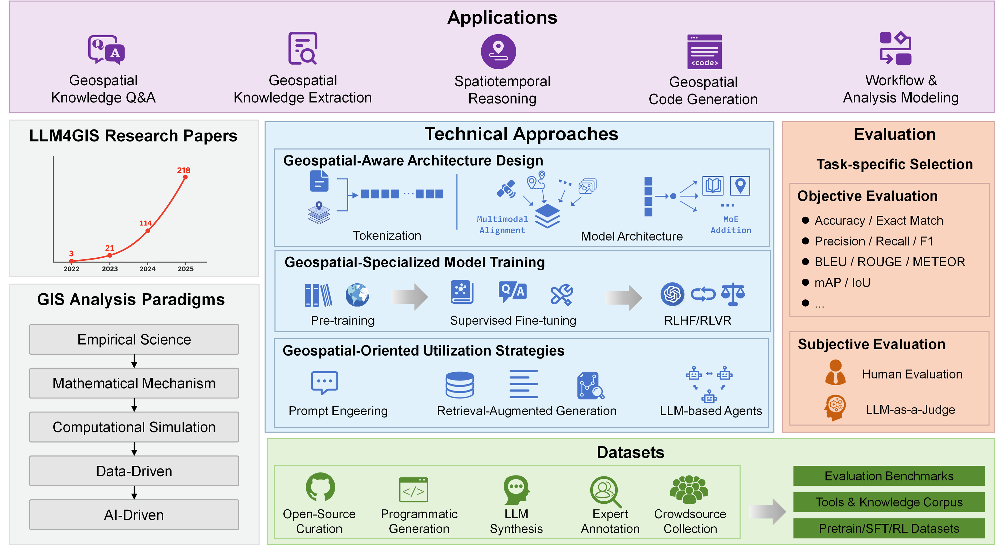
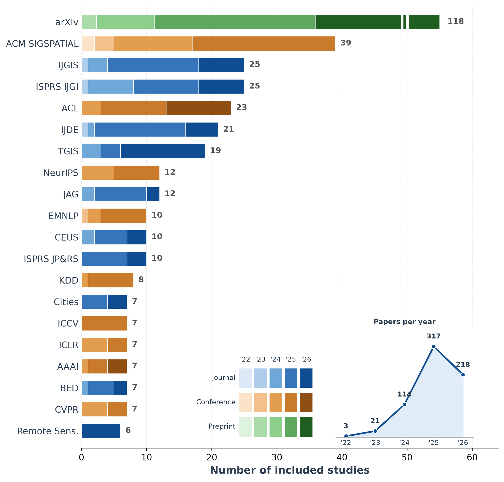
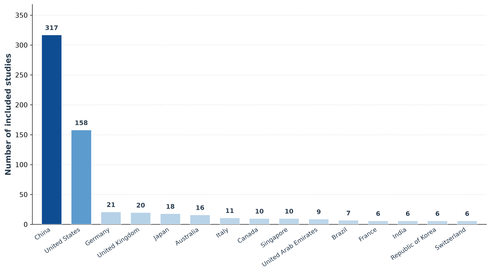
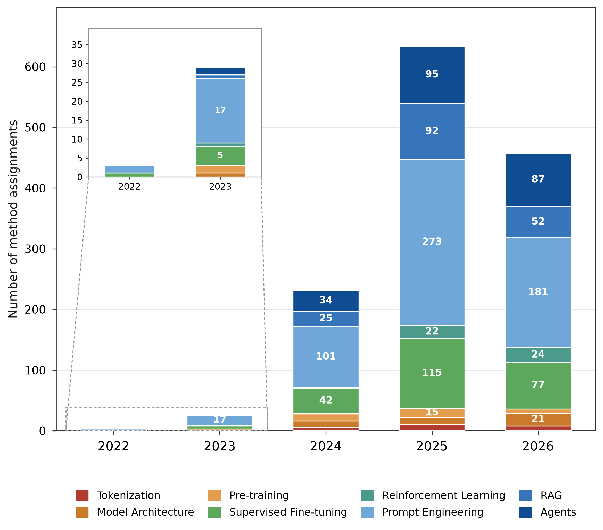
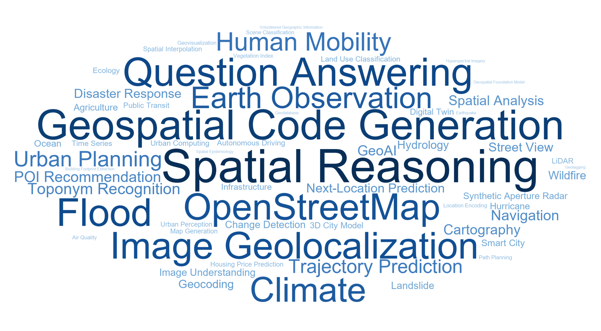
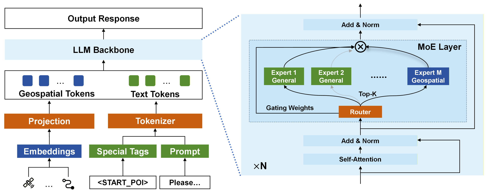
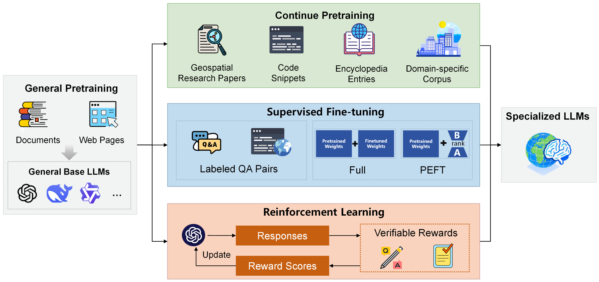
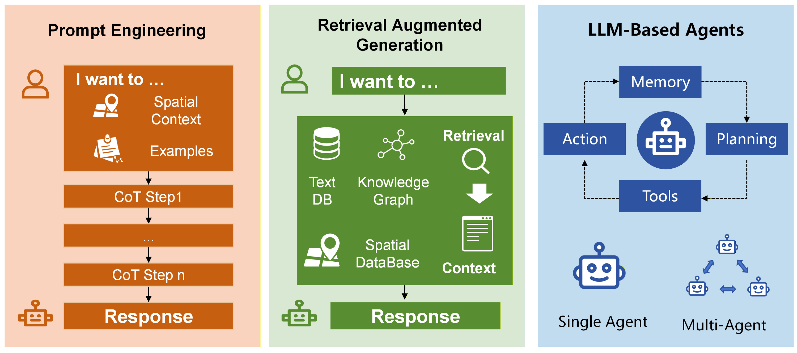
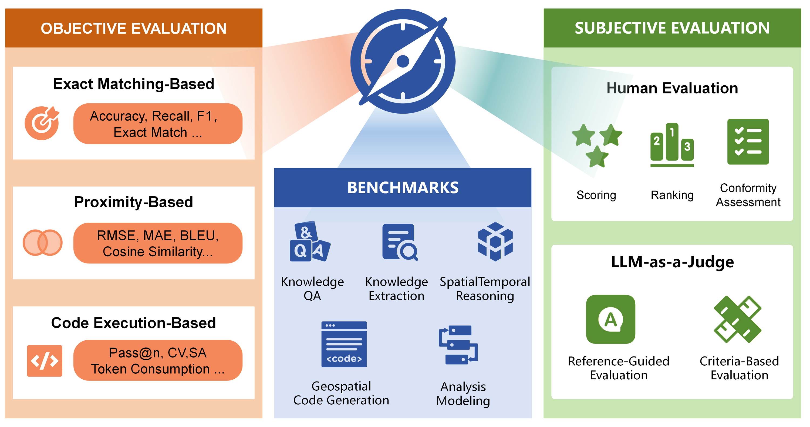

<div align="center">

# LLM4GIS: Methods, Applications, and Prospects

[](https://github.com/LuojiaGeoCode/Awesome-LLM4GIS)
[](#%EF%B8%8F-full-paper-list-all-673-papers)
[](https://doi.org/10.11947/j.AGCS.2025.20240468)
[](https://github.com/LuojiaGeoCode/Awesome-LLM4GIS/issues)

</div>

> A curated list of research on **large language model-driven GIS analysis (LLM4GIS)**, accompanying our survey *LLM4GIS: Methods, Applications, and Prospects*. It covers **673 research papers published between 2022 and July 2026**, organized by technical approaches, datasets, applications, and evaluation.
>
> We welcome everyone to open an issue for any related work we haven't discussed, and we'll try to address it in the next release!

<div align="center">
<br>
Overview of the survey
</div>

## 🎉 News
- **[2026-10]** 🔥 Major update: the paper list is extended to **673 research papers** (literature retrieved up to July 31, 2026), and the taxonomy is reorganized following our new survey *LLM4GIS: Methods, Applications, and Prospects*.
- **[2026-03-18]** 🔥 This Awesome LLM4GIS page is released!
- **[2025-03-25]** 🔥 Our survey paper is accepted by Acta Geodaetica et Cartographica Sinica!

## 📖 Contents

- [📊 Bibliometric Analysis](#-bibliometric-analysis)
- [🧩 Taxonomy and Selected Papers](#-taxonomy-and-selected-papers)
  - [3. Technical Approaches in LLM4GIS](#3-technical-approaches-in-llm4gis)
  - [4. Datasets](#4-datasets)
  - [5. Applications](#5-applications)
  - [6. Evaluation](#6-evaluation)
- [🔭 Challenges and Prospects](#-challenges-and-prospects)
- [🗂️ Full Paper List (All 673 Papers)](#%EF%B8%8F-full-paper-list-all-673-papers)
- [🎈 Citation](#-citation)

## 📊 Bibliometric Analysis

We built the corpus through a multi-source, iterative, manual identification and screening process (literature retrieved up to **July 31, 2026**). A study was included when (1) an LLM, multimodal LLM, or LLM-driven agent serves as a core reasoning or generation component; (2) geospatial data, GIS tasks, Earth observation, or urban/transportation/environmental processes are the research object; and (3) the work makes a substantive methodological, empirical, or evaluative contribution. Preprints and their formal versions are merged so that **each study is counted once**, yielding **673 core research papers** (558 general studies and 115 evaluation studies).

- **Rapid growth.** 3 papers in 2022 → 21 in 2023 → 114 in 2024 → 317 in 2025 → 218 in the first seven months of 2026.
- **Venues.** 118 studies remained arXiv-only at the cutoff, and another 134 were first released on arXiv before formal publication. ACM SIGSPATIAL (39) is the largest formal venue, followed by ISPRS IJGI (25), IJGIS (25), ACL (23), and IJDE (21).
- **Geography.** By first-author affiliation, China (317, 47.1%) and the United States (158) lead, followed by Germany, the United Kingdom, Japan, and Australia.
- **Methods.** Prompt engineering remains dominant, while RAG, LLM-based agents, architecture design, tokenization, and reinforcement learning are growing quickly.

<div align="center">
<br>
Number of papers by publication year and the top 20 publication venues<br><br>
<br>
Top 15 countries/regions of included papers by first-author affiliation<br><br>
<br>
Distribution of method usage in LLM4GIS research<br><br>
<br>
Word cloud of keywords in LLM4GIS research papers
</div>

## 🧩 Taxonomy and Selected Papers

The taxonomy follows the structure of the survey and spans four dimensions: **technical approaches, datasets, applications, and evaluation**.

- 1. Introduction
- 2. LLM4GIS
  - 2.1 Evolution of GIS Analysis Methods
  - 2.2 Concept of LLM4GIS
  - 2.3 Research Development and Trends
- 3. Technical Approaches in LLM4GIS
  - 3.1 Geospatial-Aware Architecture Design
    - 3.1.1 Tokenization
    - 3.1.2 Model Architecture
  - 3.2 Geospatial-Specialized Model Training
    - 3.2.1 Pretraining
    - 3.2.2 Supervised Fine-Tuning
    - 3.2.3 Reinforcement Learning
  - 3.3 Geospatial-Oriented Utilization Strategies
    - 3.3.1 Prompt Engineering
    - 3.3.2 Retrieval-Augmented Generation
    - 3.3.3 LLM-Based Agents
- 4. Datasets
  - 4.1 Dataset Construction (Open-Source Curation, Programmatic Generation, LLM Synthesis, Expert Annotation, Crowdsourcing)
- 5. Applications
  - 5.1 Geospatial Knowledge Q&A
  - 5.2 Geospatial Knowledge Extraction
  - 5.3 Spatiotemporal Reasoning
  - 5.4 Geospatial Code Generation
  - 5.5 Geospatial Analysis Modeling
- 6. Evaluation
  - 6.1 Evaluation for Geospatial Knowledge Q&A
  - 6.2 Evaluation for Geospatial Knowledge Extraction
  - 6.3 Evaluation for Spatiotemporal Reasoning
  - 6.4 Evaluation for Geospatial Code Generation
  - 6.5 Evaluation for Geospatial Analysis Modeling
- 7. Challenges and Prospects
- 8. Conclusions

Representative papers discussed in the survey are listed below (a paper may appear under several categories). For every included paper, see the [Full Paper List](#%EF%B8%8F-full-paper-list-all-673-papers).

<!-- AUTOMATED_TAXONOMY_START -->

### 3. Technical Approaches in LLM4GIS

#### 3.1 Geospatial-Aware Architecture Design

<div align="center"><br>Typical LLM4GIS architecture and tokenization</div>

##### 3.1.1 Tokenization

|  Year  | Title | Venue | Code |
| :----: | :---- | :---: | :--: |
| 2026 | **[LLM-Aligned Geographic Item Tokenization for Local-Life Recommendation](https://doi.org/10.1609/aaai.v40i17.38514)** | AAAI | [](https://github.com/JiangHaoPG11/LGSID) |
| 2026 | **[Traj-MLLM Can Multimodal Large Language Models Reform Trajectory Data Mining?](https://arxiv.org/abs/2509.00053)** | KDD |  |
| 2026 | **[UrbanFM: Scaling Urban Spatio-Temporal Foundation Models](https://arxiv.org/abs/2602.20677)** | KDD |  |
| 2025 | **[EarthMind: Leveraging Cross-Sensor Data for Advanced Earth Observation Interpretation with a Unified Multimodal LLM](https://arxiv.org/abs/2506.01667)** | arXiv | [](https://github.com/shuyansy/EarthMind) |
| 2025 | **[Enhancing Large Language Models for Mobility Analytics with Semantic Location Tokenization](https://doi.org/10.1145/3711896.3736937)** | KDD | [](https://github.com/shadowfall09/QT-Mob) |
| 2025 | **[GeoLLaVA-8K: Scaling Remote-Sensing Multimodal Large Language Models to 8K Resolution](https://doi.org/10.52202/085713-5317)** | NeurIPS |  |
| 2025 | **[JiuZhou: open foundation language models and effective pre-training framework for geoscience](https://doi.org/10.1080/17538947.2025.2449708)** | IJDE | [](https://github.com/THU-ESIS/JiuZhou) |
| 2025 | **[LandGPT: a multimodal large language model for parcel-level land use classification with multi-source data](https://doi.org/10.1080/13658816.2025.2506533)** | IJGIS | [](https://doi.org/10.6084/m9.figshare.28143191) |
| 2025 | **[MoveFM-R: Advancing Mobility Foundation Models via Language-driven Semantic Reasoning](https://arxiv.org/abs/2509.22403)** | arXiv |  |
| 2025 | **[SafeTraffic Copilot: adapting large language models for trustworthy traffic safety assessments and decision interventions](https://doi.org/10.1038/s41467-025-64574-w)** | Nat. Commun. |  |
| 2025 | **[SPOK: tokenizing geographic space for enhanced spatial reasoning in GeoAI](https://doi.org/10.1080/13658816.2025.2497810)** | IJGIS | [](https://doi.org/10.6084/m9.figshare.27968085) |
| 2025 | **[TourismMinds: A Geo-augmented LLM Framework for Semantic-aware Trajectory Analytics and Generation](https://doi.org/10.1145/3770697)** | IMWUT |  |
| 2024 | **[K2: A Foundation Language Model for Geoscience Knowledge Understanding and Utilization](https://doi.org/10.1145/3616855.3635772)** | WSDM | [](https://github.com/davendw49/k2) |
| 2024 | **[MobGLM: A Large Language Model for Synthetic Human Mobility Generation](https://doi.org/10.1145/3678717.3691311)** | SIGSPATIAL |  |
| 2024 | **[PreparedLLM: effective pre -pretraining framework for domain-specific large language models](https://doi.org/10.1080/20964471.2024.2396159)** | BED | [](https://github.com/THU-ESIS/Chinese-Mistral) |
| 2024 | **[UrbanGPT: Spatio-Temporal Large Language Models](https://doi.org/10.48550/arXiv.2403.00813)** | KDD | [](https://github.com/HKUDS/UrbanGPT) |

##### 3.1.2 Model Architecture

|  Year  | Title | Venue | Code |
| :----: | :---- | :---: | :--: |
| 2026 | **[GAEA: A Geolocation Aware Conversational Assistant](https://doi.org/10.1109/wacv61042.2026.00508)** | WACV | [](https://ucf-crcv.github.io/GAEA) |
| 2025 | **[GeoProspect: A domain-specific geological large language model with enhanced continual learning](https://doi.org/10.1016/j.neucom.2025.130801)** | Neurocomputing |  |
| 2025 | **[RSGPT: A Remote Sensing Vision Language Model and Benchmark](https://www.sciencedirect.com/science/article/abs/pii/S0924271625001352)** | ISPRS JP&RS | [](https://github.com/Lavender105/RSGPT) |
| 2025 | **[SkyEyeGPT: Unifying Remote Sensing Vision-Language Tasks via Instruction Tuning with Large Language Model](https://www.sciencedirect.com/science/article/pii/S0924271625000206)** | ISPRS JP&RS |  |
| 2025 | **[SkyMoE: A Vision-Language Foundation Model for Enhancing Geospatial Interpretation with Mixture of Experts](https://doi.org/10.1609/aaai.v40i9.37653)** | AAAI |  |
| 2025 | **[TourismMinds: A Geo-augmented LLM Framework for Semantic-aware Trajectory Analytics and Generation](https://doi.org/10.1145/3770697)** | IMWUT |  |
| 2025 | **[UrbanMLLM: Joint Learning of Cross-view Imagery for Urban Understanding](https://openreview.net/forum?id=YBht9Vp5vC)** | Openreview |  |
| 2024 | **[DriveGPT4: Interpretable End-to-End Autonomous Driving Via Large Language Model](https://doi.org/10.1109/lra.2024.3440097)** | IEEE Robotics and Automation Letters |  |
| 2024 | **[EarthGPT: A Universal Multimodal Large Language Model for Multisensor Image Comprehension in Remote Sensing Domain](https://doi.org/10.1109/tgrs.2024.3409624)** | IEEE TGRS | [](https://github.com/wivizhang/EarthGPT) |
| 2024 | **[GeoChat: Grounded Large Vision-Language Model for Remote Sensing](https://doi.org/10.48550/arXiv.2311.15826)** | CVPR |  |
| 2024 | **[GeoReasoner: Reasoning On Geospatially Grounded Context For Natural Language Understanding](https://doi.org/10.1145/3627673.3679934)** | CIKM |  |
| 2024 | **[LHRS-Bot: Empowering Remote Sensing with VGI-Enhanced Large Multimodal Language Model](https://doi.org/10.1007/978-3-031-72904-1_26)** | ECCV | [](https://github.com/NJU-LHRS/LHRS-Bot) |
| 2024 | **[REO-VLM: Transforming VLM to Meet Regression Challenges in Earth Observation](https://doi.org/10.48550/arXiv.2412.16583)** | arXiv |  |
| 2024 | **[TransGPT: Multi-modal Generative Pre-trained Transformer for Transportation](https://doi.org/10.1109/clnlp64123.2024.00026)** | CLNLP |  |
| 2023 | **[GeoLM Empowering Language Models for Geospatially Grounded Language Understanding](https://doi.org/10.18653/v1/2023.emnlp-main.317)** | EMNLP |  |

#### 3.2 Geospatial-Specialized Model Training

<div align="center"><br>Overview of pretraining (PT), supervised fine-tuning (SFT) and reinforcement learning (RL)</div>

##### 3.2.1 Pretraining

|  Year  | Title | Venue | Code |
| :----: | :---- | :---: | :--: |
| 2026 | **[OceanAgent: A small-scale multi-modal assistant for ocean exploration](https://doi.org/10.1016/j.eswa.2025.129640)** | Expert Systems with Applications |  |
| 2026 | **[PostGISer: The first end-to-end fine-tuned large language model for PostGIS GeoSQL query generation](https://doi.org/10.1016/j.ipm.2026.105042)** | Information Processing & Management |  |
| 2025 | **[CityGPT: Empowering Urban Spatial Cognition of Large Language Models](https://doi.org/10.1145/3711896.3736878)** | KDD | [](https://github.com/tsinghua-fib-lab/CityGPT) |
| 2025 | **[EarthDial: Turning Multi-sensory Earth Observations to Interactive Dialogues](https://doi.org/10.1109/cvpr52734.2025.01334)** | CVPR | [](https://github.com/hiyamdebary/EarthDial) |
| 2025 | **[EarthMind: Leveraging Cross-Sensor Data for Advanced Earth Observation Interpretation with a Unified Multimodal LLM](https://arxiv.org/abs/2506.01667)** | arXiv | [](https://github.com/shuyansy/EarthMind) |
| 2025 | **[GeoCode-GPT: A large language model for geospatial code generation](https://doi.org/10.1016/j.jag.2025.104456)** | JAG | [](https://github.com/whuhsy/GeoCode-GPT) |
| 2025 | **[GeoFactory: an LLM performance enhancement framework for geoscience factual and inferential tasks](https://doi.org/10.1080/20964471.2025.2506291)** | BED |  |
| 2025 | **[GeoResponder: Towards Building Geospatial LLMs for Time-Critical Disaster Response](https://arxiv.org/abs/2509.19354)** | arXiv |  |
| 2025 | **[LHRS-Bot-Nova: Improved multimodal large language model for remote sensing vision-language interpretation](https://doi.org/10.1016/j.isprsjprs.2025.06.003)** | ISPRS JP&RS | [](https://github.com/NJU-LHRS/LHRS-Bot) |
| 2025 | **[PlanGPT: Enhancing urban planning with a tailored agent framework](https://doi.org/10.18653/v1/2025.acl-industry.54)** | ACL |  |
| 2024 | **[BB-GeoGPT: A framework for learning a large language model for geographic information science](https://doi.org/10.1016/j.ipm.2024.103808)** | IPM | [](https://github.com/AGI-GIS/BB-GeoGPT) |
| 2024 | **[ClimateGPT: Towards AI Synthesizing Interdisciplinary Research on Climate Change](https://doi.org/10.48550/arXiv.2401.09646)** | arXiv | [](https://github.com/eci-io/climategpt-evaluation) |
| 2024 | **[EarthGPT: A Universal Multimodal Large Language Model for Multisensor Image Comprehension in Remote Sensing Domain](https://doi.org/10.1109/tgrs.2024.3409624)** | IEEE TGRS | [](https://github.com/wivizhang/EarthGPT) |
| 2024 | **[GeoGalactica: A Scientific Large Language Model in Geoscience](https://doi.org/10.48550/arXiv.2401.00434)** | arXiv | [](https://github.com/geobrain-ai/geogalactica) |
| 2024 | **[K2: A Foundation Language Model for Geoscience Knowledge Understanding and Utilization](https://doi.org/10.1145/3616855.3635772)** | WSDM | [](https://github.com/davendw49/k2) |
| 2024 | **[OceanGPT: A Large Language Model for Ocean Science Tasks](https://doi.org/10.18653/v1/2024.acl-long.184)** | ACL |  |
| 2023 | **[Towards a foundational platform for generative agents in simulated city environment](https://doi.org/10.1371/journal.pcsy.0000093)** | PLOS Complex Systems | [](https://github.com/tsinghua-fib-lab/UGI) |

##### 3.2.2 Supervised Fine-Tuning

|  Year  | Title | Venue | Code |
| :----: | :---- | :---: | :--: |
| 2026 | **[DeepTravel: An End-to-End Agentic Reinforcement Learning Framework for Autonomous Travel Planning Agents](https://arxiv.org/abs/2509.21842)** | KDD |  |
| 2025 | **[A Study on Individual Spatiotemporal Activity Generation Method Using MCP-Enhanced Chain-of-Thought Large Language Models](https://arxiv.org/abs/2506.10853)** | arXiv | [](https://github.com/ZYY799/spatiotemporal-activity-generation-mcp-cot) |
| 2025 | **[AddrLLM: Address Rewriting via Large Language Model on Nationwide Logistics Data](https://doi.org/10.1145/3690624.3709425)** | KDD |  |
| 2025 | **[AMAP Agentic Planning Technical Report](https://arxiv.org/abs/2512.24957)** | arXiv |  |
| 2025 | **[CityGPT: Empowering Urban Spatial Cognition of Large Language Models](https://doi.org/10.1145/3711896.3736878)** | KDD | [](https://github.com/tsinghua-fib-lab/CityGPT) |
| 2025 | **[Drive-R1: Bridging Reasoning and Planning in VLMs for Autonomous Driving with Reinforcement Learning](https://doi.org/10.1609/aaai.v40i8.37602)** | AAAI |  |
| 2025 | **[Entropy-Constrained Strategy Optimization in Urban Floods: A Multi-Agent Framework with LLM and Knowledge Graph Integration](https://arxiv.org/abs/2508.14654)** | arXiv |  |
| 2025 | **[GeoCode-GPT: A large language model for geospatial code generation](https://doi.org/10.1016/j.jag.2025.104456)** | JAG | [](https://github.com/whuhsy/GeoCode-GPT) |
| 2025 | **[GeoTool-GPT: a trainable method for facilitating Large Language Models to master GIS tools](https://doi.org/10.1080/13658816.2024.2438937)** | IJGIS | [](https://doi.org/10.6084/m9.figshare.25486414) |
| 2025 | **[GLoRA: A Novel Parameter-Efficient Fine-Tuning Framework for GIS Large Language Models](https://doi.org/10.1080/13658816.2025.2591830)** | IJGIS | [](https://doi.org/10.6084/m9.figshare.28208660) |
| 2025 | **[GRE Suite: Geo-localization Inference via Fine-Tuned Vision-Language Models and Enhanced Reasoning Chains](https://doi.org/10.52202/085713-3091)** | NeurIPS | [](https://github.com/Thorin215/GRE) |
| 2025 | **[LLMLight: Large Language Models as Traffic Signal Control Agents](https://doi.org/10.1145/3690624.3709379)** | KDD | [](https://doi.org/10.5281/zenodo.14619359) |
| 2025 | **[Open-Set Living Need Prediction with Large Language Models](https://doi.org/10.18653/v1/2025.findings-acl.285)** | ACL Findings | [](https://github.com/tsinghua-fib-lab/PIGEON) |
| 2025 | **[RadarQA: Multi-modal Quality Analysis of Weather Radar Forecasts](https://doi.org/10.52202/085713-4385)** | NeurIPS | [](https://github.com/hexmSeeU/RadarQA) |
| 2025 | **[Towards Faithful Reasoning in Remote Sensing: A Perceptually-Grounded GeoSpatial Chain-of-Thought for Vision-Language Models](https://arxiv.org/abs/2509.22221)** | arXiv | [](https://github.com/minglangL/RSThinker) |
| 2025 | **[USTBench: Benchmarking and Dissecting Spatiotemporal Reasoning of LLMs as Urban Agents](https://doi.org/10.48550/arXiv.2505.17572)** | arXiv | [](https://github.com/usail-hkust/USTBench) |
| 2024 | **[GeoAgent: To Empower LLMs using Geospatial Tools for Address Standardization](https://doi.org/10.18653/v1/2024.findings-acl.362)** | ACL Findings | [](https://github.com/chenghuahuang/GeoAgent) |

##### 3.2.3 Reinforcement Learning

|  Year  | Title | Venue | Code |
| :----: | :---- | :---: | :--: |
| 2026 | **[CityRiSE: Reasoning Urban Socio-Economic Status in Large Vision-Language Models via Reinforcement Learning](https://arxiv.org/abs/2510.22282)** | ACM MM |  |
| 2026 | **[DeepTravel: An End-to-End Agentic Reinforcement Learning Framework for Autonomous Travel Planning Agents](https://arxiv.org/abs/2509.21842)** | KDD |  |
| 2026 | **[LLM-Aligned Geographic Item Tokenization for Local-Life Recommendation](https://doi.org/10.1609/aaai.v40i17.38514)** | AAAI | [](https://github.com/JiangHaoPG11/LGSID) |
| 2026 | **[Traffic-R1: Reinforced LLMs Bring Human-Like Reasoning to Traffic Signal Control Systems](https://arxiv.org/abs/2508.02344)** | ACL | [](https://huggingface.co/Season998/Traffic-R1) |
| 2026 | **[Unlocking Zero-Shot Geospatial Reasoning via Indirect Rewards](https://arxiv.org/abs/2510.00072)** | ICML | [](https://github.com/miniHuiHui/Geo-R1) |
| 2026 | **[Vision-Language Reasoning for Geolocalization: A Reinforcement Learning Approach](https://doi.org/10.1609/aaai.v40i40.40681)** | AAAI |  |
| 2025 | **[AddrLLM: Address Rewriting via Large Language Model on Nationwide Logistics Data](https://doi.org/10.1145/3690624.3709425)** | KDD |  |
| 2025 | **[AMAP Agentic Planning Technical Report](https://arxiv.org/abs/2512.24957)** | arXiv |  |
| 2025 | **[CAMS A CityGPT-Powered Agentic Framework for Urban Human Mobility Simulation](https://arxiv.org/abs/2506.13599)** | arXiv |  |
| 2025 | **[CityGPT: Empowering Urban Spatial Cognition of Large Language Models](https://doi.org/10.1145/3711896.3736878)** | KDD | [](https://github.com/tsinghua-fib-lab/CityGPT) |
| 2025 | **[Drive-R1: Bridging Reasoning and Planning in VLMs for Autonomous Driving with Reinforcement Learning](https://doi.org/10.1609/aaai.v40i8.37602)** | AAAI |  |
| 2025 | **[Eyes Will Shut A Vision-Based Next GPS Location Prediction Model by Reinforcement Learning from Visual Map Feed Back](https://arxiv.org/abs/2507.18661)** | arXiv | [](https://github.com/Rising0321/VLMLocPredictor) |
| 2025 | **[Geo-R1: Improving Few-Shot Geospatial Referring Expression Understanding with Reinforcement Fine-Tuning](https://doi.org/10.1016/j.isprsjprs.2026.04.023)** | ISPRS JP&RS | [](https://github.com/Geo-R1/geo-r1) |
| 2025 | **[GeoZero: Incentivizing Reasoning from Scratch on Geospatial Scenes](https://arxiv.org/abs/2511.22645)** | arXiv |  |
| 2025 | **[GRE Suite: Geo-localization Inference via Fine-Tuned Vision-Language Models and Enhanced Reasoning Chains](https://doi.org/10.52202/085713-3091)** | NeurIPS | [](https://github.com/Thorin215/GRE) |
| 2025 | **[Locatability-Guided Adaptive Reasoning for Image Geo-Localization with VLMs](https://arxiv.org/abs/2603.13628)** | arXiv |  |
| 2025 | **[RadarQA: Multi-modal Quality Analysis of Weather Radar Forecasts](https://doi.org/10.52202/085713-4385)** | NeurIPS | [](https://github.com/hexmSeeU/RadarQA) |
| 2025 | **[Towards Faithful Reasoning in Remote Sensing: A Perceptually-Grounded GeoSpatial Chain-of-Thought for Vision-Language Models](https://arxiv.org/abs/2509.22221)** | arXiv | [](https://github.com/minglangL/RSThinker) |
| 2025 | **[Urban-R1: Reinforced MLLMs Mitigate Geospatial Biases for Urban General Intelligence](https://arxiv.org/abs/2510.16555)** | arXiv |  |
| 2023 | **[Towards a foundational platform for generative agents in simulated city environment](https://doi.org/10.1371/journal.pcsy.0000093)** | PLOS Complex Systems | [](https://github.com/tsinghua-fib-lab/UGI) |

#### 3.3 Geospatial-Oriented Utilization Strategies

<div align="center"><br>Overview of prompt engineering, RAG and LLM-based agents</div>

##### 3.3.1 Prompt Engineering

|  Year  | Title | Venue | Code |
| :----: | :---- | :---: | :--: |
| 2026 | **[MapMate: A framework bridging natural language interaction and map design through LLMs](https://doi.org/10.1016/j.jag.2025.105073)** | JAG |  |
| 2026 | **[TRAJEVO Trajectory Prediction Heuristics Design via LLM-driven Evolution](https://doi.org/10.1609/aaai.v40i21.38868)** | AAAI | [](https://github.com/ai4co/trajevo) |
| 2025 | **[A method for assessing urban flood impacts by combining hydrodynamic models with entity semantic evolution](https://doi.org/10.1080/17538947.2025.2515268)** | IJDE | [](https://figshare.com/s/d7254654bcc26b1f9fbe) |
| 2025 | **[A question-answering framework for geospatial data retrieval enhanced by a knowledge graph and large language models](https://doi.org/10.1080/17538947.2025.2510566)** | IJDE |  |
| 2025 | **[Chain-of-programming (CoP): empowering large language models for geospatial code generation task](https://doi.org/10.1080/17538947.2025.2509812)** | IJDE |  |
| 2025 | **[Extracting individual trajectories from text by fusing large language models with diverse knowledge](https://doi.org/10.1016/j.jag.2025.104654)** | JAG |  |
| 2025 | **[Fine-grained flood disaster information extraction incorporating multiple semantic features](https://doi.org/10.1080/17538947.2024.2448221)** | IJDE | [](https://github.com/xixiphus/Disaster-Information-Extraction) |
| 2025 | **[GeoBikeLLM: LLM-Powered Bike Route Planning with Air Quality and Vegetation-Aware Geospatial Intelligence](https://doi.org/10.1109/idsta66210.2025.11202783)** | IDSTA |  |
| 2025 | **[Monkuu: a LLM-powered natural language interface for geospatial databases with dynamic schema mapping](https://doi.org/10.1080/13658816.2025.2533322)** | IJGIS | [](https://doi.org/10.6084/m9.figshare.28573940.v1) |
| 2024 | **[Automated floodwater depth estimation using large multimodal model for rapid flood mapping](https://doi.org/10.1007/s43762-024-00123-3)** | Computational Urban Science |  |
| 2024 | **[GeoGPT: An assistant for understanding and processing geospatial tasks](https://doi.org/10.1016/j.jag.2024.103976)** | JAG |  |
| 2024 | **[Where to Move Next: Zero-shot Generalization of LLMs for Next POI Recommendation](https://doi.org/10.1109/cai59869.2024.00277)** | IEEE CAI | [](https://github.com/LLMMove/LLMMove) |
| 2024 | **[Zero-shot urban function inference with street view images through prompting a pretrained vision-language model](https://doi.org/10.1080/13658816.2024.2347322)** | IJGIS |  |
| 2023 | **[GeoQAMap - Geographic Question Answering with Maps Leveraging LLM and Open Knowledge Base](https://openreview.net/forum?id=UUwCuoloNK)** | GIScience |  |
| 2023 | **[GPT4GEO: How a Language Model Sees the World's Geography](https://doi.org/10.48550/arXiv.2306.00020)** | arXiv |  |
| 2023 | **[Where Would I Go Next? Large Language Models as Human Mobility Predictors](https://doi.org/10.48550/arXiv.2308.15197)** | arXiv | [](https://github.com/xlwang233/LLM-Mob) |

##### 3.3.2 Retrieval-Augmented Generation

|  Year  | Title | Venue | Code |
| :----: | :---- | :---: | :--: |
| 2026 | **[Physically Interpretable AlphaEarth Foundation Model Embeddings Enable LLM-based Land Surface Intelligence](https://doi.org/10.1016/j.rsase.2026.102045)** | Remote Sensing Applications: Society and E… |  |
| 2025 | **[AskNearby: An LLM-Based Application for Neighborhood Information Retrieval and Personalized Cognitive-Map Recommendations](https://doi.org/10.1145/3764912.3770813)** | SIGSPATIAL Workshop |  |
| 2025 | **[Democratizing Multi-Granularity Spatio-Temporal Intelligence with Multi-Agent Systems](https://doi.org/10.1145/3764915.3770718)** | SIGSPATIAL Workshop |  |
| 2025 | **[Design and application of a semantic-driven geospatial modeling knowledge graph based on large language models](https://doi.org/10.1080/10095020.2025.2483884)** | GSIS |  |
| 2025 | **[Enhancing geodatabases operability: advanced human-computer interaction through RAG and Multi-Agent Systems](https://doi.org/10.1080/20964471.2025.2483541)** | BED |  |
| 2025 | **[From questions to queries: an AI-powered multi-agent framework for spatial text-to-SQL](https://doi.org/10.1080/17538947.2026.2687193)** | IJDE | [](https://github.com/alikhosravi/Spatial-Text-to-SQL) |
| 2025 | **[GEE-OPs: an operator knowledge base for geospatial code generation on the Google Earth Engine platform powered by large language models](https://doi.org/10.1080/10095020.2025.2505556)** | GSIS | [](https://figshare.com/s/6d42f6335f3f6254ea14) |
| 2025 | **[Geo-FuB: A method for constructing an Operator-Function knowledge base for geospatial code generation with large language models](https://doi.org/10.1016/j.knosys.2025.113624)** | KBS | [](https://github.com/whuhsy/GEE-FuB) |
| 2025 | **[GeoFactory: an LLM performance enhancement framework for geoscience factual and inferential tasks](https://doi.org/10.1080/20964471.2025.2506291)** | BED |  |
| 2025 | **[GeoGraphRAG: A graph-based retrieval-augmented generation approach for empowering large language models in automated geospatial modeling](https://doi.org/10.1016/j.jag.2025.104712)** | JAG |  |
| 2025 | **[LLMTrajQuery: an LLM-based generative approach to semantic trajectory queries](https://doi.org/10.1080/13658816.2025.2569745)** | IJGIS | [](https://doi.org/10.6084/m9.figshare.26501146) |
| 2025 | **[More intelligent knowledge graph: A large language model-driven method for knowledge representation in geospatial digital twins](https://doi.org/10.1016/j.jag.2025.104527)** | JAG |  |
| 2025 | **[Open-Set Living Need Prediction with Large Language Models](https://doi.org/10.18653/v1/2025.findings-acl.285)** | ACL Findings | [](https://github.com/tsinghua-fib-lab/PIGEON) |
| 2025 | **[PlanGPT: Enhancing urban planning with a tailored agent framework](https://doi.org/10.18653/v1/2025.acl-industry.54)** | ACL |  |
| 2025 | **[Spatial-RAG: Spatial Retrieval Augmented Generation for Real-World Geospatial Reasoning Questions](https://doi.org/10.18653/v1/2026.findings-acl.539)** | ACL Findings |  |
| 2025 | **[SpatialGPT: Zero-Shot Vision-and-Language Navigation via Spatial CoT over Structured Spatial Memory](https://doi.org/10.1145/3748636.3762753)** | SIGSPATIAL | [](https://github.com/nobodynovember/SpatialGPT) |
| 2025 | **[UGuideRAG: Intent-Enhanced Retrieval-Augmented Generation with User-Generated Content for Personalized Urban Tourism](https://doi.org/10.1145/3748636.3762712)** | SIGSPATIAL |  |

##### 3.3.3 LLM-Based Agents

|  Year  | Title | Venue | Code |
| :----: | :---- | :---: | :--: |
| 2026 | **[Earth-agent: Unlocking the full landscape of earth observation with agents](https://arxiv.org/abs/2509.23141)** | ICLR | [](https://github.com/opendatalab/Earth-Agent) |
| 2025 | **[AMAP Agentic Planning Technical Report](https://arxiv.org/abs/2512.24957)** | arXiv |  |
| 2025 | **[An LLM Agent for Automatic Geospatial Data Analysis](https://arxiv.org/abs/2410.18792)** | ECML PKDD 2025 (ADS track) | [](https://github.com/Yusin2Chen/GeoAgent) |
| 2025 | **[CartoAgent: a multimodal large language model-powered multi-agent cartographic framework for map style transfer and evaluation](https://doi.org/10.1080/13658816.2025.2507844)** | IJGIS | [](https://github.com/GISense/CartoAgent) |
| 2025 | **[CitySim: Modeling Urban Behaviors and City Dynamics with Large-Scale LLM-Driven Agent Simulation](https://doi.org/10.18653/v1/2025.emnlp-industry.15)** | EMNLP |  |
| 2025 | **[Enhancing geodatabases operability: advanced human-computer interaction through RAG and Multi-Agent Systems](https://doi.org/10.1080/20964471.2025.2483541)** | BED |  |
| 2025 | **[GeoColab: an LLM-based multi-agent collaborative framework for geospatial code generation](https://doi.org/10.1080/17538947.2025.2569405)** | IJDE | [](https://figshare.com/s/caf071dffa1301727ee1) |
| 2025 | **[GeoEvolve: Automating Geospatial Model Discovery via Multi-Agent Large Language Models](https://arxiv.org/abs/2509.21593)** | arXiv |  |
| 2025 | **[GeoJSON Agents: A Multi-Agent LLM Architecture for Geospatial Analysis—Function Calling vs Code Generation](https://doi.org/10.1080/20964471.2026.2615511)** | BED |  |
| 2025 | **[PEACE: Empowering Geologic Map Holistic Understanding with MLLMs](https://doi.org/10.1109/cvpr52734.2025.00369)** | CVPR | [](https://github.com/microsoft/PEACE) |
| 2025 | **[PlanGPT: Enhancing urban planning with a tailored agent framework](https://doi.org/10.18653/v1/2025.acl-industry.54)** | ACL |  |
| 2025 | **[Planning, Living and Judging A Multi-agent LLM-based Framework for Cyclical Urban Planning](https://arxiv.org/abs/2412.20505)** | AAAI |  |
| 2025 | **[Swarm Intelligence in Geo-Localization: A Multi-Agent Large Vision-Language Model Collaborative Framework](https://doi.org/10.1145/3711896.3737141)** | KDD | [](https://github.com/Applied-Machine-Learning-Lab/smileGeo) |
| 2024 | **[Decoding Urban Industrial Complexity: Enhancing Knowledge-Driven Insights via IndustryScopeGPT](https://doi.org/10.1145/3664647.3681705)** | ACM MM | [](https://github.com/Tongji-KGLLM/IndustryScope) |
| 2024 | **[GeoAgent: To Empower LLMs using Geospatial Tools for Address Standardization](https://doi.org/10.18653/v1/2024.findings-acl.362)** | ACL Findings | [](https://github.com/chenghuahuang/GeoAgent) |
| 2024 | **[Large language model empowered participatory urban planning](https://doi.org/10.48550/arXiv.2402.01698)** | arXiv |  |
| 2024 | **[MapGPT: an autonomous framework for mapping by integrating large language model and cartographic tools](https://doi.org/10.1080/15230406.2024.2404868)** | CaGIS | [](https://github.com/AGI-GIS/MapGPT) |
| 2024 | **[TrafficGPT: Viewing, processing and interacting with traffic foundation models](https://doi.org/10.1016/j.tranpol.2024.03.006)** | Transport Policy |  |

### 4. Datasets

#### 4.1 Dataset Construction

##### 4.1.1 Open-Source Curation

|  Year  | Title | Venue | Code |
| :----: | :---- | :---: | :--: |
| 2026 | **[CityRiSE: Reasoning Urban Socio-Economic Status in Large Vision-Language Models via Reinforcement Learning](https://arxiv.org/abs/2510.22282)** | ACM MM |  |
| 2025 | **[CLAImate: AI-Enabled Climate Change Communication through Personalized and Localized Narrative Visualizations](https://doi.org/10.1109/vis60296.2025.00012)** | IEEE VIS |  |
| 2025 | **[DynamicVL: Benchmarking Multimodal Large Language Models for Dynamic City Understanding](https://doi.org/10.52202/085713-1114)** | NeurIPS | [](https://github.com/weihao1115/dynamicvl) |
| 2024 | **[K2: A Foundation Language Model for Geoscience Knowledge Understanding and Utilization](https://doi.org/10.1145/3616855.3635772)** | WSDM | [](https://github.com/davendw49/k2) |
| 2024 | **[UrbanGPT: Spatio-Temporal Large Language Models](https://doi.org/10.48550/arXiv.2403.00813)** | KDD | [](https://github.com/HKUDS/UrbanGPT) |
| 2023 | **[GeoQAMap - Geographic Question Answering with Maps Leveraging LLM and Open Knowledge Base](https://openreview.net/forum?id=UUwCuoloNK)** | GIScience |  |

##### 4.1.2 Programmatic Generation

|  Year  | Title | Venue | Code |
| :----: | :---- | :---: | :--: |
| 2025 | **[Can Large Reasoning Models Reason about Spatial Relations?](https://doi.org/10.1145/3764912.3770841)** | SIGSPATIAL Workshop |  |
| 2025 | **[From questions to queries: an AI-powered multi-agent framework for spatial text-to-SQL](https://doi.org/10.1080/17538947.2026.2687193)** | IJDE | [](https://github.com/alikhosravi/Spatial-Text-to-SQL) |
| 2024 | **[Can Large Language Models be Good Path Planners? A Benchmark and Investigation on Spatial-temporal Reasoning](https://arxiv.org/abs/2310.03249)** | ICLR Workshop |  |
| 2024 | **[K2: A Foundation Language Model for Geoscience Knowledge Understanding and Utilization](https://doi.org/10.1145/3616855.3635772)** | WSDM | [](https://github.com/davendw49/k2) |
| 2024 | **[Large language model as parking planning agent in the context of mixed period of autonomous vehicles and Human-Driven vehicles](https://doi.org/10.1016/j.scs.2024.105940)** | SCS |  |

##### 4.1.3 LLM Synthesis

|  Year  | Title | Venue | Code |
| :----: | :---- | :---: | :--: |
| 2025 | **[ChatEarthNet: A Global-Scale Image-Text Dataset Empowering Vision-Language Geo-Foundation Models](https://doi.org/10.5194/essd-17-1245-2025)** | Earth System Science Data | [](https://github.com/zhu-xlab/ChatEarthNet) |
| 2025 | **[Planning, Living and Judging A Multi-agent LLM-based Framework for Cyclical Urban Planning](https://arxiv.org/abs/2412.20505)** | AAAI |  |
| 2024 | **[GeoLLM-Engine: A Realistic Environment for Building Geospatial Copilots](https://doi.org/10.1109/cvprw63382.2024.00063)** | CVPR |  |

##### 4.1.4 Expert Annotation

|  Year  | Title | Venue | Code |
| :----: | :---- | :---: | :--: |
| 2025 | **[GeoCogent: an LLM-based agent for geospatial code generation](https://doi.org/10.1080/13658816.2025.2549460)** | IJGIS | [](https://doi.org/10.6084/m9.figshare.28078871) |
| 2023 | **[Towards Understanding the Geospatial Skills of ChatGPT](https://doi.org/10.1145/3615886.3627745)** | SIGSPATIAL Workshop |  |

##### 4.1.5 Crowdsourcing

|  Year  | Title | Venue | Code |
| :----: | :---- | :---: | :--: |
| 2025 | **[CitySim: Modeling Urban Behaviors and City Dynamics with Large-Scale LLM-Driven Agent Simulation](https://doi.org/10.18653/v1/2025.emnlp-industry.15)** | EMNLP |  |
| 2024 | **[GeoLLM-Engine: A Realistic Environment for Building Geospatial Copilots](https://doi.org/10.1109/cvprw63382.2024.00063)** | CVPR |  |
| 2024 | **[Where do we go from here? multi-scale allocentric relational inferencefrom natural spatial descriptions](https://doi.org/10.18653/v1/2024.eacl-long.62)** | EACL | [](https://github.com/OnlpLab/RVS) |
| 2023 | **[HeGeL: A Novel Dataset for Geo-Location from Hebrew Text](https://doi.org/10.18653/v1/2023.findings-acl.460)** | ACL Findings | [](https://github.com/OnlpLab/HeGeL) |

### 5. Applications

#### 5.1 Geospatial Knowledge Q&A

|  Year  | Title | Venue | Code |
| :----: | :---- | :---: | :--: |
| 2026 | **[A suite of large language models for public health infoveillance](https://doi.org/10.1038/s41746-026-02435-6)** | npj Digital Medicine |  |
| 2026 | **[CARAG: Context-Aware Retrieval-Augmented Generation for Railway Operation and Maintenance Question Answering over Spatial Knowledge Graph](https://doi.org/10.3390/ijgi15020078)** | ISPRS IJGI |  |
| 2026 | **[Change-LISA: Language-guided reasoning for remote sensing change detection](https://doi.org/10.1109/tgrs.2026.3684817)** | IEEE TGRS |  |
| 2026 | **[ChatPlanner: A large language model framework for personalized public transit routing](https://doi.org/10.1016/j.trc.2026.106017)** | TR Part C |  |
| 2026 | **[Describing Land Cover Changes via Multi-Temporal Remote Sensing Image Captioning Using LLM, ViT, and LoRA](https://doi.org/10.3390/rs18010166)** | Remote Sensing |  |
| 2026 | **[GAEA: A Geolocation Aware Conversational Assistant](https://doi.org/10.1109/wacv61042.2026.00508)** | WACV | [](https://ucf-crcv.github.io/GAEA) |
| 2026 | **[Generative AI in Participatory Urban Planning: Synthetic Inhabitants and Experts](https://doi.org/10.3390/land15030407)** | Land |  |
| 2026 | **[GeoIR-Compiler: A Geospatial Intermediate Representation and Compilation Framework for Chinese Urban Spatial Question Answering](https://doi.org/10.3390/ijgi15070310)** | ISPRS IJGI |  |
| 2026 | **[GIScholarBench: Benchmarking LLM Overconfidence in GIS Research](https://arxiv.org/abs/2606.08036)** | arXiv |  |
| 2026 | **[LandslideAgent with Multimodal LandslideBench: A Domain-Rule-Augmented Agent for Autonomous Landslide Identification and Analysis](https://arxiv.org/abs/2606.18661)** | arXiv |  |
| 2026 | **[OGD4All: A Framework for Accessible Interaction with Geospatial Open Government Data Based on LLMs](https://doi.org/10.1109/cai68641.2026.11536530)** | IEEE Conference on Artificial Intelligence… |  |
| 2026 | **[pykci: A Compact Urban Knowledge Graph for Semantic and Spatial Queries using Large Language Models](https://doi.org/10.1145/3841645.3843314)** | SIGSPATIAL |  |
| 2026 | **[RSICCLLM: A Multimodal Large Language Model for Remote Sensing Image Change Captioning](https://doi.org/10.1007/978-3-032-37324-3_14)** | ECCV |  |
| 2026 | **[STRIDE-QA: Visual Question Answering Dataset for Spatiotemporal Reasoning in Urban Driving Scenes](https://doi.org/10.1609/aaai.v40i7.37441)** | AAAI |  |
| 2026 | **[TraveLLaMA: A Multimodal Travel Assistant with Large-Scale Dataset and Structured Reasoning](https://arxiv.org/abs/2504.16505)** | AAAI |  |
| 2026 | **[WaterCopilot: AI-Driven Virtual Assistant for Water Management](https://arxiv.org/abs/2601.08559)** | arXiv |  |
| 2025 | **[CityGPT: Empowering Urban Spatial Cognition of Large Language Models](https://doi.org/10.1145/3711896.3736878)** | KDD | [](https://github.com/tsinghua-fib-lab/CityGPT) |
| 2025 | **[EarthMind: Leveraging Cross-Sensor Data for Advanced Earth Observation Interpretation with a Unified Multimodal LLM](https://arxiv.org/abs/2506.01667)** | arXiv | [](https://github.com/shuyansy/EarthMind) |
| 2025 | **[From knowledge graph construction to retrieval-augmented generation: a framework for comprehensive earthquake emergency support](https://doi.org/10.1080/10095020.2025.2514813)** | GSIS |  |
| 2025 | **[GeoProspect: A domain-specific geological large language model with enhanced continual learning](https://doi.org/10.1016/j.neucom.2025.130801)** | Neurocomputing |  |
| 2025 | **[GeoRAG: A Geographic RAG Framework Based on Urban Spatio-Temporal Knowledge Graph](https://doi.org/10.1007/978-981-95-4788-3_12)** | ICIC 2025 |  |
| 2025 | **[MFC4POI: Multi-factor collaboration for next point-of-interest recommendation using large language models](https://doi.org/10.1016/j.ipm.2026.104824)** | Information Processing & Management |  |
| 2025 | **[Planning with ComPlanAI: Comparative insights from a human–AI evaluation of comprehensive plans](https://doi.org/10.1016/j.cities.2026.106898)** | Cities |  |
| 2025 | **[Spatial-RAG: Spatial Retrieval Augmented Generation for Real-World Geospatial Reasoning Questions](https://doi.org/10.18653/v1/2026.findings-acl.539)** | ACL Findings |  |
| 2025 | **[Toward HydroLLM: a benchmark dataset for hydrology-specific knowledge assessment for large language models](https://doi.org/10.1017/eds.2025.10006)** | Environmental Data Science |  |
| 2025 | **[Towards Faithful Reasoning in Remote Sensing: A Perceptually-Grounded GeoSpatial Chain-of-Thought for Vision-Language Models](https://arxiv.org/abs/2509.22221)** | arXiv | [](https://github.com/minglangL/RSThinker) |
| 2024 | **[A flood knowledge-constrained large language model interactable with GIS: enhancing public risk perception of floods](https://doi.org/10.1080/13658816.2024.2306167)** | IJGIS | [](http://doi.org/10.6084/m9.figshare.23599695) |
| 2024 | **[ClimateGPT: Towards AI Synthesizing Interdisciplinary Research on Climate Change](https://doi.org/10.48550/arXiv.2401.09646)** | arXiv | [](https://github.com/eci-io/climategpt-evaluation) |
| 2024 | **[OceanGPT: A Large Language Model for Ocean Science Tasks](https://doi.org/10.18653/v1/2024.acl-long.184)** | ACL |  |
| 2024 | **[The question answering system GeoQA2 and a new benchmark for its evaluation](https://doi.org/10.1016/j.jag.2024.104203)** | JAG | [](https://github.com/AI-team-UoA/GeoQA/tree/geoqa2) |
| 2024 | **[TrafficGPT: Viewing, processing and interacting with traffic foundation models](https://doi.org/10.1016/j.tranpol.2024.03.006)** | Transport Policy |  |
| 2024 | **[WORLDBENCH: Quantifying Geographic Disparities in LLM Factual Recall](https://doi.org/10.1145/3630106.3658967)** | Global AI Cultures Workshop |  |
| 2023 | **[Towards a foundational platform for generative agents in simulated city environment](https://doi.org/10.1371/journal.pcsy.0000093)** | PLOS Complex Systems | [](https://github.com/tsinghua-fib-lab/UGI) |

#### 5.2 Geospatial Knowledge Extraction

|  Year  | Title | Venue | Code |
| :----: | :---- | :---: | :--: |
| 2026 | **[A graph-guided LLM prompting for supply-demand reasoning in substation flood prevention](https://doi.org/10.1016/j.knosys.2025.115004)** | KBS |  |
| 2026 | **[CityVLM: Towards sustainable urban development via multi-view coordinated vision–language model](https://doi.org/10.1016/j.isprsjprs.2025.11.030)** | ISPRS JP&RS |  |
| 2026 | **[Disaster Storylines and Knowledge Graphs from Global News with LLMs and RAG](https://doi.org/10.1038/s41597-026-07036-2)** | Nature Scientific Data |  |
| 2026 | **[LLM-GeoTextCog: A Cognitive Enhancement Framework for Geospatial Scene Understanding in Geographic Texts Using LLMs](https://doi.org/10.1111/tgis.70203)** | TGIS |  |
| 2026 | **[OceanAgent: A small-scale multi-modal assistant for ocean exploration](https://doi.org/10.1016/j.eswa.2025.129640)** | Expert Systems with Applications |  |
| 2026 | **[RoadEventGPT : A Data‐Driven Autonomous Framework for Detection and Geo‐Visualization of Urban Road Event Using Natural Chinese Text Data](https://doi.org/10.1111/tgis.70343)** | TGIS |  |
| 2025 | **[Design and application of a semantic-driven geospatial modeling knowledge graph based on large language models](https://doi.org/10.1080/10095020.2025.2483884)** | GSIS |  |
| 2025 | **[EarthMind: Leveraging Cross-Sensor Data for Advanced Earth Observation Interpretation with a Unified Multimodal LLM](https://arxiv.org/abs/2506.01667)** | arXiv | [](https://github.com/shuyansy/EarthMind) |
| 2025 | **[Extraction of geoprocessing modeling knowledge from crowdsourced Google Earth Engine scripts by coordinating large and small language models](https://doi.org/10.1080/13658816.2025.2577252)** | IJGIS | [](https://github.com/ZPGuiGroupWhu/Geo-CLASS) |
| 2025 | **[Fine-grained flood disaster information extraction incorporating multiple semantic features](https://doi.org/10.1080/17538947.2024.2448221)** | IJDE | [](https://github.com/xixiphus/Disaster-Information-Extraction) |
| 2025 | **[GEE-OPs: an operator knowledge base for geospatial code generation on the Google Earth Engine platform powered by large language models](https://doi.org/10.1080/10095020.2025.2505556)** | GSIS | [](https://figshare.com/s/6d42f6335f3f6254ea14) |
| 2025 | **[Geo-FuB: A method for constructing an Operator-Function knowledge base for geospatial code generation with large language models](https://doi.org/10.1016/j.knosys.2025.113624)** | KBS | [](https://github.com/whuhsy/GEE-FuB) |
| 2025 | **[GeoGraphRAG: A graph-based retrieval-augmented generation approach for empowering large language models in automated geospatial modeling](https://doi.org/10.1016/j.jag.2025.104712)** | JAG |  |
| 2025 | **[GeoGuess: Multimodal Reasoning based on Hierarchy of Visual Information in Street View](https://arxiv.org/abs/2506.16633)** | arXiv |  |
| 2025 | **[GeoMag: A Vision-Language Model for Pixel-level Fine-Grained Remote Sensing Image Parsing](https://doi.org/10.1145/3746027.3754559)** | ACM MM |  |
| 2025 | **[HierLabelNet: A Two-Stage LLMs Framework with Data Augmentation and Label Selection for Geographic Text Classification](https://doi.org/10.3390/ijgi14070268)** | ISPRS IJGI |  |
| 2025 | **[LHRS-Bot-Nova: Improved multimodal large language model for remote sensing vision-language interpretation](https://doi.org/10.1016/j.isprsjprs.2025.06.003)** | ISPRS JP&RS | [](https://github.com/NJU-LHRS/LHRS-Bot) |
| 2025 | **[MapBot: A Multi-Modal Agent for Geospatial Analysis](https://doi.org/10.65109/hfzd6332)** | AAMAS |  |
| 2025 | **[MapReader: a framework for learning a visual language model for map analysis](https://doi.org/10.1080/13658816.2025.2455112)** | IJGIS | [](https://github.com/AGI-GIS/MapReader) |
| 2025 | **[Omnigeo: Towards a multimodal large language models for geospatial artificial intelligence](https://arxiv.org/abs/2503.16326)** | arXiv |  |
| 2025 | **[PlanGPT-VL: Enhancing Urban Planning with Domain-Specific Vision-Language Models](https://arxiv.org/abs/2505.14481)** | EMNLP |  |
| 2025 | **[SegEarth-R1: Geospatial Pixel Reasoning via Large Language Model](https://arxiv.org/abs/2504.09644)** | arXiv | [](https://github.com/earth-insights/SegEarth-R1) |
| 2025 | **[SkyEyeGPT: Unifying Remote Sensing Vision-Language Tasks via Instruction Tuning with Large Language Model](https://www.sciencedirect.com/science/article/pii/S0924271625000206)** | ISPRS JP&RS |  |
| 2025 | **[Streetscape Analysis with Generative AI (SAGAI): Vision-language assessment and mapping of urban scenes](https://doi.org/10.1016/j.geomat.2025.100063)** | Geomatica | [](https://github.com/perezjoan/SAGAI) |
| 2025 | **[StreetViewAI: Making Street View Accessible Using Context-Aware Multimodal AI](https://doi.org/10.1145/3746059.3747756)** | UIST |  |
| 2025 | **[UrbanSense: A framework for quantitative analysis of urban streetscapes leveraging vision large language models](https://doi.org/10.52842/conf.ecaade.2025.1.605)** | ecaade |  |
| 2024 | **[Exploring large language models for human mobility prediction under public events](https://doi.org/10.1016/j.compenvurbsys.2024.102153)** | CEUS |  |
| 2024 | **[UrbanKGent: A Unified Large Language Model Agent Framework for Urban Knowledge Graph Construction](https://doi.org/10.52202/079017-3913)** | NeurIPS | [](https://github.com/usail-hkust/UrbanKGent) |

#### 5.3 Spatiotemporal Reasoning

|  Year  | Title | Venue | Code |
| :----: | :---- | :---: | :--: |
| 2026 | **[A Cross-Domain Tool-Augmented Vision-Language Framework for Remote Sensing Image Understanding](https://doi.org/10.3390/rs18101613)** | Remote Sensing |  |
| 2026 | **[AgentSense LLMs Empower Generalizable and Explainable Web-Based Participatory Urban Sensing](https://arxiv.org/abs/2510.19661)** | WWW |  |
| 2026 | **[CityVLM: Towards sustainable urban development via multi-view coordinated vision–language model](https://doi.org/10.1016/j.isprsjprs.2025.11.030)** | ISPRS JP&RS |  |
| 2026 | **[ClimAgent: LLM as Agents for Autonomous Open-ended Climate Science Analysis](https://doi.org/10.18653/v1/2026.findings-acl.1067)** | ACL Findings |  |
| 2026 | **[DeepTravel: An End-to-End Agentic Reinforcement Learning Framework for Autonomous Travel Planning Agents](https://arxiv.org/abs/2509.21842)** | KDD |  |
| 2026 | **[GEO-Detective Unveiling Location Privacy Risks in Images with LLM Agents](https://arxiv.org/abs/2511.22441)** | ECCV |  |
| 2026 | **[Geo-MAG: A Knowledge Graph (KG)-Enhanced Multimodal Retrieval-Augmented Generation (RAG) Framework for Geological Map Understanding](https://doi.org/10.1111/tgis.70226)** | TGIS |  |
| 2026 | **[GeoArena: Evaluating Open-World Geographic Reasoning in Large Vision-Language Models](https://doi.org/10.48448/hexc-7c26)** | Figshare |  |
| 2026 | **[LandslideAgent with Multimodal LandslideBench: A Domain-Rule-Augmented Agent for Autonomous Landslide Identification and Analysis](https://arxiv.org/abs/2606.18661)** | arXiv |  |
| 2026 | **[LLM-Aligned Geographic Item Tokenization for Local-Life Recommendation](https://doi.org/10.1609/aaai.v40i17.38514)** | AAAI | [](https://github.com/JiangHaoPG11/LGSID) |
| 2026 | **[MAS-LAND: A multi-agent system for landslide detection and rapid response](https://doi.org/10.1016/j.ijdrr.2026.106263)** | International Journal of Disaster Risk Red… |  |
| 2026 | **[OpenEarthAgent: A Unified Framework for Tool-Augmented Geospatial Agents](https://arxiv.org/abs/2602.17665)** | ECCV |  |
| 2026 | **[RemoteShield: Enable Robust Multimodal Large Language Models for Earth Observation](https://arxiv.org/abs/2604.17243)** | arXiv |  |
| 2026 | **[RoadEventGPT : A Data‐Driven Autonomous Framework for Detection and Geo‐Visualization of Urban Road Event Using Natural Chinese Text Data](https://doi.org/10.1111/tgis.70343)** | TGIS |  |
| 2026 | **[S2SServiceBench: A Multimodal Benchmark for Last-Mile S2S Climate Services](https://arxiv.org/abs/2602.14017)** | arXiv |  |
| 2026 | **[TraveLLaMA: A Multimodal Travel Assistant with Large-Scale Dataset and Structured Reasoning](https://arxiv.org/abs/2504.16505)** | AAAI |  |
| 2026 | **[VectorLLM: Human-like extraction of structured building contours via multimodal LLMs](https://doi.org/10.1016/j.isprsjprs.2026.01.025)** | ISPRS JP&RS |  |
| 2025 | **[AgentTravel: Knowledge-Augmented LLM Agent Framework for Urban Travel Planning](https://openreview.net/forum?id=34kIv0YVNe)** | NeurIPS | [](https://github.com/csjiezhao/AgentTravel) |
| 2025 | **[Eyes Will Shut A Vision-Based Next GPS Location Prediction Model by Reinforcement Learning from Visual Map Feed Back](https://arxiv.org/abs/2507.18661)** | arXiv | [](https://github.com/Rising0321/VLMLocPredictor) |
| 2025 | **[GeoGuess: Multimodal Reasoning based on Hierarchy of Visual Information in Street View](https://arxiv.org/abs/2506.16633)** | arXiv |  |
| 2025 | **[LLMLight: Large Language Models as Traffic Signal Control Agents](https://doi.org/10.1145/3690624.3709379)** | KDD | [](https://doi.org/10.5281/zenodo.14619359) |
| 2025 | **[Locatability-Guided Adaptive Reasoning for Image Geo-Localization with VLMs](https://arxiv.org/abs/2603.13628)** | arXiv |  |
| 2025 | **[MFC4POI: Multi-factor collaboration for next point-of-interest recommendation using large language models](https://doi.org/10.1016/j.ipm.2026.104824)** | Information Processing & Management |  |
| 2025 | **[Omnigeo: Towards a multimodal large language models for geospatial artificial intelligence](https://arxiv.org/abs/2503.16326)** | arXiv |  |
| 2025 | **[Open-Set Living Need Prediction with Large Language Models](https://doi.org/10.18653/v1/2025.findings-acl.285)** | ACL Findings | [](https://github.com/tsinghua-fib-lab/PIGEON) |
| 2025 | **[Plugging Small Models in Large Language Models for POI Recommendation in Smart Tourism](https://doi.org/10.3390/a18070376)** | Algorithms 2025, 18, 376 |  |
| 2025 | **[SpatialGPT: Zero-Shot Vision-and-Language Navigation via Spatial CoT over Structured Spatial Memory](https://doi.org/10.1145/3748636.3762753)** | SIGSPATIAL | [](https://github.com/nobodynovember/SpatialGPT) |
| 2025 | **[TrajAgent: An LLM-Agent Framework for Trajectory Modeling via Large-and-Small Model Collaboration](https://doi.org/10.52202/085713-0729)** | NeurIPS | [](https://github.com/tsinghua-fib-lab/TrajAgent) |
| 2025 | **[UrbanMLLM: Joint Learning of Cross-view Imagery for Urban Understanding](https://openreview.net/forum?id=YBht9Vp5vC)** | Openreview |  |
| 2024 | **[Decoding Urban Industrial Complexity: Enhancing Knowledge-Driven Insights via IndustryScopeGPT](https://doi.org/10.1145/3664647.3681705)** | ACM MM | [](https://github.com/Tongji-KGLLM/IndustryScope) |
| 2024 | **[GeoGPT: An assistant for understanding and processing geospatial tasks](https://doi.org/10.1016/j.jag.2024.103976)** | JAG |  |
| 2024 | **[GeoLLM: Extracting Geospatial Knowledge from Large Language Models](https://doi.org/10.48550/arXiv.2310.06213)** | ICLR | [](https://rohinmanvi.github.io/GeoLLM) |
| 2024 | **[How Can Large Language Models Understand Spatial-Temporal Data?](https://arxiv.org/abs/2401.14192)** | arXiv |  |
| 2024 | **[Large language model empowered participatory urban planning](https://doi.org/10.48550/arXiv.2402.01698)** | arXiv |  |
| 2024 | **[Large Language Models as Urban Residents: An LLM Agent Framework for Personal Mobility Generation](https://doi.org/10.52202/079017-3957)** | NeurIPS | [](https://github.com/Wangjw6/LLMob/) |
| 2024 | **[Large Language Models for Next Point-of-Interest Recommendation](https://doi.org/10.1145/3626772.3657840)** | SIGIR | [](https://github.com/neolifer/LLM4POI) |
| 2024 | **[MobGLM: A Large Language Model for Synthetic Human Mobility Generation](https://doi.org/10.1145/3678717.3691311)** | SIGSPATIAL |  |
| 2024 | **[SpatialRGPT: Grounded Spatial Reasoning in Vision-Language Models](https://doi.org/10.52202/079017-4293)** | NeurIPS |  |
| 2023 | **[Towards a foundational platform for generative agents in simulated city environment](https://doi.org/10.1371/journal.pcsy.0000093)** | PLOS Complex Systems | [](https://github.com/tsinghua-fib-lab/UGI) |

#### 5.4 Geospatial Code Generation

|  Year  | Title | Venue | Code |
| :----: | :---- | :---: | :--: |
| 2026 | **[Bridging Natural Language and Desktop GIS Automation with LLM-Powered GIS Plugins](https://doi.org/10.31223/x54z09)** | EarthArXiv |  |
| 2026 | **[GeoPyEval: An Automated Evaluation Framework for Python Code Generation Capabilities of Large Language Models in Geospatial Domains](https://doi.org/10.1111/tgis.70324)** | TGIS |  |
| 2026 | **[GISclaw: An Open-Source LLM-Powered Agent System for Full-Stack Geospatial Analysis](https://arxiv.org/abs/2603.26845)** | arXiv |  |
| 2026 | **[PostGISer: The first end-to-end fine-tuned large language model for PostGIS GeoSQL query generation](https://doi.org/10.1016/j.ipm.2026.105042)** | Information Processing & Management |  |
| 2026 | **[Text-to-SpatialSQL: A LLM Based Method for Generating Spatial SQL Queries With Geo-Knowledge Extracted From Software User Manual](https://doi.org/10.1111/tgis.70312)** | TGIS |  |
| 2025 | **[A method for assessing urban flood impacts by combining hydrodynamic models with entity semantic evolution](https://doi.org/10.1080/17538947.2025.2515268)** | IJDE | [](https://figshare.com/s/d7254654bcc26b1f9fbe) |
| 2025 | **[An LLM Agent for Automatic Geospatial Data Analysis](https://arxiv.org/abs/2410.18792)** | ECML PKDD 2025 (ADS track) | [](https://github.com/Yusin2Chen/GeoAgent) |
| 2025 | **[AutoGEEval++: A multi-level and multi-geospatial-modality automated evaluation framework for large language models in geospatial code generation on Google Earth Engine](https://doi.org/10.1080/20964471.2025.2581425)** | BED | [](https://github.com/szx-0633/AutoGEEval-plus) |
| 2025 | **[AutoGEEval: A Multimodal and Automated Evaluation Framework for Geospatial Code Generation on GEE with Large Language Models](https://doi.org/10.3390/ijgi14070256)** | ISPRS IJGI | [](https://github.com/szx-0633/AutoGEEval) |
| 2025 | **[Chain-of-programming (CoP): empowering large language models for geospatial code generation task](https://doi.org/10.1080/17538947.2025.2509812)** | IJDE |  |
| 2025 | **[From PowerPoint UI Sketches to Web-Based Applications: Pattern-Driven Code Generation for GIS Dashboard Development Using Knowledge-Augmented LLMs, Context-Aware Visual Prompting, and the React Framework](https://arxiv.org/abs/2502.08756)** | arXiv |  |
| 2025 | **[GEE-OPs: an operator knowledge base for geospatial code generation on the Google Earth Engine platform powered by large language models](https://doi.org/10.1080/10095020.2025.2505556)** | GSIS | [](https://figshare.com/s/6d42f6335f3f6254ea14) |
| 2025 | **[Geo-FuB: A method for constructing an Operator-Function knowledge base for geospatial code generation with large language models](https://doi.org/10.1016/j.knosys.2025.113624)** | KBS | [](https://github.com/whuhsy/GEE-FuB) |
| 2025 | **[GeoCode-GPT: A large language model for geospatial code generation](https://doi.org/10.1016/j.jag.2025.104456)** | JAG | [](https://github.com/whuhsy/GeoCode-GPT) |
| 2025 | **[GeoCogent: an LLM-based agent for geospatial code generation](https://doi.org/10.1080/13658816.2025.2549460)** | IJGIS | [](https://doi.org/10.6084/m9.figshare.28078871) |
| 2025 | **[GeoColab: an LLM-based multi-agent collaborative framework for geospatial code generation](https://doi.org/10.1080/17538947.2025.2569405)** | IJDE | [](https://figshare.com/s/caf071dffa1301727ee1) |
| 2025 | **[GeoJSEval: An Automated Evaluation Framework for Large Language Models on JavaScript-Based Geospatial Computation and Visualization Code Generation](https://doi.org/10.3390/ijgi14100382)** | ISPRS IJGI | [](https://github.com/LiuZQ802/GeoJSEval) |
| 2025 | **[GeoJSON Agents: A Multi-Agent LLM Architecture for Geospatial Analysis—Function Calling vs Code Generation](https://doi.org/10.1080/20964471.2026.2615511)** | BED |  |
| 2025 | **[GeoPandas-AI: A Smart Class Bringing LLM as Stateful AI Code Assistant](https://doi.org/10.1145/3748636.3762765)** | SIGSPATIAL | [](https://github.com/GeoPandas-AI/geopandas-ai) |
| 2025 | **[GeoSQL-Eval: First Evaluation of LLMs on PostGIS-Based NL2GeoSQL Queries](https://doi.org/10.1016/j.eswa.2026.132122)** | Expert Systems with Applications |  |
| 2025 | **[GIS Copilot: Towards an Autonomous GIS Agent for Spatial Analysis](https://doi.org/10.1080/17538947.2025.2497489)** | IJDE |  |
| 2025 | **[Monkuu: a LLM-powered natural language interface for geospatial databases with dynamic schema mapping](https://doi.org/10.1080/13658816.2025.2533322)** | IJGIS | [](https://doi.org/10.6084/m9.figshare.28573940.v1) |
| 2025 | **[OsmT: Bridging OpenStreetMap Queries and Natural Language with Open-source Tag-aware Language Models](https://doi.org/10.1109/icde65706.2026.00045)** | IEEE ICDE 2026 |  |
| 2025 | **[ShapefileGPT: A Multi-Agent Large Language Model Framework for Automated Shapefile Processing](https://doi.org/10.1080/17538947.2025.2577884)** | IJDE | [](https://figshare.com/s/92c14f811b7017da9e6d) |
| 2025 | **[Towards a barrier-free GeoQA portal: Natural language interaction with geospatial data using multi-agent LLMs and semantic search](https://doi.org/10.1016/j.jag.2025.104825)** | JAG | [](https://github.com/nitpicker55555/Geo-QA-Paper) |
| 2024 | **[ChatGeoAI: Enabling Geospatial Analysis for Public through Natural Language, with Large Language Models](https://doi.org/10.3390/ijgi13100348)** | ISPRS IJGI |  |
| 2024 | **[面向地学分析AI建模的地理信息服务层次网络模型](http://xb.chinasmp.com/CN/abstract/abstract13413.shtml)** | 测绘学报 |  |

#### 5.5 Geospatial Analysis Modeling

|  Year  | Title | Venue | Code |
| :----: | :---- | :---: | :--: |
| 2026 | **[A graph-guided LLM prompting for supply-demand reasoning in substation flood prevention](https://doi.org/10.1016/j.knosys.2025.115004)** | KBS |  |
| 2026 | **[Automated Quality Assessment of Geospatial Vector Data: A GeoAI Approach using Spatial Representation Learning](https://arxiv.org/abs/2606.28390)** | arXiv |  |
| 2026 | **[Can AI Observe Geographical Space? GVSABench For Evaluating Geo-Visuospatial Ability of Large Multimodal Models](https://doi.org/10.1111/tgis.70189)** | TGIS |  |
| 2026 | **[Can AI Reason Like an Urban Planner? Benchmarking LLMs Against Professional Judgment](https://arxiv.org/abs/2606.11678)** | arXiv |  |
| 2026 | **[ClimAgent: LLM as Agents for Autonomous Open-ended Climate Science Analysis](https://doi.org/10.18653/v1/2026.findings-acl.1067)** | ACL Findings |  |
| 2026 | **[Flood-LLM: An AI-Driven Framework for Property-Level Flood Risk Assessment Using Multi-Source Urban Data](https://doi.org/10.3390/su18062957)** | Sustainability |  |
| 2026 | **[GATSim: Urban mobility simulation with generative agents](https://doi.org/10.1016/j.trc.2026.105576)** | TR Part C |  |
| 2026 | **[GenWorld: Empirically Grounded Urban Simulation Infrastructure for LLM-Agent Studies](https://arxiv.org/abs/2606.27650)** | arXiv |  |
| 2026 | **[GISclaw: An Open-Source LLM-Powered Agent System for Full-Stack Geospatial Analysis](https://arxiv.org/abs/2603.26845)** | arXiv |  |
| 2026 | **[HydroAgent: Formalizing Forecaster Expertise into Skill-Orchestrated Flood Forecasting Workflows](https://arxiv.org/abs/2607.23983)** | arXiv |  |
| 2026 | **[Intelli-Planner: Towards Customized Urban Planning via LLM-Empowered Reinforcement Learning](https://doi.org/10.1145/3774904.3793019)** | WWW |  |
| 2026 | **[MapColorAI: designing contextually relevant choropleth map color schemes using a large language model](https://doi.org/10.1080/15230406.2025.2531055)** | CaGIS |  |
| 2026 | **[Mobility-Aware Cache Framework for Scalable LLM-Based Human Mobility Simulation](https://arxiv.org/abs/2602.16727)** | arXiv |  |
| 2026 | **[OpenEarth-Agent: From Tool Calling to Tool Creation for Open-Environment Earth Observation](https://arxiv.org/abs/2603.22148)** | arXiv |  |
| 2026 | **[RS-Claw: Progressive Active Tool Exploration via Hierarchical Skill Trees for RS Agents](https://doi.org/10.1109/tgrs.2026.3720894)** | IEEE TGRS |  |
| 2026 | **[Towards Universal Urban Patterns-of-Life Simulation](https://doi.org/10.1038/s44260-026-00083-1)** | npj Complexity |  |
| 2026 | **[TrajGenAgent: A Hierarchical LLM Agent for Human Mobility Trajectory Generation](https://doi.org/10.1109/mdm71479.2026.00026)** | IEEE International Conference on Mobile Da… |  |
| 2026 | **[UrbanDS: A Graph-Guided LLM Multi-Agent System for Data-Intensive Urban Tasks](https://arxiv.org/abs/2607.26724)** | arXiv |  |
| 2026 | **[VectorLLM: Human-like extraction of structured building contours via multimodal LLMs](https://doi.org/10.1016/j.isprsjprs.2026.01.025)** | ISPRS JP&RS |  |
| 2025 | **[An LLM Agent for Automatic Geospatial Data Analysis](https://arxiv.org/abs/2410.18792)** | ECML PKDD 2025 (ADS track) | [](https://github.com/Yusin2Chen/GeoAgent) |
| 2025 | **[From PowerPoint UI Sketches to Web-Based Applications: Pattern-Driven Code Generation for GIS Dashboard Development Using Knowledge-Augmented LLMs, Context-Aware Visual Prompting, and the React Framework](https://arxiv.org/abs/2502.08756)** | arXiv |  |
| 2025 | **[GeoEvolve: Automating Geospatial Model Discovery via Multi-Agent Large Language Models](https://arxiv.org/abs/2509.21593)** | arXiv |  |
| 2025 | **[GeoTool-GPT: a trainable method for facilitating Large Language Models to master GIS tools](https://doi.org/10.1080/13658816.2024.2438937)** | IJGIS | [](https://doi.org/10.6084/m9.figshare.25486414) |
| 2025 | **[Instructor–Worker large language model system for policy recommendation: A case study on air quality analysis of the January 2025 Los Angeles wildfires](https://doi.org/10.1016/j.jag.2025.104774)** | JAG |  |
| 2025 | **[LandGPT: a multimodal large language model for parcel-level land use classification with multi-source data](https://doi.org/10.1080/13658816.2025.2506533)** | IJGIS | [](https://doi.org/10.6084/m9.figshare.28143191) |
| 2025 | **[Monkuu: a LLM-powered natural language interface for geospatial databases with dynamic schema mapping](https://doi.org/10.1080/13658816.2025.2533322)** | IJGIS | [](https://doi.org/10.6084/m9.figshare.28573940.v1) |
| 2025 | **[Multi-Agent Geospatial Copilots for Remote Sensing Workflows](https://doi.org/10.1109/igarss55030.2025.11243915)** | IGARSS |  |
| 2025 | **[Multi-task learning-based high-speed railway inflow and outflow prediction with large language models](https://doi.org/10.1080/23249935.2025.2605210)** | Transportmetrica A: Transport Science |  |
| 2025 | **[OsmT: Bridging OpenStreetMap Queries and Natural Language with Open-source Tag-aware Language Models](https://doi.org/10.1109/icde65706.2026.00045)** | IEEE ICDE 2026 |  |
| 2025 | **[PlanGPT-VL: Enhancing Urban Planning with Domain-Specific Vision-Language Models](https://arxiv.org/abs/2505.14481)** | EMNLP |  |
| 2025 | **[Toward HydroLLM: a benchmark dataset for hydrology-specific knowledge assessment for large language models](https://doi.org/10.1017/eds.2025.10006)** | Environmental Data Science |  |
| 2025 | **[Towards a barrier-free GeoQA portal: Natural language interaction with geospatial data using multi-agent LLMs and semantic search](https://doi.org/10.1016/j.jag.2025.104825)** | JAG | [](https://github.com/nitpicker55555/Geo-QA-Paper) |
| 2024 | **[Enhancing the accessibility of regionalization techniques through large language models a case study in conversational agent guidance](https://doi.org/10.1080/13658816.2024.2415439)** | IJGIS | [](https://doi.org/10.5281/zenodo.13901021) |
| 2024 | **[GeoGPT: An assistant for understanding and processing geospatial tasks](https://doi.org/10.1016/j.jag.2024.103976)** | JAG |  |
| 2024 | **[MapGPT: an autonomous framework for mapping by integrating large language model and cartographic tools](https://doi.org/10.1080/15230406.2024.2404868)** | CaGIS | [](https://github.com/AGI-GIS/MapGPT) |
| 2024 | **[Remote Sensing ChatGPT: Solving Remote Sensing Tasks with ChatGPT and Visual Models](https://doi.org/10.1109/igarss53475.2024.10640736)** | IGARSS | [](https://github.com/HaonanGuo/Remote-Sensing-ChatGPT) |
| 2024 | **[The question answering system GeoQA2 and a new benchmark for its evaluation](https://doi.org/10.1016/j.jag.2024.104203)** | JAG | [](https://github.com/AI-team-UoA/GeoQA/tree/geoqa2) |
| 2024 | **[TrafficGPT: Viewing, processing and interacting with traffic foundation models](https://doi.org/10.1016/j.tranpol.2024.03.006)** | Transport Policy |  |

### 6. Evaluation

<div align="center"><br>Overview of evaluation methods and benchmarks</div>

#### 6.1 Evaluation for Geospatial Knowledge Q&A

|  Year  | Title | Venue | Code |
| :----: | :---- | :---: | :--: |
| 2025 | **[CityGPT: Empowering Urban Spatial Cognition of Large Language Models](https://doi.org/10.1145/3711896.3736878)** | KDD | [](https://github.com/tsinghua-fib-lab/CityGPT) |
| 2025 | **[ClimaQA: An Automated Evaluation Framework for Climate Question Answering Models](https://arxiv.org/abs/2410.16701)** | ICLR | [](https://github.com/Rose-STL-Lab/genie-climaqa) |
| 2025 | **[EarthSE: A Benchmark for Evaluating Earth Scientific Exploration Capability of LLMs](https://arxiv.org/abs/2505.17139)** | arXiv |  |
| 2025 | **[Evaluating large language models on geospatial tasks: a multiple geospatial task benchmarking study](https://doi.org/10.1080/17538947.2025.2480268)** | IJDE |  |
| 2025 | **[GeoProspect: A domain-specific geological large language model with enhanced continual learning](https://doi.org/10.1016/j.neucom.2025.130801)** | Neurocomputing |  |
| 2024 | **[A Question and Answering Service of Typhoon Disasters Based on the T5 Large Language Model](https://doi.org/10.3390/ijgi13050165)** | ISPRS IJGI |  |
| 2024 | **[GeoGalactica: A Scientific Large Language Model in Geoscience](https://doi.org/10.48550/arXiv.2401.00434)** | arXiv | [](https://github.com/geobrain-ai/geogalactica) |
| 2024 | **[K2: A Foundation Language Model for Geoscience Knowledge Understanding and Utilization](https://doi.org/10.1145/3616855.3635772)** | WSDM | [](https://github.com/davendw49/k2) |
| 2024 | **[OceanGPT: A Large Language Model for Ocean Science Tasks](https://doi.org/10.18653/v1/2024.acl-long.184)** | ACL |  |
| 2024 | **[VRSBench: A Versatile Vision-Language Benchmark Dataset for Remote Sensing Image Understanding](https://doi.org/10.52202/079017-0106)** | NeurIPS | [](https://github.com/lx709/VRSBench) |
| 2023 | **[ChatGPT as a mapping assistant: A novel method to enrich maps with generative AI and content derived from street-level photographs](https://doi.org/10.31223/x5hq1p)** | arXiv |  |
| 2023 | **[GPSBench: Do Large Language Models Understand GPS Coordinates?](https://arxiv.org/abs/2602.16105)** | arXiv |  |
| 2023 | **[Towards Understanding the Geospatial Skills of ChatGPT](https://doi.org/10.1145/3615886.3627745)** | SIGSPATIAL Workshop |  |

#### 6.2 Evaluation for Geospatial Knowledge Extraction

|  Year  | Title | Venue | Code |
| :----: | :---- | :---: | :--: |
| 2025 | **[Design and application of a semantic-driven geospatial modeling knowledge graph based on large language models](https://doi.org/10.1080/10095020.2025.2483884)** | GSIS |  |
| 2025 | **[Fine-grained flood disaster information extraction incorporating multiple semantic features](https://doi.org/10.1080/17538947.2024.2448221)** | IJDE | [](https://github.com/xixiphus/Disaster-Information-Extraction) |
| 2025 | **[Foundation models for geospatial reasoning: assessing the capabilities of large language models in understanding geometries and topological spatial relations](https://doi.org/10.1080/13658816.2025.2511227)** | IJGIS | [](https://github.com/GeoDS/GeoFM-TopologicalRelations) |
| 2025 | **[GEE-OPs: an operator knowledge base for geospatial code generation on the Google Earth Engine platform powered by large language models](https://doi.org/10.1080/10095020.2025.2505556)** | GSIS | [](https://figshare.com/s/6d42f6335f3f6254ea14) |
| 2025 | **[Geo-FuB: A method for constructing an Operator-Function knowledge base for geospatial code generation with large language models](https://doi.org/10.1016/j.knosys.2025.113624)** | KBS | [](https://github.com/whuhsy/GEE-FuB) |
| 2025 | **[GEOBench-VLM: Benchmarking Vision-Language Models for Geospatial Tasks](https://doi.org/10.1109/iccv51701.2025.00670)** | ICCV |  |
| 2025 | **[PEACE: Empowering Geologic Map Holistic Understanding with MLLMs](https://doi.org/10.1109/cvpr52734.2025.00369)** | CVPR | [](https://github.com/microsoft/PEACE) |
| 2024 | **[EarthGPT: A Universal Multimodal Large Language Model for Multisensor Image Comprehension in Remote Sensing Domain](https://doi.org/10.1109/tgrs.2024.3409624)** | IEEE TGRS | [](https://github.com/wivizhang/EarthGPT) |
| 2024 | **[Evaluating Tool-Augmented Agents in Remote Sensing Platforms](https://doi.org/10.48550/arXiv.2405.00709)** | ICLR Workshop |  |
| 2024 | **[GeoChat: Grounded Large Vision-Language Model for Remote Sensing](https://doi.org/10.48550/arXiv.2311.15826)** | CVPR |  |
| 2024 | **[LHRS-Bot: Empowering Remote Sensing with VGI-Enhanced Large Multimodal Language Model](https://doi.org/10.1007/978-3-031-72904-1_26)** | ECCV | [](https://github.com/NJU-LHRS/LHRS-Bot) |
| 2024 | **[MapIQ: Evaluating Multimodal Large Language Models for Map Question Answering](https://arxiv.org/abs/2507.11625)** | COLM |  |
| 2024 | **[Toponym resolution leveraging lightweight and open-source large language models and geo-knowledge](https://doi.org/10.1080/13658816.2024.2405182)** | IJGIS | [](https://github.com/uhuohuy/LLM-geocoding) |

#### 6.3 Evaluation for Spatiotemporal Reasoning

|  Year  | Title | Venue | Code |
| :----: | :---- | :---: | :--: |
| 2026 | **[SpatiaLab: Can Vision-Language Models Perform Spatial Reasoning in the Wild?](https://arxiv.org/abs/2602.03916)** | ICLR |  |
| 2025 | **[CityBench: Evaluating the Capabilities of Large Language Models for Urban Tasks](https://doi.org/10.48550/arXiv.2406.13945)** | KDD | [](https://github.com/tsinghua-fib-lab/CityBench) |
| 2025 | **[GEOBench-VLM: Benchmarking Vision-Language Models for Geospatial Tasks](https://doi.org/10.1109/iccv51701.2025.00670)** | ICCV |  |
| 2025 | **[Large Language Models are Zero-Shot Next Location Predictors](https://doi.org/10.1109/access.2025.3565297)** | IEEE Access | [](https://github.com/ssai-trento/LLM-zero-shot-NL) |
| 2025 | **[SPOK: tokenizing geographic space for enhanced spatial reasoning in GeoAI](https://doi.org/10.1080/13658816.2025.2497810)** | IJGIS | [](https://doi.org/10.6084/m9.figshare.27968085) |
| 2024 | **[Chain-of-Planned-Behaviour Workflow Elicits Few-Shot Mobility Generation in LLMs](https://doi.org/10.48550/arXiv.2402.09836)** | arXiv |  |
| 2024 | **[GeoLLM-Engine: A Realistic Environment for Building Geospatial Copilots](https://doi.org/10.1109/cvprw63382.2024.00063)** | CVPR |  |
| 2024 | **[GeoLLM: Extracting Geospatial Knowledge from Large Language Models](https://doi.org/10.48550/arXiv.2310.06213)** | ICLR | [](https://rohinmanvi.github.io/GeoLLM) |
| 2024 | **[LAMP: A Language Model on the Map](https://doi.org/10.48550/arXiv.2403.09059)** | arXiv |  |
| 2024 | **[Ocean Significant Wave Height Estimation with Spatio-temporally Aware Large Language Models](https://doi.org/10.1145/3627673.3679973)** | CIKM |  |

#### 6.4 Evaluation for Geospatial Code Generation

|  Year  | Title | Venue | Code |
| :----: | :---- | :---: | :--: |
| 2026 | **[GeoPyEval: An Automated Evaluation Framework for Python Code Generation Capabilities of Large Language Models in Geospatial Domains](https://doi.org/10.1111/tgis.70324)** | TGIS |  |
| 2025 | **[AutoGEEval++: A multi-level and multi-geospatial-modality automated evaluation framework for large language models in geospatial code generation on Google Earth Engine](https://doi.org/10.1080/20964471.2025.2581425)** | BED | [](https://github.com/szx-0633/AutoGEEval-plus) |
| 2025 | **[Can large language models generate geospatial code?](https://doi.org/10.1080/10095020.2025.2535523)** | GSIS | [](https://figshare.com/s/364b7615e27bbe049bcb) |
| 2025 | **[Chain-of-programming (CoP): empowering large language models for geospatial code generation task](https://doi.org/10.1080/17538947.2025.2509812)** | IJDE |  |
| 2025 | **[GeoCode-GPT: A large language model for geospatial code generation](https://doi.org/10.1016/j.jag.2025.104456)** | JAG | [](https://github.com/whuhsy/GeoCode-GPT) |
| 2025 | **[GeoColab: an LLM-based multi-agent collaborative framework for geospatial code generation](https://doi.org/10.1080/17538947.2025.2569405)** | IJDE | [](https://figshare.com/s/caf071dffa1301727ee1) |
| 2025 | **[GeoEvolve: Automating Geospatial Model Discovery via Multi-Agent Large Language Models](https://arxiv.org/abs/2509.21593)** | arXiv |  |
| 2025 | **[GeoJSEval: An Automated Evaluation Framework for Large Language Models on JavaScript-Based Geospatial Computation and Visualization Code Generation](https://doi.org/10.3390/ijgi14100382)** | ISPRS IJGI | [](https://github.com/LiuZQ802/GeoJSEval) |
| 2025 | **[GeoSQL-Eval: First Evaluation of LLMs on PostGIS-Based NL2GeoSQL Queries](https://doi.org/10.1016/j.eswa.2026.132122)** | Expert Systems with Applications |  |
| 2024 | **[ChatGeoAI: Enabling Geospatial Analysis for Public through Natural Language, with Large Language Models](https://doi.org/10.3390/ijgi13100348)** | ISPRS IJGI |  |

#### 6.5 Evaluation for Geospatial Analysis Modeling

|  Year  | Title | Venue | Code |
| :----: | :---- | :---: | :--: |
| 2026 | **[Can AI Reason Like an Urban Planner? Benchmarking LLMs Against Professional Judgment](https://arxiv.org/abs/2606.11678)** | arXiv |  |
| 2025 | **[GeoAnalystBench: A GeoAI Benchmark for Assessing Large Language Models for Spatial Analysis Workflow and Code Generation](https://doi.org/10.1111/tgis.70135)** | TGIS | [](https://github.com/GeoDS/GeoAnalystBench.) |
| 2025 | **[GeoBenchX: Benchmarking LLMs in Agent Solving Multistep Geospatial Tasks](https://doi.org/10.1145/3764915.3770721)** | SIGSPATIAL Workshop |  |
| 2025 | **[GeoCogent: an LLM-based agent for geospatial code generation](https://doi.org/10.1080/13658816.2025.2549460)** | IJGIS | [](https://doi.org/10.6084/m9.figshare.28078871) |
| 2025 | **[GeoGraphRAG: A graph-based retrieval-augmented generation approach for empowering large language models in automated geospatial modeling](https://doi.org/10.1016/j.jag.2025.104712)** | JAG |  |
| 2025 | **[GeoJSON Agents: A Multi-Agent LLM Architecture for Geospatial Analysis—Function Calling vs Code Generation](https://doi.org/10.1080/20964471.2026.2615511)** | BED |  |
| 2025 | **[GeoTool-GPT: a trainable method for facilitating Large Language Models to master GIS tools](https://doi.org/10.1080/13658816.2024.2438937)** | IJGIS | [](https://doi.org/10.6084/m9.figshare.25486414) |
| 2025 | **[一种集成知识图谱和大语言模型的智能地图制图框架](http://ch.whu.edu.cn/article/doi/10.13203/j.whugis20240266)** | 武汉大学学报信息科学版 |  |
| 2024 | **[GeoGPT: An assistant for understanding and processing geospatial tasks](https://doi.org/10.1016/j.jag.2024.103976)** | JAG |  |
| 2024 | **[GeoLLM-Engine: A Realistic Environment for Building Geospatial Copilots](https://doi.org/10.1109/cvprw63382.2024.00063)** | CVPR |  |
| 2024 | **[MapGPT: an autonomous framework for mapping by integrating large language model and cartographic tools](https://doi.org/10.1080/15230406.2024.2404868)** | CaGIS | [](https://github.com/AGI-GIS/MapGPT) |
| 2024 | **[面向地学分析AI建模的地理信息服务层次网络模型](http://xb.chinasmp.com/CN/abstract/abstract13413.shtml)** | 测绘学报 |  |

<!-- AUTOMATED_TAXONOMY_END -->

## 🔭 Challenges and Prospects

LLM4GIS is moving from early application-oriented exploration toward systematic methodological innovation. The survey identifies five key directions:

1. **Unified integration of multimodal spatiotemporal data.** Text, remote sensing imagery, vector, raster, and trajectory data differ in structure, coordinate reference systems, and spatiotemporal resolution, calling for unified representation and access mechanisms.
2. **High-quality data and standardization.** Annotated GIS data for pretraining, fine-tuning, and evaluation remain scarce, and shared data standards and widely recognized benchmarks are still lacking.
3. **Exploration of domain-specific small models for GIS.** Lightweight, task-oriented models can complement general-purpose LLMs for well-defined GIS tasks at lower deployment cost.
4. **Integration with world models and real-world environments.** Coupling LLMs with physical process models, simulation, and real geospatial environments is needed for reliable reasoning about geographic processes.
5. **Improving interpretability and trustworthiness.** Hallucination and black-box behavior remain major barriers in high-stakes applications such as urban planning and disaster response.

Looking further ahead, the rigorous spatiotemporal logic and structured knowledge of GIS can in turn strengthen LLMs, pointing toward a bidirectional synergy between **LLM4GIS** and **GIS4LLM**.

## 🗂️ Full Paper List (All 673 Papers)

This list contains all 673 core research papers included in the survey (literature retrieved up to July 31, 2026), grouped by year and sorted alphabetically. Each study is counted once: papers first released on arXiv and later published are listed under their formal venue.

**Keywords Legend:** 🟦 **Method**: `Arch` (model architecture), `Token` (tokenization), `PT` (pretraining), `SFT` (supervised fine-tuning), `RL` (reinforcement learning), `Prompt` (prompt engineering), `RAG` (retrieval-augmented generation), `Agent` (LLM-based agents); 🟧 `Benchmark`: evaluation-oriented study.

| Year | Papers |
| :--: | :--: |
| [2026](#2026) | 218 |
| [2025](#2025) | 317 |
| [2024](#2024) | 114 |
| [2023](#2023) | 21 |
| [2022](#2022) | 3 |
| **Total** | **673** |

<!-- AUTOMATED_FULLLIST_START -->
### 2026
<details open><summary>Click to expand/collapse (218 papers)</summary>

| # | Title | Venue | Method Keywords | Code |
| :-: | :--- | :---: | :--- | :--: |
| 1 | **[A Cross-Domain Tool-Augmented Vision-Language Framework for Remote Sensing Image Understanding](https://doi.org/10.3390/rs18101613)** | Remote Sensing |    |  |
| 2 | **[A Dual-Helix Governance Approach Towards Reliable Agentic Artificial Intelligence for WebGIS Development](https://doi.org/10.1111/tgis.70402)** | TGIS |   |  |
| 3 | **[A graph-guided LLM prompting for supply-demand reasoning in substation flood prevention](https://doi.org/10.1016/j.knosys.2025.115004)** | KBS |   |  |
| 4 | **[A Hierarchical Multi-Agent System for Autonomous Discovery in Geoscientific Data Archives](https://arxiv.org/abs/2602.21351)** | arXiv |    |  |
| 5 | **[A large language model framework for urban perception mapping: Linking greenspace patterns and park attractiveness across the pandemic](https://doi.org/10.1016/j.compenvurbsys.2026.102433)** | CEUS |  |  |
| 6 | **[A LLM-based agent for the construction of typhoon knowledge graphs](https://doi.org/10.1016/j.envsoft.2026.106856)** | Environmental Modelling and Software |    | [](https://github.com/2BAIHAO/LLM4TyphoonKG) |
| 7 | **[A multi-agent large language model workflow for analyzing perceived cultural values from social media: A study of 141 Chinese cities](https://doi.org/10.1016/j.cities.2026.107232)** | Cities |    |  |
| 8 | **[A Multi-Step location prediction model based on large language model knowledge distillation and experts integration](https://doi.org/10.1016/j.trc.2026.105668)** | TR Part C |    |  |
| 9 | **[A suite of large language models for public health infoveillance](https://doi.org/10.1038/s41746-026-02435-6)** | npj Digital Medicine |  |  |
| 10 | **[A System for Name and Address Parsing with Large Language Models](https://doi.org/10.1007/978-3-032-27214-0_31)** | ITNG 2026 (Springer) |  |  |
| 11 | **[A Unified LLM-Assisted Framework for Extracting and Classifying Geographical Study Areas from Article Metadata](https://www.tandfonline.com/doi/full/10.1080/13658816.2026.2686261)** | IJGIS |    |  |
| 12 | **[A wildfire exposure risk assessment framework combining LLM and spatial-temporal knowledge hypergraphs](https://doi.org/10.1016/j.compenvurbsys.2026.102411)** | CEUS |  |  |
| 13 | **[AddrKG-LLM: Address rewriting/standardization via KG-aware retrieval + LLM decoding](https://doi.org/10.1038/s41598-026-39348-z)** | Scientific Reports |     |  |
| 14 | **[Agentic AI for Remote Sensing: Technical Challenges and Research Directions](https://arxiv.org/abs/2604.24919)** | arXiv |    |  |
| 15 | **[AgentSense LLMs Empower Generalizable and Explainable Web-Based Participatory Urban Sensing](https://arxiv.org/abs/2510.19661)** | WWW |    |  |
| 16 | **[AI-Supported Smart Search for Multi-Period Historical Maps Using the mapKurator Place Name Index](https://doi.org/10.1080/15420353.2025.2580239)** | Journal of Map & Geography Libraries |   |  |
| 17 | **[Aligning LLM with human travel choices a persona-based embedding learning approach](https://arxiv.org/abs/2505.19003)** | Transportation Science (INFORMS) |  |  |
| 18 | **[An Automated Framework for Natural Language-Based Spatial Query Using LLMs](https://doi.org/10.1007/s41651-026-00260-9)** | Journal of Geovisualization and Spatial An… |    |  |
| 19 | **[An Infectious Disease Spread Simulation Based on Large Language Model Decision Making](https://arxiv.org/abs/2606.06360)** | KDD |  |  |
| 20 | **[An LLM-based multi-agent system for remote sensing analysis](https://doi.org/10.1080/20964471.2025.2600178)** | IJDE |   |  |
| 21 | **[Automated Quality Assessment of Geospatial Vector Data: A GeoAI Approach using Spatial Representation Learning](https://arxiv.org/abs/2606.28390)** | arXiv |  |  |
| 22 | **[Believable urban planning via large language model-enabled behavior modeling: A conceptual framework](https://doi.org/10.1016/j.cities.2026.107243)** | Cities |   |  |
| 23 | **[Benchmarking Retrieval-Augmented Generation Strategies for Large Language Model-Based Travel Mode Choice Prediction](https://doi.org/10.1016/j.tbs.2026.101375)** | Travel Behaviour and Society |   |  |
| 24 | **[BigEarthNet.txt: A Large-Scale Multi-Sensor Image-Text Dataset and Benchmark for Earth Observation](https://arxiv.org/abs/2603.29630)** | arXiv |     |  |
| 25 | **[Bridging Natural Language and Desktop GIS Automation with LLM-Powered GIS Plugins](https://doi.org/10.31223/x54z09)** | EarthArXiv |   |  |
| 26 | **[Bridging natural language and GIS: a multi-agent framework for LLM-driven autonomous geospatial analysis](https://doi.org/10.1080/17538947.2026.2633849)** | IJDE |      |  |
| 27 | **[Bridging text and topology: empowering large language models through graph retrieval for constraint-aware reasoning in campus digital twins](https://www.tandfonline.com/doi/full/10.1080/17538947.2026.2677856)** | IJDE |  |  |
| 28 | **[BuildingView Constructing Urban Building Exteriors Databases with Street View Imagery and Multimodal Large Language Model](https://doi.org/10.1007/978-981-95-3102-8_1)** | SpatialDI |  | [](https://github.com/Jasper0122/BuildingView) |
| 29 | **[Calibrating the Instrument: Controllability of an LLM-Driven Synthetic Population](https://arxiv.org/abs/2607.00910)** | arXiv |   |  |
| 30 | **[Can AI Observe Geographical Space? GVSABench For Evaluating Geo-Visuospatial Ability of Large Multimodal Models](https://doi.org/10.1111/tgis.70189)** | TGIS |   |  |
| 31 | **[Can AI Reason Like an Urban Planner? Benchmarking LLMs Against Professional Judgment](https://arxiv.org/abs/2606.11678)** | arXiv |   |  |
| 32 | **[Can LLM Agents Respond to Disasters? Benchmarking Heterogeneous Geospatial Reasoning in Emergency Operations](https://arxiv.org/abs/2605.11633)** | arXiv |   |  |
| 33 | **[Can LLMs Learn to Map the World from Local Descriptions?](https://arxiv.org/abs/2505.20874)** | ACL |   |  |
| 34 | **[Can MLLMs Guide Me Home? A Benchmark Study on Fine-Grained Visual Reasoning from Transit Maps](https://arxiv.org/abs/2505.18675)** | CVPR |   |  |
| 35 | **[CARAG: Context-Aware Retrieval-Augmented Generation for Railway Operation and Maintenance Question Answering over Spatial Knowledge Graph](https://doi.org/10.3390/ijgi15020078)** | ISPRS IJGI |    |  |
| 36 | **[Change-LISA: Language-guided reasoning for remote sensing change detection](https://doi.org/10.1109/tgrs.2026.3684817)** | IEEE TGRS |   |  |
| 37 | **[ChatENV: An Interactive Vision-Language Model for Sensor-Guided Environmental Monitoring and Scenario Simulation](https://arxiv.org/abs/2508.10635)** | IEEE TGRS |   | [](https://github.com/HosamGen/ChatENV/) |
| 38 | **[ChatPlanner: A large language model framework for personalized public transit routing](https://doi.org/10.1016/j.trc.2026.106017)** | TR Part C |    |  |
| 39 | **[CityLens: Evaluating Large Vision-Language Models for Urban Socioeconomic Sensing](https://openreview.net/forum?id=kswX9NfAlo)** | ICLR |   | [](https://github.com/tsinghua-fib-lab/CityLens) |
| 40 | **[CityLLM: A framework for natural-language querying of semantic 3D city models](https://arxiv.org/abs/2607.14542)** | arXiv |  |  |
| 41 | **[CityRiSE: Reasoning Urban Socio-Economic Status in Large Vision-Language Models via Reinforcement Learning](https://arxiv.org/abs/2510.22282)** | ACM MM |  |  |
| 42 | **[CityVLM: Towards sustainable urban development via multi-view coordinated vision–language model](https://doi.org/10.1016/j.isprsjprs.2025.11.030)** | ISPRS JP&RS |  |  |
| 43 | **[ClimAgent: LLM as Agents for Autonomous Open-ended Climate Science Analysis](https://doi.org/10.18653/v1/2026.findings-acl.1067)** | ACL Findings |    |  |
| 44 | **[Constrained LLM Reporting for Geospatial Climate Risk: A One-Shot In-Context Framework for Critical Infrastructure](https://doi.org/10.3390/infrastructures11070247)** | Preprints.org |  |  |
| 45 | **[Coordinates from Context: Using LLMs to Ground Complex Location References](https://arxiv.org/abs/2510.08741)** | ACL |    |  |
| 46 | **[CrisiSense-RAG: Crisis Sensing Multimodal RAG for Rapid Disaster Impact Assessment](https://doi.org/10.1016/j.cacaie.2026.100096)** | Computer-Aided Civil and Infrastructure En… |   |  |
| 47 | **[Data-driven and distributed governance of building facilities management using decentralized autonomous organization, digital twin, and large language models](https://arxiv.org/abs/2605.16298)** | arXiv |   |  |
| 48 | **[Decoding the Delta: Unifying Remote Sensing Change Detection and Understanding with MLLMs](https://arxiv.org/abs/2604.14044)** | arXiv |   |  |
| 49 | **[DeepTravel: An End-to-End Agentic Reinforcement Learning Framework for Autonomous Travel Planning Agents](https://arxiv.org/abs/2509.21842)** | KDD |     |  |
| 50 | **[Defending from GeoLocalization through Adversarial Road Trips](https://arxiv.org/abs/2607.03277)** | ECCV |  |  |
| 51 | **[DeltaVLM: Interactive remote sensing image change analysis via instruction-guided difference perception](https://doi.org/10.3390/rs18040541)** | Remote Sensing |    |  |
| 52 | **[Describing Land Cover Changes via Multi-Temporal Remote Sensing Image Captioning Using LLM, ViT, and LoRA](https://doi.org/10.3390/rs18010166)** | Remote Sensing |   |  |
| 53 | **[Describing Land Cover Changes via Multi-Temporal Remote Sensing Image Captioning Using LLM, ViT, and LoRA](https://www.mdpi.com/2072-4292/18/1/166)** | Remote Sensing |   |  |
| 54 | **[Detecting and Modeling Emotional Landscapes Through Deep Learning, GPT-4.1, and 3D Spatial Interpolation](https://doi.org/10.1111/tgis.70188)** | TGIS |  |  |
| 55 | **[Development of an LLM-agent-based physics–AI hybrid Model for urban flood hazard prediction](https://doi.org/10.5194/egusphere-egu26-16226)** | EGU General Assembly 2026 |  |  |
| 56 | **[Disaster Storylines and Knowledge Graphs from Global News with LLMs and RAG](https://doi.org/10.1038/s41597-026-07036-2)** | Nature Scientific Data |   |  |
| 57 | **[DisasterBench: Benchmarking LLM Planning under Typed Tool Interface Constraints](https://arxiv.org/abs/2605.27957)** | arXiv |    |  |
| 58 | **[Do Math Reasoning LLMs Help Predict the Impact of Public Transit Events?](https://arxiv.org/abs/2511.00808)** | TR Part C |   |  |
| 59 | **[DVGBench: Implicit-to-explicit visual grounding benchmark in UAV imagery with large vision-language models](https://doi.org/10.1016/j.isprsjprs.2026.01.005)** | ISPRS JP&RS |    |  |
| 60 | **[Earth-agent: Unlocking the full landscape of earth observation with agents](https://arxiv.org/abs/2509.23141)** | ICLR |   | [](https://github.com/opendatalab/Earth-Agent) |
| 61 | **[ELLMob: Event-Driven Human Mobility Generation with Self-Aligned LLM Framework](https://arxiv.org/abs/2603.07946)** | ICLR |   |  |
| 62 | **[Enabling Intrinsic Reasoning over Dense Geospatial Embeddings with DFR-Gemma](https://arxiv.org/abs/2604.07490)** | arXiv |  |  |
| 63 | **[Enhancing Geo-localization for Crowdsourced Flood Imagery via LLM-Guided Attention](https://doi.org/10.1016/j.compenvurbsys.2026.102434)** | CEUS |  |  |
| 64 | **[EO-Agents: A Three-Agent LLM Pipeline for Earth Observation Hypothesis Generation](https://arxiv.org/abs/2607.01584)** | ICML Workshop |    |  |
| 65 | **[ERGeoBench: A Comprehensive Benchmark for Embodied Reasoning and Geo-localization in MLLMs](https://arxiv.org/abs/2605.31251)** | arXiv |   |  |
| 66 | **[EVGeoQA: Benchmarking LLMs on Dynamic, Multi-Objective Geo-Spatial Exploration](https://arxiv.org/abs/2604.07070)** | ACL Findings |    |  |
| 67 | **[Exploring Robust Multi-Agent Workflows for Environmental Data Management](https://doi.org/10.1145/3785462.3815810)** | ACM PEARC 2026 |   |  |
| 68 | **[Extracting and analysing geographic information from natural language texts](https://doi.org/10.1080/13658816.2026.2629948)** | IJGIS |  |  |
| 69 | **[Fair Geolocation Extraction from Humanitarian Documents Using Large Language Models](https://doi.org/10.1145/3774905.3795457)** | WWW |   |  |
| 70 | **[Fine-Tuning Small Language Models (SLMs) for Autonomous Web-based Geographical Information Systems (AWebGIS)](https://arxiv.org/abs/2508.04846)** | CaGIS |   | [](https://github.com/mahdin75/awebgis) |
| 71 | **[Flood-LLM: An AI-Driven Framework for Property-Level Flood Risk Assessment Using Multi-Source Urban Data](https://doi.org/10.3390/su18062957)** | Sustainability |   |  |
| 72 | **[Forest-Chat: Adapting Vision-Language Agents for Interactive Forest Change Analysis](https://doi.org/10.2139/ssrn.6140853)** | SSRN |    |  |
| 73 | **[From GPS Points to Travel Patterns: Flexible and Semantic Trajectory Generation with LLMs](https://doi.org/10.1145/3770855.3817701)** | KDD |    |  |
| 74 | **[From Landslide Detection to Multi-Source LLM-Based Reporting: A Complete Framework for Rapid Assessment of Post-Disaster Scenarios](https://doi.org/10.3390/rs18111821)** | Remote Sensing |   |  |
| 75 | **[From Time and Place to Preference: LLM-Driven Geo-Temporal Context in Recommendations](https://dl.acm.org/doi/10.1145/3805712.3808485)** | SIGIR |  |  |
| 76 | **[From tool to collaborator: rethinking GIScience as GIS becomes agentic and autonomous](https://doi.org/10.1080/17538947.2026.2687228)** | IJDE |  |  |
| 77 | **[FusionRS: A Large-Scale RGB-Infrared-Style Remote Sensing Dataset for Cross-Modal Vision-Language Learning](https://arxiv.org/abs/2606.17020)** | arXiv |   |  |
| 78 | **[GAEA: A Geolocation Aware Conversational Assistant](https://doi.org/10.1109/wacv61042.2026.00508)** | WACV |    | [](https://ucf-crcv.github.io/GAEA) |
| 79 | **[GATSim: Urban mobility simulation with generative agents](https://doi.org/10.1016/j.trc.2026.105576)** | TR Part C |   |  |
| 80 | **[GCA Framework: A GCC Countries-Grounded Dataset and Agentic Pipeline for Climate Decision Support](https://doi.org/10.18653/v1/2026.acl-long.1967)** | ACL |     |  |
| 81 | **[Generating Realistic Human Mobility Data with Hybrid LLM Agent](https://doi.org/10.1145/3770854.3785685)** | ACM SIGKDD 2026 |    |  |
| 82 | **[Generative AI in Participatory Urban Planning: Synthetic Inhabitants and Experts](https://doi.org/10.3390/land15030407)** | Land |  |  |
| 83 | **[GenWorld: Empirically Grounded Urban Simulation Infrastructure for LLM-Agent Studies](https://arxiv.org/abs/2606.27650)** | arXiv |  |  |
| 84 | **[GEO-Detective Unveiling Location Privacy Risks in Images with LLM Agents](https://arxiv.org/abs/2511.22441)** | ECCV |    |  |
| 85 | **[Geo-MAG: A Knowledge Graph (KG)-Enhanced Multimodal Retrieval-Augmented Generation (RAG) Framework for Geological Map Understanding](https://doi.org/10.1111/tgis.70226)** | TGIS |   |  |
| 86 | **[GeoAgent: a hierarchical LLM-based multi-agent architecture for autonomous spatial analysis](https://doi.org/10.1080/13658816.2026.2624784)** | IJGIS |    |  |
| 87 | **[GeoAgent: Learning to Geolocate Everywhere with Reinforced Geographic Characteristic](https://arxiv.org/abs/2602.12617)** | CVPR |     |  |
| 88 | **[GeoAgentBench: A Dynamic Execution Benchmark for Tool-Augmented Agents in Spatial Analysis](https://arxiv.org/abs/2604.13888)** | arXiv |     |  |
| 89 | **[GeoAgentic-RAG: A Multi-Agent framework for autonomous geospatial reasoning and visual insight generation with LLM](https://doi.org/10.1016/j.jag.2026.105195)** | JAG |    |  |
| 90 | **[GeoAI for map generalization in multi-scale cartography: foundations, a research agenda, and interdisciplinary perspectives](https://doi.org/10.1080/13658816.2026.2626935)** | IJDE |     |  |
| 91 | **[GeoArena: An Open Platform for Benchmarking Large Vision-language Models on WorldWide Image Geolocalization](https://aclanthology.org/2026.acl-long.956/)** | ACL |   | [](https://github.com/Applied-Machine-Learning-Lab/GeoArena) |
| 92 | **[GeoArena: Evaluating Open-World Geographic Reasoning in Large Vision-Language Models](https://doi.org/10.48448/hexc-7c26)** | Figshare |  |  |
| 93 | **[GeoIR-Compiler: A Geospatial Intermediate Representation and Compilation Framework for Chinese Urban Spatial Question Answering](https://doi.org/10.3390/ijgi15070310)** | ISPRS IJGI |  |  |
| 94 | **[GeoNatureAgent Benchmark: Benchmarking LLM Agents for Environmental Geospatial Analysis Across Frontier and Open-Weight Foundation Models](https://doi.org/10.1145/3841645.3844198)** | SIGSPATIAL |    |  |
| 95 | **[GeoNav: Empowering MLLMs with dual-scale geospatial reasoning for language-goal aerial navigation](https://arxiv.org/abs/2504.09587)** | Pattern Recognition, article 113365 |   |  |
| 96 | **[GeoPyEval: An Automated Evaluation Framework for Python Code Generation Capabilities of Large Language Models in Geospatial Domains](https://doi.org/10.1111/tgis.70324)** | TGIS |  |  |
| 97 | **[Georeferencing complex relative locality descriptions with large language models](https://doi.org/10.1080/13658816.2026.2613291)** | IJGIS |   |  |
| 98 | **[GeoRouter: Dynamic Paradigm Routing for Worldwide Image Geolocalization](https://arxiv.org/abs/2603.24376)** | arXiv |   |  |
| 99 | **[GeoSearch: Augmenting Worldwide Geolocalization with Web-Scale Reverse Image Search and Image Matching](https://doi.org/10.1145/3805712.3809936)** | SIGIR |    |  |
| 100 | **[GeoSIRR 1.0: Conversational Geological Cross-Section Modeling Using Large Language Models](https://egusphere.copernicus.org/preprints/2026/egusphere-2025-6545/)** | EGUsphere |  |  |
| 101 | **[Geospatial Knowledge-Base Question Answering Using Multi-Agent Systems](https://doi.org/10.3390/ijgi15010035)** | ISPRS IJGI |   |  |
| 102 | **[Geospatial Mechanistic Interpretability of Large Language Models](https://arxiv.org/abs/2505.03368)** | Frontiers in Artificial Intelligence and A… |  | [](https://github.com/sdesabbata/geospatial-mechanistic-interpretability) |
| 103 | **[GIScholarBench: Benchmarking LLM Overconfidence in GIS Research](https://arxiv.org/abs/2606.08036)** | arXiv |   |  |
| 104 | **[GISclaw: An Open-Source LLM-Powered Agent System for Full-Stack Geospatial Analysis](https://arxiv.org/abs/2603.26845)** | arXiv |   |  |
| 105 | **[GLACIA: Instance-Aware Positional Reasoning for Glacial Lake Segmentation via Multimodal Large Language Model](https://doi.org/10.1109/wacvw68408.2026.00086)** | WACV Workshop |    |  |
| 106 | **[Global flood research patterns, disparities, and risk–attention mismatches revealed by large language models](https://www.tandfonline.com/doi/full/10.1080/20964471.2026.2676422)** | BED |  |  |
| 107 | **[Golden Gate Bridge, as Always? Eliciting Prototypical Places From Autoregressive Large Language Models via Category Production](https://doi.org/10.1111/tgis.70242)** | TGIS |  |  |
| 108 | **[GS-QA: A Benchmark for Geospatial Question Answering](https://arxiv.org/abs/2605.22811)** | arXiv |    |  |
| 109 | **[GTPred: Benchmarking MLLMs for Interpretable Geo-localization and Time-of-capture Prediction](https://arxiv.org/abs/2601.13207)** | arXiv |   |  |
| 110 | **[HydroAgent: Formalizing Forecaster Expertise into Skill-Orchestrated Flood Forecasting Workflows](https://arxiv.org/abs/2607.23983)** | arXiv |   |  |
| 111 | **[ICDL-Agent: A Tool-Augmented LLM Agent for Automatic Instrument Workflows in Incoherent Doppler LiDAR Analysis](https://doi.org/10.3390/ijgi15060238)** | ISPRS IJGI |    |  |
| 112 | **[Identifying the Geographic Foci of US Local News](https://doi.org/10.1145/3795766.3799765)** | ACM Web Science Conference 2026 |  |  |
| 113 | **[Identifying Toponymic Evolution Patterns Using Knowledge Graph-Enhanced Large Language Models: Evidence From Chinese Historical and Cultural Cities](https://doi.org/10.1111/tgis.70229)** | TGIS |   |  |
| 114 | **[IMAIA: Interactive Maps AI Assistant for Travel Planning and Geo-Spatial Intelligence](https://arxiv.org/abs/2507.06993)** | CVPR |     |  |
| 115 | **[Improving FAIRness of Geospatial data using Large Language Models](https://doi.org/10.1038/s41597-026-07575-8)** | Scientific Data |   |  |
| 116 | **[Integrating Fragmented Standards Through Semantic Harmonization: A Large Language Model-Driven Knowledge Graph Framework for Natural Resource Governance](https://doi.org/10.1111/tgis.70308)** | TGIS |  |  |
| 117 | **[Integrating large language models into spatial analysis: experimental insights from GIS interpolation](https://doi.org/10.1007/s41324-026-00674-z)** | Spatial Information Research |  |  |
| 118 | **[Intelli-Planner: Towards Customized Urban Planning via LLM-Empowered Reinforcement Learning](https://doi.org/10.1145/3774904.3793019)** | WWW |    |  |
| 119 | **[Introduction to the Special Issue on GeoAI Foundation Models and Their Applications, Part I](https://doi.org/10.1145/3810438)** | ACM Transactions on Spatial Algorithms and… |   |  |
| 120 | **[Invisible Walls in Cities: Designing LLM Agent to Predict Urban Segregation Experience with Social Media Content](https://dl.acm.org/doi/10.1145/3774904.3793020)** | WWW |   | [](https://github.com/LinChen-65/REEM) |
| 121 | **[LandslideAgent with Multimodal LandslideBench: A Domain-Rule-Augmented Agent for Autonomous Landslide Identification and Analysis](https://arxiv.org/abs/2606.18661)** | arXiv |     |  |
| 122 | **[Large Language Models as Calibration Agents in Hydrological Modeling: Feasibility and Limitations](https://agupubs.onlinelibrary.wiley.com/doi/10.1029/2025GL120043)** | Geophysical Research Letters |  |  |
| 123 | **[Large Language Models in Transportation Systems Management and Operations](https://arxiv.org/abs/2606.00991)** | arXiv |      |  |
| 124 | **[Leveraging large language models (LLMs) for GeoAI-enabled digital agro-advisory](https://doi.org/10.3389/frsen.2026.1839369)** | Frontiers in Remote Sensing |     |  |
| 125 | **[Leveraging LLMs for Agent-Based Simulation of Human-Water System Interactions](https://doi.org/10.1029/2025wr042111)** | Water Resources Research |   |  |
| 126 | **[LLM-Aligned Geographic Item Tokenization for Local-Life Recommendation](https://doi.org/10.1609/aaai.v40i17.38514)** | AAAI |     | [](https://github.com/JiangHaoPG11/LGSID) |
| 127 | **[LLM-Based Map Conflation: Performance Assessment on Matching Embedded Road Lines](https://doi.org/10.3390/ijgi15040144)** | ISPRS IJGI |  |  |
| 128 | **[LLM-GeoTextCog: A Cognitive Enhancement Framework for Geospatial Scene Understanding in Geographic Texts Using LLMs](https://doi.org/10.1111/tgis.70203)** | TGIS |    |  |
| 129 | **[LLM-Reflex-GeoKG: A reflexion-enhanced LLM framework for automated geographic knowledge graph construction](https://doi.org/10.1371/journal.pone.0344565)** | PMC (2026) |   |  |
| 130 | **[LLM-SATPOI: A Semantic-Aligned Large Language Model with Temporal Modeling for Next POI Recommendation](https://doi.org/10.1007/978-981-92-1465-5_38)** | PAKDD 2026 |   |  |
| 131 | **[LLM4Geopolitics : A Framework Leveraging Large Language Models for Predicting Geopolitical Events](https://doi.org/10.1111/exsy.70258)** | Expert Systems |   |  |
| 132 | **[LocationAgent: A Hierarchical Agent for Image Geolocation](https://arxiv.org/abs/2601.19155)** | arXiv |    |  |
| 133 | **[MapAgent: A Hierarchical Agent for Geospatial Reasoning with Dynamic Map Tool Integration](https://arxiv.org/abs/2509.05933)** | EACL Findings |    | [](https://github.com/Hasebul/MapAgent) |
| 134 | **[MapColorAI: designing contextually relevant choropleth map color schemes using a large language model](https://doi.org/10.1080/15230406.2025.2531055)** | CaGIS |  |  |
| 135 | **[MapGPT: A Vision-Language Model for Large-Scale High-Definition Map Generation](https://www.openaccess.thecvf.com/content/CVPR2026F/html/Wu_MapGPT_A_Vision-Language_Model_for_Large-Scale_High-Definition_Map_Generation_CVPRF_2026_paper.html)** | CVPR |     |  |
| 136 | **[MapMate: A framework bridging natural language interaction and map design through LLMs](https://doi.org/10.1016/j.jag.2025.105073)** | JAG |    |  |
| 137 | **[MapQA: A Map-Question-Answering Benchmark for Visual Language Model Reasoning](https://openreview.net/forum?id=dOISCbmkmG)** | OpenReview (2026) |   |  |
| 138 | **[MAS-LAND: A multi-agent system for landslide detection and rapid response](https://doi.org/10.1016/j.ijdrr.2026.106263)** | International Journal of Disaster Risk Red… |   |  |
| 139 | **[Mil-SCORE: Benchmarking Long-Context Geospatial Reasoning and Planning in LLMs](https://arxiv.org/abs/2601.21826)** | arXiv |    |  |
| 140 | **[MMUEChange: A generalized LLM agent framework for intelligent multi-modal urban environment change analysis](https://doi.org/10.1016/j.asoc.2026.114576)** | Applied Soft Computing |   |  |
| 141 | **[Mobility-Aware Cache Framework for Scalable LLM-Based Human Mobility Simulation](https://arxiv.org/abs/2602.16727)** | arXiv |   |  |
| 142 | **[Much of Geospatial Web Search Is Beyond Traditional GIS](https://arxiv.org/abs/2605.11336)** | arXiv |   |  |
| 143 | **[Named Entity Recognition Method for Natural Disaster Emergencies Based on Instruction Tuning and Graph Retrieval-Augmented Generation](https://doi.org/10.3390/bdcc10060185)** | Big Data and Cognitive Computing |    |  |
| 144 | **[NextLocMoE: Next Location Prediction via Location-Semantics and Personalized MoE](https://arxiv.org/abs/2505.24597)** | ICLR |    |  |
| 145 | **[NORA: A Harness-Engineered Autonomous Research Agent for End-to-End Spatial Data Science](https://arxiv.org/abs/2605.02092)** | arXiv |   |  |
| 146 | **[OceanAgent: A small-scale multi-modal assistant for ocean exploration](https://doi.org/10.1016/j.eswa.2025.129640)** | Expert Systems with Applications |    |  |
| 147 | **[OGD4All: A Framework for Accessible Interaction with Geospatial Open Government Data Based on LLMs](https://doi.org/10.1109/cai68641.2026.11536530)** | IEEE Conference on Artificial Intelligence… |    |  |
| 148 | **[Omni Geometry Representation Learning Versus Large Language Models for Geospatial Entity Resolution](https://doi.org/10.1111/tgis.70199)** | TGIS |    |  |
| 149 | **[On the Performance of LLMs for Real Estate Appraisal](https://doi.org/10.1007/978-3-032-06118-8_12)** | Lecture Notes in Computer Science (ECML PK… |  |  |
| 150 | **[Open and Extendable Urban Digital Twins: Real-Time Data Pipelines and Conversational Interfaces for Sustainable Cities](https://doi.org/10.1016/j.procs.2026.03.052)** | Procedia Computer Science |  |  |
| 151 | **[OpenEarth-Agent: From Tool Calling to Tool Creation for Open-Environment Earth Observation](https://arxiv.org/abs/2603.22148)** | arXiv |   |  |
| 152 | **[OpenEarthAgent: A Unified Framework for Tool-Augmented Geospatial Agents](https://arxiv.org/abs/2602.17665)** | ECCV |    |  |
| 153 | **[OpenStreetMap based POI knowledge graph enhanced by large language model](https://doi.org/10.1007/s10109-026-00494-7)** | Journal of Geographical Systems |  |  |
| 154 | **[Paper2Data: Large-Scale LLM Extraction and Metadata Structuring of Global Urban Data from Scientific Literature](https://arxiv.org/abs/2604.16317)** | arXiv |    |  |
| 155 | **[Physically Interpretable AlphaEarth Foundation Model Embeddings Enable LLM-based Land Surface Intelligence](https://doi.org/10.1016/j.rsase.2026.102045)** | Remote Sensing Applications: Society and E… |   |  |
| 156 | **[PostGISer: The first end-to-end fine-tuned large language model for PostGIS GeoSQL query generation](https://doi.org/10.1016/j.ipm.2026.105042)** | Information Processing & Management |   |  |
| 157 | **[Proof of Concept: Multi-Target Wildfire Risk Prediction and Large Language Model Synthesis](https://arxiv.org/abs/2601.11686)** | arXiv |  |  |
| 158 | **[pykci: A Compact Urban Knowledge Graph for Semantic and Spatial Queries using Large Language Models](https://doi.org/10.1145/3841645.3843314)** | SIGSPATIAL |  |  |
| 159 | **[QueryPlot: Generating Geological Evidence Layers using Natural Language Queries for Mineral Exploration](https://arxiv.org/abs/2602.17784)** | arXiv |  |  |
| 160 | **[Real world community oriented high-definition social simulation: Combining reinforcement learning and large language models](https://doi.org/10.1016/j.cities.2025.106468)** | Cities |    | [](https://github.com/WhaiPkuKeyuhao/RL_LLM_Social_Simulation.git) |
| 161 | **[Reasoning over Heterogeneous Geospatial Schemas: Aligning Authoritative Taxonomies and Collaborative Folksonomies Through LLMs](https://doi.org/10.3390/ijgi15020087)** | ISPRS IJGI |  |  |
| 162 | **[Reasoning Over Space: Enabling Geographic Reasoning for LLM-Based Generative Next POI Recommendation](https://doi.org/10.18653/v1/2026.acl-long.332)** | ACL |     |  |
| 163 | **[Referencing, Internalizing, or Activating Knowledge: A Comparative Analysis of Strategies for Enhancing LLM Performance in Cartography](https://doi.org/10.1080/24694452.2026.2617563)** | Annals of the American Association of Geog… |    |  |
| 164 | **[RemoteShield: Enable Robust Multimodal Large Language Models for Earth Observation](https://arxiv.org/abs/2604.17243)** | arXiv |   |  |
| 165 | **[REMSA: Foundation Model Selection for Remote Sensing via a Constraint-Aware Agent](https://arxiv.org/abs/2511.17442)** | ECCV |    | [](https://github.com/be-chen/REMSA) |
| 166 | **[Risk-Aware LLM Agents for Geospatial Data Retrieval: Design and Preliminary Adversarial Evaluation](https://doi.org/10.5194/isprs-archives-xlix-b3-2026-1419-2026)** | ISPRS Archives (XXIV ISPRS Congress) |   |  |
| 167 | **[RoadBench: Benchmarking MLLMs on Fine-Grained Spatial Understanding and Reasoning under Urban Road Scenarios](https://arxiv.org/abs/2511.18011)** | ECCV |   |  |
| 168 | **[RoadEventGPT : A Data‐Driven Autonomous Framework for Detection and Geo‐Visualization of Urban Road Event Using Natural Chinese Text Data](https://doi.org/10.1111/tgis.70343)** | TGIS |   |  |
| 169 | **[RS-Claw: Progressive Active Tool Exploration via Hierarchical Skill Trees for RS Agents](https://doi.org/10.1109/tgrs.2026.3720894)** | IEEE TGRS |   |  |
| 170 | **[RSHallu: Dual-Mode Hallucination Evaluation for Remote-Sensing MLLMs](https://arxiv.org/abs/2602.10799)** | arXiv |   |  |
| 171 | **[RSICCLLM: A Multimodal Large Language Model for Remote Sensing Image Change Captioning](https://doi.org/10.1007/978-3-032-37324-3_14)** | ECCV |     |  |
| 172 | **[S2SServiceBench: A Multimodal Benchmark for Last-Mile S2S Climate Services](https://arxiv.org/abs/2602.14017)** | arXiv |    |  |
| 173 | **[SARLANG-1M: A Benchmark for Vision-Language Modeling in SAR Image Understanding](https://doi.org/10.1109/tgrs.2026.3652099)** | IEEE TGRS |    |  |
| 174 | **[Sentinel2Cap: A Human-Annotated Benchmark Dataset for Multimodal Remote Sensing Image Captioning](https://arxiv.org/abs/2605.03189)** | arXiv |   |  |
| 175 | **[Smart-QGIS：空间数据处理与制图智能体](http://www.dqxxkx.cn/CN/10.12082/dqxxkx.2026.250585)** | J. Geo-inf. Sci. |   |  |
| 176 | **[Spatial CoT: A Spatial Concept Transformation Guided LLM Reasoning Framework for Complex Geospatial Question Answering](https://doi.org/10.1080/13658816.2026.2696352)** | IJGIS |  |  |
| 177 | **[Spatial Heterogeneity in Climate Risk and Human Flourishing: An Exploration With Generative AI](https://doi.org/10.7910/dvn/bebjml)** | TGIS |   |  |
| 178 | **[Spatial-Agent: Agentic Geo-spatial Reasoning with Scientific Core Concepts](https://doi.org/10.18653/v1/2026.acl-long.679)** | ACL |      |  |
| 179 | **[Spatiotemporal knowledge graph multi-hop reasoning based on large language models](https://doi.org/10.1016/j.engappai.2025.113229)** | Engineering Applications of Artificial Int… |   |  |
| 180 | **[SpotAgent: Grounding Visual Geo-localization in Large Vision-Language Models through Agentic Reasoning](https://doi.org/10.1145/3770855.3817948)** | KDD |     |  |
| 181 | **[STReasoner: Empowering LLMs for Spatio-Temporal Reasoning in Time Series via Spatial-Aware Reinforcement Learning](https://doi.org/10.18653/v1/2026.acl-long.702)** | ACL |     |  |
| 182 | **[STRIDE-QA: Visual Question Answering Dataset for Spatiotemporal Reasoning in Urban Driving Scenes](https://doi.org/10.1609/aaai.v40i7.37441)** | AAAI |   |  |
| 183 | **[TerraScope: Pixel-Grounded Visual Reasoning for Earth Observation](https://arxiv.org/abs/2603.19039)** | CVPR |    |  |
| 184 | **[Text-to-SpatialSQL: A LLM Based Method for Generating Spatial SQL Queries With Geo-Knowledge Extracted From Software User Manual](https://doi.org/10.1111/tgis.70312)** | TGIS |   |  |
| 185 | **[Textual Supervision Enhances Geospatial Representations in Vision-Language Models](https://arxiv.org/abs/2606.07172)** | ICML |  |  |
| 186 | **[Theft Address Extraction and Classification from Chinese Judicial Documents Based on Large Language Model](https://doi.org/10.3390/ijgi15030124)** | ISPRS IJGI |   |  |
| 187 | **[Thinking with Map: Reinforced Parallel Map-Augmented Agent for Geolocalization](https://arxiv.org/abs/2601.05432)** | ACL Findings |    |  |
| 188 | **[Toward Interactive Next Location Prediction Driven by LLMs](https://doi.org/10.1109/tcss.2024.3522965)** | IEEE Xplore (2026) |  |  |
| 189 | **[Towards Earth intelligence: the co-evolution of AI models and agents for digital sustainable development](https://doi.org/10.1080/20964471.2026.2672225)** | BED |   |  |
| 190 | **[Towards Efficient and Evidence-grounded Mobility Prediction with LLM-Driven Agent](https://arxiv.org/abs/2606.05130)** | arXiv |  |  |
| 191 | **[Towards Intelligent Emergency Management: A Scenario–Learning–Decision Framework Enabled by Large Language Models](https://doi.org/10.3390/math13213463)** | ResearchGate (2026) |   |  |
| 192 | **[Towards Intelligent Geospatial Data Discovery: a knowledge graph-driven multi-agent framework powered by LLMs](https://doi.org/10.1080/13658816.2026.2724505)** | IJGIS |    |  |
| 193 | **[Towards Interactive Global Geolocation Assistant](https://arxiv.org/abs/2412.08907)** | ECCV |   |  |
| 194 | **[Towards llm agents for earth observation](https://arxiv.org/abs/2504.12110)** | ACL Findings |      |  |
| 195 | **[Towards Universal Urban Patterns-of-Life Simulation](https://doi.org/10.1038/s44260-026-00083-1)** | npj Complexity |  |  |
| 196 | **[Towards Urban Semantic Cognition: Investigating the Capability of LLMs in Understanding Urban Areas](https://doi.org/10.1007/978-981-95-4367-0_3)** | ICONIP |  | [](https://github.com/LMZZML/LLM-UrbanPlus) |
| 197 | **[Traffic-R1: Reinforced LLMs Bring Human-Like Reasoning to Traffic Signal Control Systems](https://arxiv.org/abs/2508.02344)** | ACL |    | [](https://huggingface.co/Season998/Traffic-R1) |
| 198 | **[Training-free enhancement of satellite remote sensing VLMs via Geo-Contrastive Decoding](https://doi.org/10.1186/s13677-026-00885-7)** | Journal of Cloud Computing |  |  |
| 199 | **[Traj-MLLM Can Multimodal Large Language Models Reform Trajectory Data Mining?](https://arxiv.org/abs/2509.00053)** | KDD |   |  |
| 200 | **[TRAJEVO Trajectory Prediction Heuristics Design via LLM-driven Evolution](https://doi.org/10.1609/aaai.v40i21.38868)** | AAAI |  | [](https://github.com/ai4co/trajevo) |
| 201 | **[TrajGenAgent: A Hierarchical LLM Agent for Human Mobility Trajectory Generation](https://doi.org/10.1109/mdm71479.2026.00026)** | IEEE International Conference on Mobile Da… |   |  |
| 202 | **[TraveLLaMA: A Multimodal Travel Assistant with Large-Scale Dataset and Structured Reasoning](https://arxiv.org/abs/2504.16505)** | AAAI |   |  |
| 203 | **[UGFF-VLM: Uncertainty-Guided and Frequency-Fused Vision-Language Model for Remote Sensing Farmland Segmentation](https://doi.org/10.3390/rs18020282)** | Remote Sensing |   |  |
| 204 | **[UniTopRank : a scalable and language-independent method for toponym resolution](https://doi.org/10.1080/13658816.2026.2645831)** | IJGIS |  |  |
| 205 | **[Unlocking Zero-Shot Geospatial Reasoning via Indirect Rewards](https://arxiv.org/abs/2510.00072)** | ICML |    | [](https://github.com/miniHuiHui/Geo-R1) |
| 206 | **[UrbanDS: A Graph-Guided LLM Multi-Agent System for Data-Intensive Urban Tasks](https://arxiv.org/abs/2607.26724)** | arXiv |   |  |
| 207 | **[Using Zero-Shot LLM-Generated Survey Data for Geographically Explicit Population Synthesis](https://arxiv.org/abs/2605.27401)** | arXiv |  |  |
| 208 | **[VectorLLM: Human-like extraction of structured building contours via multimodal LLMs](https://doi.org/10.1016/j.isprsjprs.2026.01.025)** | ISPRS JP&RS |      |  |
| 209 | **[Vision-Language Reasoning for Geolocalization: A Reinforcement Learning Approach](https://doi.org/10.1609/aaai.v40i40.40681)** | AAAI |    |  |
| 210 | **[WaterCopilot: AI-Driven Virtual Assistant for Water Management](https://arxiv.org/abs/2601.08559)** | arXiv |   |  |
| 211 | **[When Agents Learn to Think: Large Language Model-Enhanced Agent-Based Modeling for Crowd Evacuation in Disaster Scenarios](https://doi.org/10.1016/j.ress.2025.112056)** | Reliability Engineering and System Safety |   |  |
| 212 | **[When Plausible Is Not Realistic: Evaluating Human Mobility in LLM-Based Urban Simulation](https://arxiv.org/abs/2606.13835)** | arXiv |   |  |
| 213 | **[Where Do Vision-Language Models Fail? World Scale Analysis for Image Geolocalization](https://arxiv.org/abs/2604.16248)** | CVPR Workshop |  |  |
| 214 | **[Why Users Go There: World Knowledge-Augmented Generative Next POI Recommendation](https://arxiv.org/abs/2605.11807)** | arXiv |     |  |
| 215 | **[城市消费空间的话语建构——基于AI幻觉的分析](https://www.rddl.com.cn/EN/10.13284/j.cnki.rddl.20250684)** | 热带地理 (Tropical Geography) |  |  |
| 216 | **[基于BERT大语言模型的广东省人工智能发明专利测度与时空演化特征](https://www.rddl.com.cn/EN/10.13284/j.cnki.rddl.20250373)** | 热带地理 (Tropical Geography) |  |  |
| 217 | **[基于大语言模型的遥感信息产品智能分析系统](https://doi.org/10.6046/zrzyyg.2024378)** | 自然资源遥感 (Remote Sensing for Natural Resources) |   |  |
| 218 | **[大语言模型驱动的街道空间感知评价与语义挖掘方法研究](http://www.dqxxkx.cn/CN/10.12082/dqxxkx.2026.250586)** | J. Geo-inf. Sci. |  |  |

</details>

### 2025
<details open><summary>Click to expand/collapse (317 papers)</summary>

| # | Title | Venue | Method Keywords | Code |
| :-: | :--- | :---: | :--- | :--: |
| 1 | **[A Conversational Geography Tutor Utilizing Google Maps and LLMs](https://doi.org/10.1007/978-3-032-13803-3_29)** | WCAIAA 2025 |  |  |
| 2 | **[A large language model-based agent for wayfinding: simulation of spatial perception and memory](https://doi.org/10.1080/15230406.2024.2405596)** | CaGIS |    |  |
| 3 | **[A large language model-based approach to building the knowledge graph for master plan: A case study in Guangzhou, China](https://doi.org/10.1016/j.landusepol.2025.107807)** | Land Use Policy |  |  |
| 4 | **[A method for assessing urban flood impacts by combining hydrodynamic models with entity semantic evolution](https://doi.org/10.1080/17538947.2025.2515268)** | IJDE |   | [](https://figshare.com/s/d7254654bcc26b1f9fbe) |
| 5 | **[A Modular Multitask Reasoning Framework Integrating Spatio-temporal Models and LLMs](https://arxiv.org/abs/2506.20073)** | arXiv |   |  |
| 6 | **[A Natural Language-Based Automatic Identification System Trajectory Query Approach Using Large Language Models](https://doi.org/10.3390/ijgi14050204)** | ISPRS IJGI |   |  |
| 7 | **[A question-answering framework for geospatial data retrieval enhanced by a knowledge graph and large language models](https://doi.org/10.1080/17538947.2025.2510566)** | IJDE |  |  |
| 8 | **[A real-time mapping method for knowledge graph-driven large language models: a focus on indoor fire evacuations](https://doi.org/10.1080/17538947.2025.2468407)** | IJDE |   |  |
| 9 | **[A Self-Evolving AI Agent System for Climate Science](https://arxiv.org/abs/2507.17311)** | arXiv |   | [](https://github.com/OpenEarthLab/EarthLink) |
| 10 | **[A Study on Individual Spatiotemporal Activity Generation Method Using MCP-Enhanced Chain-of-Thought Large Language Models](https://arxiv.org/abs/2506.10853)** | arXiv |     | [](https://github.com/ZYY799/spatiotemporal-activity-generation-mcp-cot) |
| 11 | **[A Vision for Geo-Temporal Deep Research Systems: Towards Comprehensive, Transparent, and Reproducible Geo-Temporal Information Synthesis](https://arxiv.org/abs/2506.14345)** | arXiv |  |  |
| 12 | **[A vision-language foundation model-based multi-modal retrieval-augmented generation framework for remote sensing lithological recognition](https://doi.org/10.1016/j.isprsjprs.2025.04.015)** | ISPRS JP&RS |   |  |
| 13 | **[Accelerating earth science discovery via multi-agent LLM systems](https://doi.org/10.3389/frai.2025.1674927)** | Frontiers in Artificial Intelligence |  |  |
| 14 | **[Addressing the alignment problem in transportation policy making: an LLM approach](https://doi.org/10.1016/j.trc.2026.105686)** | TR Part C |   |  |
| 15 | **[AddressVLM: Cross-view Alignment Tuning for Image Address Localization using Large Vision-Language Models](https://arxiv.org/abs/2508.10667)** | arXiv |  |  |
| 16 | **[AddrLLM: Address Rewriting via Large Language Model on Nationwide Logistics Data](https://doi.org/10.1145/3690624.3709425)** | KDD |    |  |
| 17 | **[Advancing Geospatial Data Infrastructure in Dataverse via Metadata Automation, Interactive Tools and LLM Case Study](https://doi.org/10.1016/j.envsoft.2025.106792)** | Environmental Modelling & Software |  | [](https://github.com/gdcc/geospatial-data) |
| 18 | **[Agentic Large Language Models for day-to-day route choices](https://doi.org/10.1016/j.trc.2025.105307)** | TR Part C |   | [](https://github.com/georgewanglz2019/LLMTraveler) |
| 19 | **[Agentic LLM Framework for Generating Spatial Intelligence to Support Decision-Making in Smart Cities](https://doi.org/10.1145/3764924.3770899)** | SIGSPATIAL |   |  |
| 20 | **[Agentmove: A large language model based agentic framework for zero-shot next location prediction](https://doi.org/10.18653/v1/2025.naacl-long.61)** | NAACL |   | [](https://github.com/tsinghua-fib-lab/AgentMove) |
| 21 | **[AgentTravel: Knowledge-Augmented LLM Agent Framework for Urban Travel Planning](https://openreview.net/forum?id=34kIv0YVNe)** | NeurIPS |     | [](https://github.com/csjiezhao/AgentTravel) |
| 22 | **[AI Sees Your Location, But With A Bias Toward The Wealthy World](https://doi.org/10.18653/v1/2025.emnlp-main.910)** | EMNLP |   | [](https://github.com/uscnlp-lime/FairLocator) |
| 23 | **[AirGPT: pioneering the convergence of conversational AI with atmospheric science](https://doi.org/10.1038/s41612-025-01070-4)** | npj climate and atmospheric science |    |  |
| 24 | **[AMAP Agentic Planning Technical Report](https://arxiv.org/abs/2512.24957)** | arXiv |     |  |
| 25 | **[An Agile Design of Activity-based Mobility Intervention using Large Language Models](https://doi.org/10.1145/3764921.3770150)** | SIGSPATIAL Workshop |  |  |
| 26 | **[An Autonomous GIS Agent Framework for Geospatial Data Retrieval](https://doi.org/10.1080/17538947.2025.2458688)** | IJDE |    | [](https://github.com/gladcolor/LLM-Find) |
| 27 | **[An LLM Agent for Automatic Geospatial Data Analysis](https://arxiv.org/abs/2410.18792)** | ECML PKDD 2025 (ADS track) |     | [](https://github.com/Yusin2Chen/GeoAgent) |
| 28 | **[Answering Complex Geographic Questions by Adaptive Reasoning with Visual Context and External Commonsense Knowledge](https://doi.org/10.18653/v1/2025.acl-long.1239)** | ACL |     |  |
| 29 | **[AskNearby: An LLM-Based Application for Neighborhood Information Retrieval and Personalized Cognitive-Map Recommendations](https://doi.org/10.1145/3764912.3770813)** | SIGSPATIAL Workshop |  |  |
| 30 | **[Assessing ChatGPT for GIS education and assignment creation](https://doi.org/10.1080/03098265.2024.2397332)** | Journal of Geography in Higher Education |  |  |
| 31 | **[Assessing Urban Environments with Vision-Language Models: A Comparative Analysis of AI-Generated Ratings and Human Volunteer Evaluations](https://doi.org/10.1109/ijcnn64981.2025.11229058)** | IJCNN |   | [](http://www.visualdslab.com/papers/UrbanVLM) |
| 32 | **[Augmenting a Large Language Model with a Combination of Text and Visual Data for Conversational Visualization of Global Geospatial Data](https://arxiv.org/abs/2501.09521)** | arXiv |  |  |
| 33 | **[Augur: Modeling Covariate Causal Associations in Time Series via Large Language Models](https://doi.org/10.18653/v1/2026.acl-long.32)** | ACL |    |  |
| 34 | **[AutoGEEval++: A multi-level and multi-geospatial-modality automated evaluation framework for large language models in geospatial code generation on Google Earth Engine](https://doi.org/10.1080/20964471.2025.2581425)** | BED |   | [](https://github.com/szx-0633/AutoGEEval-plus) |
| 35 | **[AutoGEEval: A Multimodal and Automated Evaluation Framework for Geospatial Code Generation on GEE with Large Language Models](https://doi.org/10.3390/ijgi14070256)** | ISPRS IJGI |   | [](https://github.com/szx-0633/AutoGEEval) |
| 36 | **[Automated Label Placement on Maps via Large Language Models](https://arxiv.org/abs/2507.22952)** | KDD |    |  |
| 37 | **[Benchmarking LLMs for Geolocating Colonial Virginia Land Grants](https://doi.org/10.5311/josis.2025.31.502)** | Journal of Spatial Information Science |    |  |
| 38 | **[Benchmarking Spatiotemporal Reasoning in LLMs and Reasoning Models: Capabilities and Challenges](https://doi.org/10.52202/085713-2200)** | NeurIPS |    | [](https://github.com/nesl/STARK_Benchmark/) |
| 39 | **[Beyond words: evaluating large language models in transportation planning](https://doi.org/10.1080/10095020.2025.2493073)** | GSIS |   |  |
| 40 | **[CAMS A CityGPT-Powered Agentic Framework for Urban Human Mobility Simulation](https://arxiv.org/abs/2506.13599)** | arXiv |      |  |
| 41 | **[Can ChatGPT-4o assess the perceptions of streetscape change? Evidence from Shanghai, China](https://doi.org/10.1016/j.scs.2025.106674)** | SCS |  |  |
| 42 | **[Can large language models generate geospatial code?](https://doi.org/10.1080/10095020.2025.2535523)** | GSIS |   | [](https://figshare.com/s/364b7615e27bbe049bcb) |
| 43 | **[Can Large Reasoning Models Reason about Spatial Relations?](https://doi.org/10.1145/3764912.3770841)** | SIGSPATIAL Workshop |   |  |
| 44 | **[Can Large Vision Language Models Read Maps like a Human?](https://arxiv.org/abs/2503.14607)** | arXiv |   | [](https://github.com/taco-group/MapBench) |
| 45 | **[CartoAgent: a multimodal large language model-powered multi-agent cartographic framework for map style transfer and evaluation](https://doi.org/10.1080/13658816.2025.2507844)** | IJGIS |   | [](https://github.com/GISense/CartoAgent) |
| 46 | **[CartoMapQA: A Fundamental Benchmark Dataset Evaluating Vision-Language Models on Cartographic Map Understanding](https://doi.org/10.1145/3748636.3762755)** | SIGSPATIAL |   | [](https://github.com/ungquanghuy-kddi/CartoMapQA.git) |
| 47 | **[CausalMob: Causal Human Mobility Prediction with LLMs-derived Human Intentions toward Public Events](https://doi.org/10.1145/3690624.3709231)** | KDD |  |  |
| 48 | **[Chain-of-programming (CoP): empowering large language models for geospatial code generation task](https://doi.org/10.1080/17538947.2025.2509812)** | IJDE |   |  |
| 49 | **[Chat-RSC: interactive remote sensing image classification via large language models](https://doi.org/10.1080/17538947.2025.2519999)** | IJDE |   | [](https://github.com/PanXinZebra/CHATRSC) |
| 50 | **[ChatEarthNet: A Global-Scale Image-Text Dataset Empowering Vision-Language Geo-Foundation Models](https://doi.org/10.5194/essd-17-1245-2025)** | Earth System Science Data |   | [](https://github.com/zhu-xlab/ChatEarthNet) |
| 51 | **[City-VLM: Towards Multidomain Perception Scene Understanding via Multimodal Incomplete Learning](https://doi.org/10.1145/3746027.3755088)** | ACM MM |  |  |
| 52 | **[CityBench: Evaluating the Capabilities of Large Language Models for Urban Tasks](https://doi.org/10.48550/arXiv.2406.13945)** | KDD |    | [](https://github.com/tsinghua-fib-lab/CityBench) |
| 53 | **[CityEQA: A Hierarchical LLM Agent on Embodied Question Answering Benchmark in City Space](https://arxiv.org/abs/2502.12532)** | EMNLP |   | [](https://anonymous.4open.science/r/CityEQA-3027) |
| 54 | **[CityGPT: Empowering Urban Spatial Cognition of Large Language Models](https://doi.org/10.1145/3711896.3736878)** | KDD |   | [](https://github.com/tsinghua-fib-lab/CityGPT) |
| 55 | **[CityNavAgent: Aerial Vision-and-Language Navigation with Hierarchical Semantic Planning and Global Memory](https://arxiv.org/abs/2505.05622)** | ACL |   |  |
| 56 | **[CitySense RAG: Personalized urban mobility recommendations via streetscape perception and multi-source semantics](https://doi.org/10.1109/itsc60802.2025.11423814)** | ResearchGate |  |  |
| 57 | **[CitySim: Modeling Urban Behaviors and City Dynamics with Large-Scale LLM-Driven Agent Simulation](https://doi.org/10.18653/v1/2025.emnlp-industry.15)** | EMNLP |   |  |
| 58 | **[CityVerse: A Unified Data Platform for Multi-Task Urban Computing with Large Language Models](https://arxiv.org/abs/2511.10418)** | arXiv |   |  |
| 59 | **[CLAImate: AI-Enabled Climate Change Communication through Personalized and Localized Narrative Visualizations](https://doi.org/10.1109/vis60296.2025.00012)** | IEEE VIS |    |  |
| 60 | **[ClimaQA: An Automated Evaluation Framework for Climate Question Answering Models](https://arxiv.org/abs/2410.16701)** | ICLR |      | [](https://github.com/Rose-STL-Lab/genie-climaqa) |
| 61 | **[ClimateChat: Designing Data and Methods for Instruction Tuning LLMs to Answer Climate Change Queries](https://doi.org/10.48550/arXiv.2506.13796)** | ICLR |   | [](https://github.com/THU-ESIS/JiuZhou) |
| 62 | **[ClimateIQA: A New Dataset and Benchmark to Advance Vision-Language Models in Meteorology Anomalies Analysis](https://doi.org/10.1145/3711896.3737406)** | KDD |    | [](https://github.com/AlexJJJChen/Climate-Zoo) |
| 63 | **[CLLMate: A Multimodal Benchmark for Weather and Climate Events Forecasting](https://doi.org/10.18653/v1/2025.emnlp-main.886)** | EMNLP |    | [](https://github.com/hobolee/CLLMate) |
| 64 | **[CoAlign: Uncertainty Calibration of LLM for Geospatial Repartition](https://aclanthology.org/2025.acl-industry.19/)** | ACL |   |  |
| 65 | **[Comparative Evaluation of Prompting and Fine-Tuning for Applying Large Language Models to Grid-Structured Geospatial Data](https://arxiv.org/abs/2505.17116)** | arXiv |   | [](https://github.com/Lab-Notebooks/ARAIA-Model-Finetuning) |
| 66 | **[Comparing the Spatial Querying Capacity of Large Language Models: OpenAI’s ChatGPT and Google’s Gemini Pro](https://doi.org/10.1080/00330124.2024.2434455)** | The Professional Geographer |   |  |
| 67 | **[Context-Aware Visual Prompting: Automating Geospatial Web Dashboards with Large Language Models and Agent Self-Validation for Decision Support](https://arxiv.org/abs/2511.20656)** | arXiv |     |  |
| 68 | **[Continuously Updating Digital Twins using Large Language Models](https://arxiv.org/abs/2506.12091)** | OpenReview |    |  |
| 69 | **[CrimeMind Simulating Urban Crime with Multi-Modal LLM Agents](https://arxiv.org/abs/2506.05981)** | arXiv |   | [](https://anonymous.4open.science/r/CrimeMind-EB3E) |
| 70 | **[Decoding Neighborhood Environments with Large Language Models](https://arxiv.org/abs/2505.08163)** | 2025 55th Annual IEEE/IFIP International C… |   |  |
| 71 | **[Decoding nested entities from classical Chinese with LLMs](https://doi.org/10.1080/13658816.2025.2583431)** | IJGIS |   | [](https://github.com/jizijing/C-CLUE/tree/main/data_ner) |
| 72 | **[Democratizing Multi-Granularity Spatio-Temporal Intelligence with Multi-Agent Systems](https://doi.org/10.1145/3764915.3770718)** | SIGSPATIAL Workshop |   |  |
| 73 | **[Design and application of a semantic-driven geospatial modeling knowledge graph based on large language models](https://doi.org/10.1080/10095020.2025.2483884)** | GSIS |   |  |
| 74 | **[Detecting Legend Items on Historical Maps Using GPT-4o with In-Context Learning](https://doi.org/10.1145/3764920.3770590)** | SIGSPATIAL Workshop |  |  |
| 75 | **[DistRAG: Towards Distance-Based Spatial Reasoning in LLMs](https://doi.org/10.1145/3764920.3771694)** | SIGSPATIAL Workshop |   | [](https://github.com/nani-r/dist-rag) |
| 76 | **[Drive-R1: Bridging Reasoning and Planning in VLMs for Autonomous Driving with Reinforcement Learning](https://doi.org/10.1609/aaai.v40i8.37602)** | AAAI |   |  |
| 77 | **[DynamicVL: Benchmarking Multimodal Large Language Models for Dynamic City Understanding](https://doi.org/10.52202/085713-1114)** | NeurIPS |   | [](https://github.com/weihao1115/dynamicvl) |
| 78 | **[Earth AI: Unlocking Geospatial Insights with Foundation Models and Cross-Modal Reasoning](https://arxiv.org/abs/2510.18318)** | arXiv |   |  |
| 79 | **[EarthDial: Turning Multi-sensory Earth Observations to Interactive Dialogues](https://doi.org/10.1109/cvpr52734.2025.01334)** | CVPR |   | [](https://github.com/hiyamdebary/EarthDial) |
| 80 | **[EarthMind: Leveraging Cross-Sensor Data for Advanced Earth Observation Interpretation with a Unified Multimodal LLM](https://arxiv.org/abs/2506.01667)** | arXiv |    | [](https://github.com/shuyansy/EarthMind) |
| 81 | **[EarthSE: A Benchmark for Evaluating Earth Scientific Exploration Capability of LLMs](https://arxiv.org/abs/2505.17139)** | arXiv |   |  |
| 82 | **[Embracing Large Language Models in Traffic Flow Forecasting](https://doi.org/10.18653/v1/2025.findings-acl.424)** | ACL Findings |  | [](https://github.com/YushengZhao/LEAF) |
| 83 | **[Empowering LLM Agents with Geospatial Awareness: Toward Grounded Reasoning for Wildfire Response](https://doi.org/10.48550/arXiv.2510.12061)** | arXiv |    |  |
| 84 | **[Enhancing geodatabases operability: advanced human-computer interaction through RAG and Multi-Agent Systems](https://doi.org/10.1080/20964471.2025.2483541)** | BED |    |  |
| 85 | **[Enhancing Large Language Models for Mobility Analytics with Semantic Location Tokenization](https://doi.org/10.1145/3711896.3736937)** | KDD |    | [](https://github.com/shadowfall09/QT-Mob) |
| 86 | **[Enhancing participatory planning with ChatGPT-assisted planning support systems: a hypothetical case study in Seoul](https://doi.org/10.1080/12265934.2025.2462823)** | International Journal of Urban Sciences |    |  |
| 87 | **[Enhancing Ultrahigh Resolution Remote Sensing Imagery Analysis With ImageRAG: A new framework](https://doi.org/10.1109/MGRS.2025.3574742)** | IEEE GRSM |    |  |
| 88 | **[Entity–Relation Joint Extraction from Urban Planning Standards without Annotated Data Resources](https://doi.org/10.1111/tgis.70111)** | TGIS |   |  |
| 89 | **[Entropy-Constrained Strategy Optimization in Urban Floods: A Multi-Agent Framework with LLM and Knowledge Graph Integration](https://arxiv.org/abs/2508.14654)** | arXiv |     |  |
| 90 | **[Estimating urban flooding depth by integrating multimodal image-text data: A segment-level direct preference optimization-based multimodal large language model](https://doi.org/10.1016/j.isprsjprs.2025.10.013)** | ISPRS JP&RS |    |  |
| 91 | **[Evaluating Intrinsic Geospatial Topological Reasoning in LLMs](https://doi.org/10.1145/3764915.3770722)** | SIGSPATIAL Workshop |   | [](https://github.com/shaolin-x/topology_reasoning_queries) |
| 92 | **[Evaluating large language models on geospatial tasks: a multiple geospatial task benchmarking study](https://doi.org/10.1080/17538947.2025.2480268)** | IJDE |   |  |
| 93 | **[Evaluating Vision-Language Models as Evaluators in Path Planning](https://doi.org/10.1109/cvpr52734.2025.00646)** | CVPR |    | [](https://github.com/MohamedAghzal/PathEval) |
| 94 | **[Evaluation of Geolocation Capabilities of Multimodal Large Language Models and Analysis of Associated Privacy Risks](https://arxiv.org/abs/2506.23481)** | arXiv |   |  |
| 95 | **[Evaluation of Thermal Comfort in Urban Commercial Space with Vision–Language-Model-Based Agent Model](https://doi.org/10.3390/land14040786)** | Land |   |  |
| 96 | **[Event-aware analysis of cross-city visitor flows using large language models and social media data](https://doi.org/10.1016/j.tra.2026.105023)** | Transportation Research Part A: Policy and… |  |  |
| 97 | **[Exploring the opportunities and challenges of using LLMs to represent institutional agency in land system modelling](https://doi.org/10.5194/esd-16-423-2025)** | Earth System Dynamics |   |  |
| 98 | **[Extracting geographic relations from large social media text data](https://doi.org/10.1080/13658816.2025.2510419)** | IJGIS |   | [](https://github.com/yiyunyc2/geographic-relations.git) |
| 99 | **[Extracting individual trajectories from text by fusing large language models with diverse knowledge](https://doi.org/10.1016/j.jag.2025.104654)** | JAG |  |  |
| 100 | **[Extraction of geoprocessing modeling knowledge from crowdsourced Google Earth Engine scripts by coordinating large and small language models](https://doi.org/10.1080/13658816.2025.2577252)** | IJGIS |  | [](https://github.com/ZPGuiGroupWhu/Geo-CLASS) |
| 101 | **[Eyes Will Shut A Vision-Based Next GPS Location Prediction Model by Reinforcement Learning from Visual Map Feed Back](https://arxiv.org/abs/2507.18661)** | arXiv |    | [](https://github.com/Rising0321/VLMLocPredictor) |
| 102 | **[Fine-grained flood disaster information extraction incorporating multiple semantic features](https://doi.org/10.1080/17538947.2024.2448221)** | IJDE |   | [](https://github.com/xixiphus/Disaster-Information-Extraction) |
| 103 | **[Fine-tuning large language models for interdisciplinary environmental challenges](https://doi.org/10.1016/j.ese.2025.100608)** | Environmental Science and Ecotechnology |   |  |
| 104 | **[Fine-Tuning LLM-Assisted Chinese Disaster Geospatial Intelligence Extraction and Case Studies](https://doi.org/10.3390/ijgi14020079)** | ISPRS IJGI |   | [](https://github.com/SpatialPathfinder/DGI-Corpus) |
| 105 | **[FLLL3M: Federated Learning with LLMs for Mobility Modeling](https://arxiv.org/abs/2507.08843)** | ASONAM 2025 (17th International Conference… |   |  |
| 106 | **[Foundation models for geospatial reasoning: assessing the capabilities of large language models in understanding geometries and topological spatial relations](https://doi.org/10.1080/13658816.2025.2511227)** | IJGIS |   | [](https://github.com/GeoDS/GeoFM-TopologicalRelations) |
| 107 | **[From knowledge graph construction to retrieval-augmented generation: a framework for comprehensive earthquake emergency support](https://doi.org/10.1080/10095020.2025.2514813)** | GSIS |   |  |
| 108 | **[From narrative to action: A hierarchical cognitive large language model agent framework for interpretable and adaptive human mobility behavior generation](https://doi.org/10.1016/j.engappai.2026.116203)** | Engineering Applications of Artificial Int… |   |  |
| 109 | **[From Pixels to Places: A Systematic Benchmark for Evaluating Image Geolocalization Ability in Large Language Models](https://arxiv.org/abs/2508.01608)** | arXiv |   | [](https://github.com/Lingyao1219/benchmark-reverse-geocoding) |
| 110 | **[From Pixels to Urban Policy-Intelligence: Recovering Legacy Effects of Redlining with a Multimodal LLM](https://arxiv.org/abs/2509.15132)** | arXiv |  |  |
| 111 | **[From PowerPoint UI Sketches to Web-Based Applications: Pattern-Driven Code Generation for GIS Dashboard Development Using Knowledge-Augmented LLMs, Context-Aware Visual Prompting, and the React Framework](https://arxiv.org/abs/2502.08756)** | arXiv |    |  |
| 112 | **[From Queries to Insights: Agentic LLM Pipelines for Spatio-Temporal Text-to-SQL](https://doi.org/10.1145/3764915.3770724)** | SIGSPATIAL Workshop |    |  |
| 113 | **[From questions to queries: an AI-powered multi-agent framework for spatial text-to-SQL](https://doi.org/10.1080/17538947.2026.2687193)** | IJDE |    | [](https://github.com/alikhosravi/Spatial-Text-to-SQL) |
| 114 | **[GEE-OPs: an operator knowledge base for geospatial code generation on the Google Earth Engine platform powered by large language models](https://doi.org/10.1080/10095020.2025.2505556)** | GSIS |   | [](https://figshare.com/s/6d42f6335f3f6254ea14) |
| 115 | **[Generating Individual Travel Diaries Using Large Language Models Informed by Census and Land-Use Data](https://arxiv.org/abs/2509.09710)** | arXiv |  |  |
| 116 | **[Generative AI for Geospatial Analysis: Fine-Tuning ChatGPT to Convert Natural Language into Python-Based Geospatial Computations](https://doi.org/10.3390/ijgi14080314)** | ISPRS IJGI |   |  |
| 117 | **[Geo-Agent:支持自然语言交互的地理信息智能体架构](https://school.cqvip.com/collection/articleDetail/7202159296?type=1)** | 测绘通报 |    |  |
| 118 | **[Geo-FuB: A method for constructing an Operator-Function knowledge base for geospatial code generation with large language models](https://doi.org/10.1016/j.knosys.2025.113624)** | KBS |   | [](https://github.com/whuhsy/GEE-FuB) |
| 119 | **[Geo-Llama: Leveraging LLMs for Human Mobility Trajectory Generation with Constraints](https://doi.org/10.1109/mdm65600.2025.00023)** | MDM |   | [](https://github.com/Emory-AIMS/Geo-Llama) |
| 120 | **[Geo-OLM Enabling Sustainable Earth Observation Studies with Cost-Efficient Open Language Models & State-Driven Workflows](https://doi.org/10.1145/3715335.3735494)** | COMPASS |    | [](https://github.com/dstamoulis/geo-olms) |
| 121 | **[Geo-R1: Improving Few-Shot Geospatial Referring Expression Understanding with Reinforcement Fine-Tuning](https://doi.org/10.1016/j.isprsjprs.2026.04.023)** | ISPRS JP&RS |    | [](https://github.com/Geo-R1/geo-r1) |
| 122 | **[GeoAgent: An Agentic AI Framework for Spatial Query Understanding and Interactive Geospatial Intelligence](https://doi.org/10.1145/3764915.3770719)** | SIGSPATIAL Workshop |   |  |
| 123 | **[GeoAnalystBench: A GeoAI Benchmark for Assessing Large Language Models for Spatial Analysis Workflow and Code Generation](https://doi.org/10.1111/tgis.70135)** | TGIS |   | [](https://github.com/GeoDS/GeoAnalystBench.) |
| 124 | **[GEOBench-VLM: Benchmarking Vision-Language Models for Geospatial Tasks](https://doi.org/10.1109/iccv51701.2025.00670)** | ICCV |   |  |
| 125 | **[GeoBenchX: Benchmarking LLMs in Agent Solving Multistep Geospatial Tasks](https://doi.org/10.1145/3764915.3770721)** | SIGSPATIAL Workshop |    |  |
| 126 | **[GeoBikeLLM: LLM-Powered Bike Route Planning with Air Quality and Vegetation-Aware Geospatial Intelligence](https://doi.org/10.1109/idsta66210.2025.11202783)** | IDSTA |  |  |
| 127 | **[GeoChain: Multimodal Chain-of-Thought for Geographic Reasoning](https://doi.org/10.18653/v1/2025.findings-emnlp.1284)** | EMNLP Findings |   | [](https://github.com/sahitiy/geochain) |
| 128 | **[GeoCode-GPT: A large language model for geospatial code generation](https://doi.org/10.1016/j.jag.2025.104456)** | JAG |    | [](https://github.com/whuhsy/GeoCode-GPT) |
| 129 | **[GeoCogent: an LLM-based agent for geospatial code generation](https://doi.org/10.1080/13658816.2025.2549460)** | IJGIS |    | [](https://doi.org/10.6084/m9.figshare.28078871) |
| 130 | **[GeoColab: an LLM-based multi-agent collaborative framework for geospatial code generation](https://doi.org/10.1080/17538947.2025.2569405)** | IJDE |    | [](https://figshare.com/s/caf071dffa1301727ee1) |
| 131 | **[GeoEvolve: Automating Geospatial Model Discovery via Multi-Agent Large Language Models](https://arxiv.org/abs/2509.21593)** | arXiv |    |  |
| 132 | **[GeoFactory: an LLM performance enhancement framework for geoscience factual and inferential tasks](https://doi.org/10.1080/20964471.2025.2506291)** | BED |      |  |
| 133 | **[GeoFlow: Agentic Workflow Automation for Geospatial Tasks](https://doi.org/10.1145/3748636.3763217)** | SIGSPATIAL |   | [](https://github.com/dstamoulis/geo-olms) |
| 134 | **[GeoGraphRAG: A graph-based retrieval-augmented generation approach for empowering large language models in automated geospatial modeling](https://doi.org/10.1016/j.jag.2025.104712)** | JAG |    |  |
| 135 | **[GeoGrid-Bench: Can Foundation Models Understand Multimodal Gridded Geo-Spatial Data?](https://arxiv.org/abs/2505.10714)** | arXiv |   | [](https://github.com/bowen-upenn/GeoGrid_Bench) |
| 136 | **[GeoGuess: Multimodal Reasoning based on Hierarchy of Visual Information in Street View](https://arxiv.org/abs/2506.16633)** | arXiv |   |  |
| 137 | **[GeoJSEval: An Automated Evaluation Framework for Large Language Models on JavaScript-Based Geospatial Computation and Visualization Code Generation](https://doi.org/10.3390/ijgi14100382)** | ISPRS IJGI |   | [](https://github.com/LiuZQ802/GeoJSEval) |
| 138 | **[GeoJSON Agents: A Multi-Agent LLM Architecture for Geospatial Analysis—Function Calling vs Code Generation](https://doi.org/10.1080/20964471.2026.2615511)** | BED |   |  |
| 139 | **[GeoLLaVA-8K: Scaling Remote-Sensing Multimodal Large Language Models to 8K Resolution](https://doi.org/10.52202/085713-5317)** | NeurIPS |    |  |
| 140 | **[Geolocation Representation from Large Language Models are Generic Enhancers for Spatio-Temporal Learning](https://doi.org/10.1609/aaai.v39i16.33879)** | AAAI |  |  |
| 141 | **[GeoMag: A Vision-Language Model for Pixel-level Fine-Grained Remote Sensing Image Parsing](https://doi.org/10.1145/3746027.3754559)** | ACM MM |   |  |
| 142 | **[GeoMinLM: A Large Language Model in Geology and Mineral Survey in Yunnan Province](https://doi.org/10.1016/j.oregeorev.2025.106638)** | Ore Geology Reviews |  | [](https://github.com/wangcug/GeoMinLM) |
| 143 | **[GeoPandas-AI: A Smart Class Bringing LLM as Stateful AI Code Assistant](https://doi.org/10.1145/3748636.3762765)** | SIGSPATIAL |    | [](https://github.com/GeoPandas-AI/geopandas-ai) |
| 144 | **[GeoPet Interactive Prompt Engineering for Enhancing Tool Calling of Large Language Models in Geospatial Tasks](https://www.computer.org/csdl/proceedings-article/pacificvis/2025/058100a047/27ASdJOZHTG)** | PacificVis |  |  |
| 145 | **[GeoPix: A multimodal large language model for pixel-level image understanding in remote sensing](https://doi.org/10.1109/mgrs.2025.3560293)** | IEEE GRSM |   | [](https://github.com/Norman-Ou/GeoPix) |
| 146 | **[GeoProspect: A domain-specific geological large language model with enhanced continual learning](https://doi.org/10.1016/j.neucom.2025.130801)** | Neurocomputing |    |  |
| 147 | **[GeoRAG: A Geographic RAG Framework Based on Urban Spatio-Temporal Knowledge Graph](https://doi.org/10.1007/978-981-95-4788-3_12)** | ICIC 2025 |   |  |
| 148 | **[GeoRAG: A Question-Answering Approach from a Geographical Perspective](https://arxiv.org/abs/2504.01458)** | arXiv |  |  |
| 149 | **[GeoResponder: Towards Building Geospatial LLMs for Time-Critical Disaster Response](https://arxiv.org/abs/2509.19354)** | arXiv |    |  |
| 150 | **[Geospatial large language model trained with a simulated environment for generating tool-use chains autonomously](https://doi.org/10.1016/j.jag.2024.104312)** | JAG |   | [](https://github.com/AGI-GIS/GTChain) |
| 151 | **[Geospatial Question Answering on Historical Maps Using Spatio-Temporal Knowledge Graphs and Large Language Models](https://arxiv.org/abs/2508.21491)** | SIGSPATIAL Workshop |   |  |
| 152 | **[GeoSQL-Eval: First Evaluation of LLMs on PostGIS-Based NL2GeoSQL Queries](https://doi.org/10.1016/j.eswa.2026.132122)** | Expert Systems with Applications |   |  |
| 153 | **[GeoSR: Cognitive-Agentic Framework for Probing Geospatial Knowledge Boundaries via Iterative Self-Refinement](https://arxiv.org/abs/2508.04080)** | arXiv |    |  |
| 154 | **[GeoTool-GPT: a trainable method for facilitating Large Language Models to master GIS tools](https://doi.org/10.1080/13658816.2024.2438937)** | IJGIS |   | [](https://doi.org/10.6084/m9.figshare.25486414) |
| 155 | **[GeoVision Labeler: Zero-Shot Geospatial Classification with Vision and Language Models](https://arxiv.org/abs/2505.24340)** | arXiv |  | [](https://github.com/microsoft/geo-vision-labeler) |
| 156 | **[GeoVista: Web-Augmented Agentic Visual Reasoning for Geolocalization](https://arxiv.org/abs/2511.15705)** | arXiv |    |  |
| 157 | **[GeoZero: Incentivizing Reasoning from Scratch on Geospatial Scenes](https://arxiv.org/abs/2511.22645)** | arXiv |    |  |
| 158 | **[GER-LLM: Efficient and Effective Geospatial Entity Resolution with Large Language Model](https://doi.org/10.18653/v1/2025.emnlp-main.1186)** | EMNLP |  |  |
| 159 | **[GIS Copilot: Towards an Autonomous GIS Agent for Spatial Analysis](https://doi.org/10.1080/17538947.2025.2497489)** | IJDE |    |  |
| 160 | **[GISedu-GPT: a large language model framework with prior knowledge for GIS education question bank generation](https://doi.org/10.1080/03098265.2025.2549784)** | Journal of Geography in Higher Education |   | [](https://figshare.com/s/9ea1bfc452f0f0775d06) |
| 161 | **[Global and local feature extraction of urban historical spatial perception using large language models: A case study of Harbin Central Street District](https://doi.org/10.1016/j.cities.2025.106183)** | Cities |  |  |
| 162 | **[GLoRA: A Novel Parameter-Efficient Fine-Tuning Framework for GIS Large Language Models](https://doi.org/10.1080/13658816.2025.2591830)** | IJGIS |  | [](https://doi.org/10.6084/m9.figshare.28208660) |
| 163 | **[GPT-Based Text-to-SQL for Spatial Databases](https://doi.org/10.3390/ijgi14080288)** | ISPRS IJGI |   |  |
| 164 | **[GRE Suite: Geo-localization Inference via Fine-Tuned Vision-Language Models and Enhanced Reasoning Chains](https://doi.org/10.52202/085713-3091)** | NeurIPS |    | [](https://github.com/Thorin215/GRE) |
| 165 | **[HiCoTraj Zero-Shot Demographic Reasoning via Hierarchical Chain-of-Thought Prompting from Trajectory](https://doi.org/10.1145/3764915.3770723)** | SIGSPATIAL Workshop |  |  |
| 166 | **[HierLabelNet: A Two-Stage LLMs Framework with Data Augmentation and Label Selection for Geographic Text Classification](https://doi.org/10.3390/ijgi14070268)** | ISPRS IJGI |  |  |
| 167 | **[How Events Move Us: Estimating the Causal Effects of Special Events on Shared Micromobility](https://doi.org/10.1007/s41651-025-00244-1)** | Journal of Geovisualization and Spatial An… |  |  |
| 168 | **[Identifying street multi-activity potential (SMAP) and local networks with MLLMs and multi-view graph clustering](https://doi.org/10.1016/j.compenvurbsys.2025.102350)** | CEUS |  |  |
| 169 | **[Instructor–Worker large language model system for policy recommendation: A case study on air quality analysis of the January 2025 Los Angeles wildfires](https://doi.org/10.1016/j.jag.2025.104774)** | JAG |   |  |
| 170 | **[Integrating human-centered AI for land use policy Insights from agricultural interventions in international development](https://doi.org/10.1016/j.landusepol.2025.107716)** | Land Use Policy |   |  |
| 171 | **[Intelligent National Map: A Vision for Distributed and Agentic Geospatial Intelligence](https://eartharxiv.org/repository/view/10064/)** | eartharxiv |  |  |
| 172 | **[Interpretable Multimodal Framework for Human-Centered Street Assessment: Integrating Visual-Language Models for Perceptual Urban Diagnostics](https://doi.org/10.3390/land15030449)** | Land |   |  |
| 173 | **[Issues on Pre-Training and Applications of Urban Mobility Foundation Models](https://doi.org/10.1145/3764925.3770906)** | SIGSPATIAL Workshop |   |  |
| 174 | **[Iti-Validator: A Guardrail Framework for Validating and Correcting LLM-Generated Itineraries](https://doi.org/10.1145/3748636.3763206)** | SIGSPATIAL |  | [](https://github.com/MasumiD/Spatiotemporal-Validator-for-LLMs) |
| 175 | **[JiuZhou: open foundation language models and effective pre-training framework for geoscience](https://doi.org/10.1080/17538947.2025.2449708)** | IJDE |    | [](https://github.com/THU-ESIS/JiuZhou) |
| 176 | **[Joint Translation Method for English–Chinese Place Names Based on Prompt Learning and Knowledge Graph Enhancement](https://doi.org/10.3390/ijgi14030128)** | ISPRS IJGI |    |  |
| 177 | **[Knowledge-Enhanced Geospatial QA: Integrating Wikidata Fact Verification with LLMs](https://doi.org/10.1609/aaaiss.v5i1.35609)** | AAAI |   |  |
| 178 | **[Knowledge-Guided Large Language Models for Enhancing Agent-Based Wildfire Spatial Simulation](https://doi.org/10.1145/3764921.3770152)** | SIGSPATIAL Workshop |   |  |
| 179 | **[LandGPT: a multimodal large language model for parcel-level land use classification with multi-source data](https://doi.org/10.1080/13658816.2025.2506533)** | IJGIS |     | [](https://doi.org/10.6084/m9.figshare.28143191) |
| 180 | **[Large language model as user daily behavior data generator balancing population diversity and individual personality](https://arxiv.org/abs/2505.17615)** | arXiv |  |  |
| 181 | **[Large language model empowered smart city mobility](https://doi.org/10.1007/s42524-025-4213-0)** | Frontiers of Engineering Management |   |  |
| 182 | **[Large language model-enhanced reinforcement learning for generic bus holding control strategies](https://doi.org/10.1016/j.tre.2025.104142)** | Transportation Research Part E: Logistics … |  |  |
| 183 | **[Large Language Models are Zero-Shot Next Location Predictors](https://doi.org/10.1109/access.2025.3565297)** | IEEE Access |   | [](https://github.com/ssai-trento/LLM-zero-shot-NL) |
| 184 | **[Learning Beyond Proximity: Causal Reasoning with LLMs for Robust POI Prediction](https://openreview.net/forum?id=Sfk40QgQNz)** | ICLR |    |  |
| 185 | **[Leveraging LLM-based multi-agent simulations to boost participatory design education: An experimental exploration in residential area design](https://doi.org/10.1016/j.scs.2025.106761)** | SCS |   | [](https://github.com/zhangyudi-32/MAPS) |
| 186 | **[LFT4POI: Multimodal POI Recommendation via LLM Fine-Tuning](https://doi.org/10.1007/978-981-95-6426-2_51)** | WISA 2025 |   |  |
| 187 | **[LHRS-Bot-Nova: Improved multimodal large language model for remote sensing vision-language interpretation](https://doi.org/10.1016/j.isprsjprs.2025.06.003)** | ISPRS JP&RS |     | [](https://github.com/NJU-LHRS/LHRS-Bot) |
| 188 | **[LLeCaT: LLM Enhanced Causality-Aware Traffic Accidents Post-Effects Prediction](https://doi.org/10.1109/tits.2025.3599839)** | IEEE TITS |  |  |
| 189 | **[LLM Agents for Georelating - A New Task for Locating Events](https://doi.org/10.1145/3748636.3762733)** | SIGSPATIAL |   | [](https://github.com/semantic-systems/SIGSPATIAL2025-Georelating) |
| 190 | **[LLM Agents for Smart City Management: Enhancing Decision Support Through Multi-Agent AI Systems](https://doi.org/10.3390/smartcities8010019)** | Smart Cities |    | [](https://github.com/ITMO-NSS-team/llm-agents-for-smartcities-paper) |
| 191 | **[LLM Planning Agents: Exploring the potential and challenges of large language model agents in urban design and planning](https://doi.org/10.52842/conf.caadria.2025.1.223)** | CAADRIA |    |  |
| 192 | **[Llm-Assisted GIS Validation: A Computational Method for Improving Traffic Crash Location Data](https://doi.org/10.2139/ssrn.5249988)** | ssrn |  |  |
| 193 | **[LLM-DSK: A Domain-Specific Semantic Knowledge-Guided Ocean Environment Prediction Method Based on Large Language Models](https://doi.org/10.1109/jstars.2025.3590651)** | J-STARS |  |  |
| 194 | **[LLM-enhanced disaster geolocalization using implicit geoinformation from multimodal data: A case study of Hurricane Harvey](https://doi.org/10.1016/j.jag.2025.104423)** | JAG |   |  |
| 195 | **[LLM-GeoCWS: a semi-supervised chinese word segmentation method using large language model for geoscience domain](https://doi.org/10.1007/s12145-025-02007-4)** | Earth Science Informatics |   |  |
| 196 | **[LLM-Guided Reinforcement Learning with Representative Agents for Traffic Modeling](https://arxiv.org/abs/2511.06260)** | arXiv |   |  |
| 197 | **[LLM-ODDR: A Large Language Model Framework for Joint Order Dispatching and Driver Repositioning](https://doi.org/10.1109/tits.2026.3692449)** | IEEE Transactions on Intelligent Transport… |    | [](https://github.com/usail-hkust/LLM-ODDR) |
| 198 | **[LLM4PT: A large language model-based system for flexible and explainable public transit demand prediction](https://doi.org/10.1016/j.cie.2025.111449)** | Computers & Industrial Engineering |   |  |
| 199 | **[LLMLight: Large Language Models as Traffic Signal Control Agents](https://doi.org/10.1145/3690624.3709379)** | KDD |     | [](https://doi.org/10.5281/zenodo.14619359) |
| 200 | **[LLMTrajQuery: an LLM-based generative approach to semantic trajectory queries](https://doi.org/10.1080/13658816.2025.2569745)** | IJGIS |   | [](https://doi.org/10.6084/m9.figshare.26501146) |
| 201 | **[Locatability-Guided Adaptive Reasoning for Image Geo-Localization with VLMs](https://arxiv.org/abs/2603.13628)** | arXiv |    |  |
| 202 | **[MACityChat: Integrating remote sensing professional large model with general-purpose large model for multi-domain urban land use analysis](https://doi.org/10.1016/j.asoc.2025.113929)** | Applied Soft Computing |    |  |
| 203 | **[MapBot: A Multi-Modal Agent for Geospatial Analysis](https://doi.org/10.65109/hfzd6332)** | AAMAS |  |  |
| 204 | **[MapEval: A Map-Based Evaluation of Geo-Spatial Reasoning in Foundation Models](https://doi.org/10.48550/arXiv.2501.00316)** | ICML |   | [](https://github.com/MapEval/) |
| 205 | **[MapQA: Open-domain Geospatial Question Answering on Map Data](https://doi.org/10.48550/arXiv.2503.07871)** | SIGSPATIAL |   | [](https://github.com/knowledge-computing/MapQA-dataset) |
| 206 | **[MapReader: a framework for learning a visual language model for map analysis](https://doi.org/10.1080/13658816.2025.2455112)** | IJGIS |   | [](https://github.com/AGI-GIS/MapReader) |
| 207 | **[MAPWise: Evaluating Vision-Language Models for Advanced Map Queries](https://doi.org/10.18653/v1/2025.naacl-long.473)** | NAACL |   |  |
| 208 | **[Measuring nuanced walkability: Leveraging ChatGPT's vision reasoning with multisource spatial data](https://doi.org/10.1016/j.compenvurbsys.2025.102319)** | CEUS |  |  |
| 209 | **[MFC4POI: Multi-factor collaboration for next point-of-interest recommendation using large language models](https://doi.org/10.1016/j.ipm.2026.104824)** | Information Processing & Management |     |  |
| 210 | **[MineAgent: Towards remote-sensing mineral exploration with multimodal large language models](https://arxiv.org/abs/2412.17339)** | arXiv |   |  |
| 211 | **[Mitigating Geospatial Knowledge Hallucination in Large Language Models: Benchmarking and Dynamic Factuality Aligning](https://doi.org/10.18653/v1/2025.findings-emnlp.45)** | EMNLP |     | [](https://github.com/tsinghua-fib-lab/GeospatialHallucination) |
| 212 | **[MITS: A large-scale multimodal benchmark dataset for Intelligent Traffic Surveillance](https://doi.org/10.1016/j.imavis.2025.105736)** | Image and Vision Computing |    |  |
| 213 | **[MobiVerse Scaling Urban Mobility Simulation with Hybrid Lightweight Domain-Specific Generator and Large Language Models](https://arxiv.org/abs/2506.21784)** | 2025 IEEE 28th International Conference on… |  |  |
| 214 | **[MobQA A Benchmark Dataset for Semantic Understanding of Human Mobility Data through Question Answering](https://arxiv.org/abs/2508.11163)** | arXiv |    | [](https://github.com/CyberAgentAILab/mobqa) |
| 215 | **[Monkuu: a LLM-powered natural language interface for geospatial databases with dynamic schema mapping](https://doi.org/10.1080/13658816.2025.2533322)** | IJGIS |  | [](https://doi.org/10.6084/m9.figshare.28573940.v1) |
| 216 | **[More intelligent knowledge graph: A large language model-driven method for knowledge representation in geospatial digital twins](https://doi.org/10.1016/j.jag.2025.104527)** | JAG |   |  |
| 217 | **[MoveFM-R: Advancing Mobility Foundation Models via Language-driven Semantic Reasoning](https://arxiv.org/abs/2509.22403)** | arXiv |     |  |
| 218 | **[Multi-Agent Geospatial Copilots for Remote Sensing Workflows](https://doi.org/10.1109/igarss55030.2025.11243915)** | IGARSS |    |  |
| 219 | **[Multi-agent systems of large language models as weight assigners: An approach to collaborative weighting in spatial multi-criteria decision-making](https://doi.org/10.1016/j.geomat.2025.100071)** | Geomatica |   | [](https://github.com/mhvahidnia/MAS-LLMs) |
| 220 | **[Multi-task learning-based high-speed railway inflow and outflow prediction with large language models](https://doi.org/10.1080/23249935.2025.2605210)** | Transportmetrica A: Transport Science |  |  |
| 221 | **[Naiad: Novel Agentic Intelligent Autonomous System for Inland Water Monitoring](https://doi.org/10.1117/12.3069894)** | SPIE Remote Sensing for Agriculture, Ecosy… |    |  |
| 222 | **[New directions in mapping the Earth’s surface with citizen science and generative AI](https://doi.org/10.1016/j.isci.2025.111919)** | iScience |  |  |
| 223 | **[NextLocLLM: Location Semantics Modeling and Coordinate-Based Next Location Prediction with LLMs](https://jiangyue61610306.github.io/publication/2025-09-11-paper-title-number-9)** | STIntelligence Workshop @ CIKM 2025 |   | [](https://github.com/liuwj2000/NexelocLLM) |
| 224 | **[OKG-LLM: Aligning Ocean Knowledge Graph with Observation Data via LLMs for Global Sea Surface Temperature Prediction](https://doi.org/10.1109/tkde.2026.3674110)** | IEEE Transactions on Knowledge and Data En… |  | [](https://github.com/Neoyanghc/OKGLLM) |
| 225 | **[Omnigeo: Towards a multimodal large language models for geospatial artificial intelligence](https://arxiv.org/abs/2503.16326)** | arXiv |  |  |
| 226 | **[On the Use of LLMs for GIS-Based Spatial Analysis](https://doi.org/10.3390/ijgi14100401)** | ISPRS IJGI |  |  |
| 227 | **[Open-Set Living Need Prediction with Large Language Models](https://doi.org/10.18653/v1/2025.findings-acl.285)** | ACL Findings |    | [](https://github.com/tsinghua-fib-lab/PIGEON) |
| 228 | **[Operationalizing Geographic Diversity for the Evaluation of AI‐Generated Content](https://doi.org/10.1111/tgis.70057)** | TGIS |   |  |
| 229 | **[Optimizing context-based location extraction by tuning open-source LLMs with RAG](https://doi.org/10.1080/17538947.2025.2521786)** | IJDE |   |  |
| 230 | **[OsmT: Bridging OpenStreetMap Queries and Natural Language with Open-source Tag-aware Language Models](https://doi.org/10.1109/icde65706.2026.00045)** | IEEE ICDE 2026 |    |  |
| 231 | **[PEACE: Empowering Geologic Map Holistic Understanding with MLLMs](https://doi.org/10.1109/cvpr52734.2025.00369)** | CVPR |    | [](https://github.com/microsoft/PEACE) |
| 232 | **[PlanGPT-VL: Enhancing Urban Planning with Domain-Specific Vision-Language Models](https://arxiv.org/abs/2505.14481)** | EMNLP |   |  |
| 233 | **[PlanGPT: Enhancing urban planning with a tailored agent framework](https://doi.org/10.18653/v1/2025.acl-industry.54)** | ACL |     |  |
| 234 | **[Planning with ComPlanAI: Comparative insights from a human–AI evaluation of comprehensive plans](https://doi.org/10.1016/j.cities.2026.106898)** | Cities |  |  |
| 235 | **[Planning, Living and Judging A Multi-agent LLM-based Framework for Cyclical Urban Planning](https://arxiv.org/abs/2412.20505)** | AAAI |   |  |
| 236 | **[Plugging Small Models in Large Language Models for POI Recommendation in Smart Tourism](https://doi.org/10.3390/a18070376)** | Algorithms 2025, 18, 376 |   |  |
| 237 | **[Popularity influence mechanism of coastal spaces in urban areas: Insights from multi-modal large language models](https://doi.org/10.1016/j.cities.2025.105909)** | Cities |   |  |
| 238 | **[Prompts for Planning-AI Integration: LLM Prompt Design for Supporting Sustainable Urban Development](https://doi.org/10.1016/j.joitmc.2025.100666)** | Journal of Open Innovation: Technology, Ma… |  |  |
| 239 | **[Public Perception of Urban Recreational Spaces Based on Large Vision–Language Models: A Case Study of Beijing’s Third Ring Area](https://doi.org/10.3390/land14112155)** | Land |   |  |
| 240 | **[Question Answering in Climate Adaptation for Agriculture: Model Development and Evaluation with Expert Feedback](https://doi.org/10.18653/v1/2025.findings-acl.368)** | ACL Findings |    |  |
| 241 | **[RadarQA: Multi-modal Quality Analysis of Weather Radar Forecasts](https://doi.org/10.52202/085713-4385)** | NeurIPS |   | [](https://github.com/hexmSeeU/RadarQA) |
| 242 | **[Rapid Disaster Response and Damage Estimation with Social Media and Pretrained Large Language Models: Insights from Multiple Hurricanes](https://doi.org/10.1080/24694452.2025.2560491)** | Annals of AAG |   | [](https://doi.org/10.6084/m9.figshare.28806497.v1) |
| 243 | **[Recognition through Reasoning: Reinforcing Image Geo-localization with Large Vision-Language Models](https://doi.org/10.52202/085713-2077)** | NeurIPS |   | [](https://github.com/lingli1996/GLOBE) |
| 244 | **[Refine-POI: Reinforcement Fine-Tuned LLMs for Next POI Recommendation](https://arxiv.org/abs/2506.21599)** | arXiv |   |  |
| 245 | **[Reimagining Urban Science: Scaling Causal Inference with Large Language Models](https://arxiv.org/abs/2504.12345)** | arXiv |  |  |
| 246 | **[REMFLOW: RAG-enhanced multi-factor rainfall flooding warning in sponge airports via large language model](https://doi.org/10.1007/s13042-025-02570-8)** | International Journal of Machine Learning … |   |  |
| 247 | **[RS-MoE: A Vision–Language Model With Mixture of Experts for Remote Sensing Image Captioning and Visual Question Answering](https://doi.org/10.1109/tgrs.2025.3547988)** | IEEE TGRS |   |  |
| 248 | **[RSGPT: A Remote Sensing Vision Language Model and Benchmark](https://www.sciencedirect.com/science/article/abs/pii/S0924271625001352)** | ISPRS JP&RS |    | [](https://github.com/Lavender105/RSGPT) |
| 249 | **[RSTeller: Scaling up visual language modeling in remote sensing with rich linguistic semantics from openly available data and large language models](https://doi.org/10.1016/j.isprsjprs.2025.05.002)** | ISPRS JP&RS |  |  |
| 250 | **[SafeRoute: Enhancing Traffic Scene Understanding via a Unified Deep Learning and Multimodal LLM](https://doi.org/10.1109/iccvw69036.2025.00478)** | ICCV Workshop |   | [](https://github.com/ARV-MLCORE/TrafficInternVL) |
| 251 | **[SafeTraffic Copilot: adapting large language models for trustworthy traffic safety assessments and decision interventions](https://doi.org/10.1038/s41467-025-64574-w)** | Nat. Commun. |    |  |
| 252 | **[SegEarth-R1: Geospatial Pixel Reasoning via Large Language Model](https://arxiv.org/abs/2504.09644)** | arXiv |   | [](https://github.com/earth-insights/SegEarth-R1) |
| 253 | **[SegEarth-R2: Towards Comprehensive Language-guided Segmentation for Remote Sensing Images](https://arxiv.org/abs/2512.20013)** | arXiv |   | [](https://github.com/earth-insights/SegEarth-R2) |
| 254 | **[ShapefileGPT: A Multi-Agent Large Language Model Framework for Automated Shapefile Processing](https://doi.org/10.1080/17538947.2025.2577884)** | IJDE |    | [](https://figshare.com/s/92c14f811b7017da9e6d) |
| 255 | **[SkyEyeGPT: Unifying Remote Sensing Vision-Language Tasks via Instruction Tuning with Large Language Model](https://www.sciencedirect.com/science/article/pii/S0924271625000206)** | ISPRS JP&RS |    |  |
| 256 | **[SkyMoE: A Vision-Language Foundation Model for Enhancing Geospatial Interpretation with Mixture of Experts](https://doi.org/10.1609/aaai.v40i9.37653)** | AAAI |   |  |
| 257 | **[SmartCityFM: A Multimodal Foundation Model for Urban Intelligence Trained on Telecom Network Data](https://doi.org/10.2139/ssrn.5210614)** | SSRN |   |  |
| 258 | **[Spatial-RAG: Spatial Retrieval Augmented Generation for Real-World Geospatial Reasoning Questions](https://doi.org/10.18653/v1/2026.findings-acl.539)** | ACL Findings |   |  |
| 259 | **[Spatially-Enhanced Retrieval-Augmented Generation for Walkability and Urban Discovery](https://arxiv.org/abs/2512.04790)** | arXiv |   |  |
| 260 | **[SPOK: tokenizing geographic space for enhanced spatial reasoning in GeoAI](https://doi.org/10.1080/13658816.2025.2497810)** | IJGIS |  | [](https://doi.org/10.6084/m9.figshare.27968085) |
| 261 | **[SPOT: Bridging Natural Language and Geospatial Search for Investigative Journalism](https://doi.org/10.18653/v1/2025.acl-demo.8)** | ACL |   |  |
| 262 | **[STA-CoT: Structured Target-Centric Agentic Chain-of-Thought for Consistent Multi-Image Geological Reasoning](https://doi.org/10.18653/v1/2025.findings-emnlp.1386)** | EMNLP Findings |   |  |
| 263 | **[STBench: Assessing the Ability of Large Language Models in Spatio-Temporal Analysis](https://doi.org/10.1145/3701716.3715293)** | WWW |    | [](https://github.com/LwbXc/STBench) |
| 264 | **[STER-VLM: Spatio-Temporal With Enhanced Reference Vision-Language Models](https://doi.org/10.1109/iccvw69036.2025.00578)** | ICCV Workshop |   |  |
| 265 | **[Street-Level Geolocalization Using Multimodal Large Language Models and Retrieval-Augmented Generation](https://arxiv.org/abs/2509.01341)** | arXiv |   |  |
| 266 | **[StreetLens: Enabling Human-Centered AI Agents for Neighborhood Assessment from Street View Imagery](https://arxiv.org/abs/2506.14670)** | SIGSPATIAL Workshop |   |  |
| 267 | **[Streetscape Analysis with Generative AI (SAGAI): Vision-language assessment and mapping of urban scenes](https://doi.org/10.1016/j.geomat.2025.100063)** | Geomatica |  | [](https://github.com/perezjoan/SAGAI) |
| 268 | **[StreetSenser: a novel approach to sensing street view via a fine-tuned multimodal large language model](https://doi.org/10.1080/13658816.2025.2566795)** | IJGIS |   | [](https://doi.org/10.6084/m9.figshare.28746737) |
| 269 | **[StreetViewAI: Making Street View Accessible Using Context-Aware Multimodal AI](https://doi.org/10.1145/3746059.3747756)** | UIST |    |  |
| 270 | **[Structured Prompting and Collaborative Multi-Agent Knowledge Distillation for Traffic Video Interpretation and Risk Inference](https://doi.org/10.3390/computers14110490)** | Computers |    | [](https://github.com/winstonyang117/Vision-informed-Safety-and-Transportation-Assessment) |
| 271 | **[Swarm Intelligence in Geo-Localization: A Multi-Agent Large Vision-Language Model Collaborative Framework](https://doi.org/10.1145/3711896.3737141)** | KDD |    | [](https://github.com/Applied-Machine-Learning-Lab/smileGeo) |
| 272 | **[TB-Bench: Training and Testing Multi-Modal AI for Understanding Spatio-Temporal Traffic Behaviors from Dashcam Images/Videos](https://doi.org/10.1109/cvprw67362.2025.00230)** | ICCV Workshop |   | [](https://github.com/TB-AD/TB-Bench) |
| 273 | **[TerraQ: Spatiotemporal Question-Answering on Satellite Image Archives](https://arxiv.org/abs/2502.04415)** | IGARSS |   |  |
| 274 | **[The Cloud-Based Geospatial Benchmark: Challenges and LLM Evaluation](https://openreview.net/forum?id=oaYShIy3Xe)** | ICML Workshop |    | [](https://github.com/google/earthengine-community/tree/master/experimental/cbgb_benchmark) |
| 275 | **[The Meliferea chatbot: Harnessing large language models to interact with geoanalytical services using natural human language](https://doi.org/10.1109/ie64880.2025.11130073)** | International Conference on Intelligent En… |     |  |
| 276 | **[The World As Large Language Models See It: Exploring the reliability of LLMs in representing geographical features](https://arxiv.org/abs/2506.00203)** | arXiv |   |  |
| 277 | **[ThinkGeo: Evaluating Tool-Augmented Agents for Remote Sensing Tasks](https://arxiv.org/abs/2505.23752)** | arXiv |    | [](https://github.com/mbzuai-oryx/ThinkGeo) |
| 278 | **[TOOL4POI: A Tool-Augmented LLM Framework for Next POI Recommendation](https://arxiv.org/abs/2511.06405)** | arXiv |   | [](https://github.com/wds1996/TOOL4POI) |
| 279 | **[TourismMinds: A Geo-augmented LLM Framework for Semantic-aware Trajectory Analytics and Generation](https://doi.org/10.1145/3770697)** | IMWUT |       |  |
| 280 | **[Toward HydroLLM: a benchmark dataset for hydrology-specific knowledge assessment for large language models](https://doi.org/10.1017/eds.2025.10006)** | Environmental Data Science |   |  |
| 281 | **[Toward LLM-agent-based modeling of transportation systems A conceptual framework](https://doi.org/10.1016/j.ait.2025.100001)** | Artificial Intelligence for Transportation |    |  |
| 282 | **[Toward satisfactory public accessibility: A crowdsourcing approach through online reviews to inclusive urban design](https://doi.org/10.1016/j.compenvurbsys.2025.102329)** | CEUS |   |  |
| 283 | **[Towards a barrier-free GeoQA portal: Natural language interaction with geospatial data using multi-agent LLMs and semantic search](https://doi.org/10.1016/j.jag.2025.104825)** | JAG |    | [](https://github.com/nitpicker55555/Geo-QA-Paper) |
| 284 | **[Towards AI-Assisted Mapmaking: Assessing the Capabilities of GPT-4o in Cartographic Design](https://doi.org/10.3390/ijgi14010035)** | ISPRS IJGI |   |  |
| 285 | **[Towards efficient and accessible geoparsing of U.K. local media: A benchmark dataset and LLM-based approach](https://doi.org/10.1017/chr.2025.10012)** | Computational Humanities Research |  |  |
| 286 | **[Towards Faithful Reasoning in Remote Sensing: A Perceptually-Grounded GeoSpatial Chain-of-Thought for Vision-Language Models](https://arxiv.org/abs/2509.22221)** | arXiv |    | [](https://github.com/minglangL/RSThinker) |
| 287 | **[Towards Foundation Model-based Generation of Human Mobility Trajectories](https://doi.org/10.1145/3764925.3770908)** | SIGSPATIAL Workshop |    |  |
| 288 | **[Towards Physics-guided Generative Foundation Models](https://doi.org/10.1145/3764915.3770717)** | SIGSPATIAL Workshop |  |  |
| 289 | **[TP-RAG: Benchmarking Retrieval-Augmented Large Language Model Agents for Spatiotemporal-Aware Travel Planning](https://arxiv.org/abs/2504.08694)** | EMNLP |     |  |
| 290 | **[TrafficInternVL: Spatially-Guided Fine-Tuning with Caption Refinement for Fine-Grained Traffic Safety Captioning and Visual Question Answering](https://doi.org/10.1109/iccvw69036.2025.00559)** | ICCV Workshop |   |  |
| 291 | **[TrafficNetQA: Question Answering Datasets for Evaluating LLM Performance on Traffic Network Files](https://doi.org/10.1145/3748636.3763215)** | SIGSPATIAL |  | [](https://github.com/UMN-Choi-Lab/TrafficNetQA) |
| 292 | **[TrajAgent: An LLM-Agent Framework for Trajectory Modeling via Large-and-Small Model Collaboration](https://doi.org/10.52202/085713-0729)** | NeurIPS |    | [](https://github.com/tsinghua-fib-lab/TrajAgent) |
| 293 | **[TrajLLM: A Modular LLM-Enhanced Agent-Based Framework for Realistic Human Trajectory Simulation](https://doi.org/10.1145/3701716.3715201)** | WWW |    | [](https://github.com/cju0/TrajLLM) |
| 294 | **[Transforming climate services with LLMs and multi-source data integration](https://doi.org/10.1038/s44168-025-00300-y)** | npj Climate Action |    |  |
| 295 | **[TurnBack: A Geospatial Route Cognition Benchmark for Large Language Models through Reverse Route](https://doi.org/10.18653/v1/2025.emnlp-main.440)** | EMNLP |   |  |
| 296 | **[UGuideRAG: Intent-Enhanced Retrieval-Augmented Generation with User-Generated Content for Personalized Urban Tourism](https://doi.org/10.1145/3748636.3762712)** | SIGSPATIAL |   |  |
| 297 | **[Understanding the Geospatial Reasoning Capabilities of LLMs: A Trajectory Recovery Perspective](https://arxiv.org/abs/2510.01639)** | arXiv |  | [](https://github.com/joey234/llm_traj_rec) |
| 298 | **[Urban attractiveness according to ChatGPT: Contrasting AI and human insights](https://doi.org/10.1016/j.compenvurbsys.2024.102243)** | CEUS |   |  |
| 299 | **[Urban planning in the age of large language models: Assessing OpenAI o1's performance and capabilities across 556 tasks](https://doi.org/10.1016/j.compenvurbsys.2025.102332)** | CEUS |   |  |
| 300 | **[Urban safety perception assessments via integrating multimodal large language models with street view images](https://doi.org/10.1016/j.cities.2025.106122)** | Cities |  |  |
| 301 | **[Urban sensing in the era of large language models](https://doi.org/10.1016/j.xinn.2024.100749)** | The Innovation |  |  |
| 302 | **[Urban-MAS Human-Centered Urban Prediction with LLM-Based Multi Agent System](https://doi.org/10.1145/3764926.3771951)** | SIGSPATIAL Workshop |  | [](https://github.com/THETUREHOOHA/UrbanMAS) |
| 303 | **[Urban-R1: Reinforced MLLMs Mitigate Geospatial Biases for Urban General Intelligence](https://arxiv.org/abs/2510.16555)** | arXiv |   |  |
| 304 | **[UrbanFeel: A Comprehensive Benchmark for Temporal and Perceptual Understanding of City Scenes through Human Perspective](https://arxiv.org/abs/2509.22228)** | arXiv |   |  |
| 305 | **[UrbanLLaVA: A Multi-Modal Large Language Model for Urban Intelligence](https://doi.org/10.1109/iccv51701.2025.00586)** | ICCV |   | [](https://github.com/tsinghua-fib-lab/UrbanLLaVA) |
| 306 | **[UrbanMLLM: Joint Learning of Cross-view Imagery for Urban Understanding](https://openreview.net/forum?id=YBht9Vp5vC)** | Openreview |    |  |
| 307 | **[UrbanPlanBench: A Comprehensive Urban Planning Benchmark for Evaluating Large Language Models](https://doi.org/10.21203/rs.3.rs-6551071/v1)** | Research Square |     |  |
| 308 | **[UrbanSense: A framework for quantitative analysis of urban streetscapes leveraging vision large language models](https://doi.org/10.52842/conf.ecaade.2025.1.605)** | ecaade |  |  |
| 309 | **[USTBench: Benchmarking and Dissecting Spatiotemporal Reasoning of LLMs as Urban Agents](https://doi.org/10.48550/arXiv.2505.17572)** | arXiv |     | [](https://github.com/usail-hkust/USTBench) |
| 310 | **[VHM Versatile and Honest Vision Language Model for Remote Sensing Image Analysis](https://doi.org/10.1609/aaai.v39i6.32683)** | AAAI |    | [](https://github.com/opendatalab/VHM) |
| 311 | **[When Large Vision-Language Model Meets Large Remote Sensing Imagery: Coarse-to-Fine Text-Guided Token Pruning](https://arxiv.org/abs/2503.07588)** | ICCV |    |  |
| 312 | **[Where am I? Cross-View Geo-localization with Natural Language Descriptions](https://doi.org/10.1109/iccv51701.2025.00557)** | ICCV |   |  |
| 313 | **[WHICH IS THE BEST LLM FOR GEOSCIENCES?](https://doi.org/10.1109/igarss55030.2025.11243488)** | IGARSS |    | [](https://github.com/Malta-Lab/LLM-GeoBenchmark) |
| 314 | **[Who gets to use the street? Evaluate the utilization and inclusiveness using crowdsourced videos and vision-language models](https://doi.org/10.1016/j.scs.2025.106906)** | SCS |   |  |
| 315 | **[WXImpactBench: A Disruptive Weather Impact Understanding Benchmark for Evaluating Large Language Models](https://doi.org/10.18653/v1/2025.findings-acl.207)** | ACL |   | [](https://github.com/Michaelyya/WXImpactBench) |
| 316 | **[Zero-shot prediction of neighborhood health using multimodal large language models](https://doi.org/10.1007/s44212-025-00092-w)** | Urban Informatics |  |  |
| 317 | **[一种集成知识图谱和大语言模型的智能地图制图框架](http://ch.whu.edu.cn/article/doi/10.13203/j.whugis20240266)** | 武汉大学学报信息科学版 |     |  |

</details>

### 2024
<details><summary>Click to expand/collapse (114 papers)</summary>

| # | Title | Venue | Method Keywords | Code |
| :-: | :--- | :---: | :--- | :--: |
| 1 | **[A benchmark of large language models for spatially informed proposal generation in local search](https://doi.org/10.1016/j.compenvurbsys.2026.102467)** | CEUS |   |  |
| 2 | **[A flood knowledge-constrained large language model interactable with GIS: enhancing public risk perception of floods](https://doi.org/10.1080/13658816.2024.2306167)** | IJGIS |    | [](http://doi.org/10.6084/m9.figshare.23599695) |
| 3 | **[A GPT-enhanced framework on knowledge extraction and reuse for geographic analysis models in Google Earth Engine](https://doi.org/10.1080/17538947.2024.2398063)** | IJDE |   | [](https://github.com/GenuineJianyuan/GEEKnowledgeFramework) |
| 4 | **[A Prompt Refinement-based Large Language Model for Metro Passenger Flow Forecasting under Delay Conditions](https://arxiv.org/abs/2410.15111)** | arXiv |  |  |
| 5 | **[A Question and Answering Service of Typhoon Disasters Based on the T5 Large Language Model](https://doi.org/10.3390/ijgi13050165)** | ISPRS IJGI |    |  |
| 6 | **[Advanced susceptibility analysis of ground deformation disasters using large language models and machine learning A Hangzhou City case study](https://doi.org/10.1371/journal.pone.0310724)** | PLoS One |  | [](https://figshare.com/articles/dataset/25907179) |
| 7 | **[Advancing Large Language Models for Spatiotemporal and Semantic Association Mining of Similar Environmental Events](https://doi.org/10.1111/tgis.13282)** | TGIS |  |  |
| 8 | **[Advancing urban management: Integrating GIS, LLMs, and media narratives into environmental and socio-economic analyses for enhanced urban crime analysis](https://journals.plos.org/plosone/article?id=10.1371/journal.pone.0331788)** | PMC |  |  |
| 9 | **[An Evaluation of Large Language Models for Geological Named Entity Recognition](https://doi.org/10.1109/ictai62512.2024.00076)** | ICTAI |   | [](https://github.com/RafaelOleques/geoner) |
| 10 | **[An LLM-based Intelligent System for the Evaluation of Property Geographical Environment](https://doi.org/10.1109/isoirs63136.2024.00057)** | ISoIRS |   |  |
| 11 | **[An LLM-Based Inventory Construction Framework of Urban Ground Collapse Events with Spatiotemporal Locations](https://doi.org/10.3390/ijgi13040133)** | ISPRS IJGI |  |  |
| 12 | **[An LLM-Based Method for Quality Information Extraction From Web Text for Crowed-Sensing Spatiotemporal Data](https://doi.org/10.1111/tgis.13294)** | TGIS |   |  |
| 13 | **[Are Crowded Events Forecastable from Promotional Announcements with Large Language Models?](https://doi.org/10.1145/3678717.3691240)** | SIGSPATIAL |  |  |
| 14 | **[Assessing Large Language Models on Climate Information](https://arxiv.org/abs/2310.02932)** | ICML |   |  |
| 15 | **[Automated floodwater depth estimation using large multimodal model for rapid flood mapping](https://doi.org/10.1007/s43762-024-00123-3)** | Computational Urban Science |  |  |
| 16 | **[Automating Geospatial Analysis Workflows Using ChatGPT-4](https://doi.org/10.1145/3678717.3695760)** | SIGSPATIAL |  |  |
| 17 | **[BB-GeoGPT: A framework for learning a large language model for geographic information science](https://doi.org/10.1016/j.ipm.2024.103808)** | IPM |    | [](https://github.com/AGI-GIS/BB-GeoGPT) |
| 18 | **[Be More Real: Travel Diary Generation Using LLM Agents and Individual Profiles](https://doi.org/10.48550/arXiv.2407.18932)** | arXiv |    |  |
| 19 | **[Can Large Language Models Automatically Generate GIS Reports?](https://doi.org/10.1007/978-3-031-60796-7_11)** | W2GIS |   |  |
| 20 | **[Can Large Language Models be Good Path Planners? A Benchmark and Investigation on Spatial-temporal Reasoning](https://arxiv.org/abs/2310.03249)** | ICLR Workshop |     |  |
| 21 | **[Chain-of-Planned-Behaviour Workflow Elicits Few-Shot Mobility Generation in LLMs](https://doi.org/10.48550/arXiv.2402.09836)** | arXiv |   |  |
| 22 | **[Charting New Territories: Exploring the Geographic and Geospatial Capabilities of Multimodal LLMs](https://doi.org/10.1109/cvprw63382.2024.00060)** | CVPR |   | [](https://github.com/jonathan-roberts1/charting-new-territories) |
| 23 | **[ChatGeoAI: Enabling Geospatial Analysis for Public through Natural Language, with Large Language Models](https://doi.org/10.3390/ijgi13100348)** | ISPRS IJGI |   |  |
| 24 | **[ChatGPT for Intelligent Spatial Analysis Workflow Construction](https://doi.org/10.1145/3678717.3695759)** | SIGSPATIAL |  |  |
| 25 | **[ClimateGPT: Towards AI Synthesizing Interdisciplinary Research on Climate Change](https://doi.org/10.48550/arXiv.2401.09646)** | arXiv |     | [](https://github.com/eci-io/climategpt-evaluation) |
| 26 | **[Context-aware Conversational Map Search with LLM](https://doi.org/10.1145/3678717.3691220)** | SIGSPATIAL |   |  |
| 27 | **[Correctness Comparison of ChatGPT-4, Gemini, Claude-3, and Copilot for Spatial Tasks](https://doi.org/10.1111/tgis.13233)** | TGIS |   |  |
| 28 | **[CrisisSense-LLM: Instruction Fine-Tuned Large Language Model for Multi-label Social Media Text Classification in Disaster Informatics](https://doi.org/10.1016/j.aei.2026.104836)** | Advanced Engineering Informatics |   | [](https://github.com/KaiYin97/CrsisLLM) |
| 29 | **[Decoding Urban Industrial Complexity: Enhancing Knowledge-Driven Insights via IndustryScopeGPT](https://doi.org/10.1145/3664647.3681705)** | ACM MM |    | [](https://github.com/Tongji-KGLLM/IndustryScope) |
| 30 | **[DisasterQA A Benchmark for Assessing the performance of LLMs in Disaster Response](https://arxiv.org/abs/2410.20707)** | arXiv |   |  |
| 31 | **[DriveGPT4: Interpretable End-to-End Autonomous Driving Via Large Language Model](https://doi.org/10.1109/lra.2024.3440097)** | IEEE Robotics and Automation Letters |     |  |
| 32 | **[DriveLLM: Charting the Path Toward Full Autonomous Driving With Large Language Models](https://doi.org/10.1109/tiv.2023.3327715)** | IEEE Transactions on Intelligent Vehicles |     |  |
| 33 | **[EarthGPT: A Universal Multimodal Large Language Model for Multisensor Image Comprehension in Remote Sensing Domain](https://doi.org/10.1109/tgrs.2024.3409624)** | IEEE TGRS |     | [](https://github.com/wivizhang/EarthGPT) |
| 34 | **[Enhancing the accessibility of regionalization techniques through large language models a case study in conversational agent guidance](https://doi.org/10.1080/13658816.2024.2415439)** | IJGIS |    | [](https://doi.org/10.5281/zenodo.13901021) |
| 35 | **[Enriching building function classification using Large Language Model embeddings of OpenStreetMap Tags](https://doi.org/10.1007/s12145-024-01463-8)** | Earth Science Informatics |  |  |
| 36 | **[Evaluating Tool-Augmented Agents in Remote Sensing Platforms](https://doi.org/10.48550/arXiv.2405.00709)** | ICLR Workshop |     |  |
| 37 | **[Evaluation of Code LLMs on Geospatial Code Generation](https://doi.org/10.1145/3687123.3698286)** | SIGSPATIAL Workshop |   | [](https://github.com/kraina-ai/geospatial-code-llms-dataset) |
| 38 | **[Exploring large language models for human mobility prediction under public events](https://doi.org/10.1016/j.compenvurbsys.2024.102153)** | CEUS |  |  |
| 39 | **[From Data to Decisions: Streamlining Geospatial Operations with Multimodal GlobeFlowGPT](https://doi.org/10.1145/3678717.3691248)** | SIGSPATIAL |    |  |
| 40 | **[From Geolocated Images to Urban Region Identification and Description: a Large Language Model Approach](https://doi.org/10.1145/3678717.3691317)** | SIGSPATIAL |  | [](https://github.com/giuid/UrbanRegionDescription) |
| 41 | **[From text to maps: Llm-driven extraction and geotagging of epidemiological data](https://doi.org/10.18653/v1/2024.nlp4pi-1.24)** | Proceedings of the Third Workshop on NLP f… |   |  |
| 42 | **[GeoAgent: To Empower LLMs using Geospatial Tools for Address Standardization](https://doi.org/10.18653/v1/2024.findings-acl.362)** | ACL Findings |    | [](https://github.com/chenghuahuang/GeoAgent) |
| 43 | **[GeoChat: Grounded Large Vision-Language Model for Remote Sensing](https://doi.org/10.48550/arXiv.2311.15826)** | CVPR |    |  |
| 44 | **[Geode: A Zero-shot Geospatial Question-Answering Agent with Explicit Reasoning and Precise Spatio-Temporal Retrieval](https://arxiv.org/abs/2407.11014)** | arXiv |    |  |
| 45 | **[GeoGalactica: A Scientific Large Language Model in Geoscience](https://doi.org/10.48550/arXiv.2401.00434)** | arXiv |    | [](https://github.com/geobrain-ai/geogalactica) |
| 46 | **[GeoGPT: An assistant for understanding and processing geospatial tasks](https://doi.org/10.1016/j.jag.2024.103976)** | JAG |   |  |
| 47 | **[GeoGround: A Unified Large Vision-Language Model for Remote Sensing Visual Grounding](https://arxiv.org/abs/2411.11904)** | arXiv |   | [](https://github.com/zytx121/GeoGround) |
| 48 | **[GeoLLM-Engine: A Realistic Environment for Building Geospatial Copilots](https://doi.org/10.1109/cvprw63382.2024.00063)** | CVPR |    |  |
| 49 | **[GeoLLM: Extracting Geospatial Knowledge from Large Language Models](https://doi.org/10.48550/arXiv.2310.06213)** | ICLR |    | [](https://rohinmanvi.github.io/GeoLLM) |
| 50 | **[GeoLocator: A Location-Integrated Large Multimodal Model (LMM) for Inferring Geo-Privacy](https://doi.org/10.3390/app14167091)** | Applied Sciences |    |  |
| 51 | **[GeoReasoner: Geo-localization with Reasoning in Street Views using a Large Vision-Language Model](https://doi.org/10.48550/arXiv.2406.18572)** | ICML |   | [](https://github.com/lingli1996/GeoReasoner) |
| 52 | **[GeoReasoner: Reasoning On Geospatially Grounded Context For Natural Language Understanding](https://doi.org/10.1145/3627673.3679934)** | CIKM |   |  |
| 53 | **[GeoSEE Regional Socio-Economic Estimation With a Large Language Model](https://arxiv.org/abs/2406.09799)** | arXiv |   |  |
| 54 | **[Geospatial Topological Relation Extraction from Text with Knowledge Augmentation](https://doi.org/10.1137/1.9781611978032.55)** | SIAM SDM |    | [](https://github.com/I-GUIDE/GeoWISE) |
| 55 | **[Good at captioning bad at counting: Benchmarking gpt-4v on earth observation data](https://doi.org/10.1109/cvprw63382.2024.00780)** | CVPR Workshop |   |  |
| 56 | **[GPS-Enhanced Tourist Mobility Modeling with Seasonal Spatial Priors and LLM-Based Activity Chain Generation](https://arxiv.org/abs/2605.29578)** | arXiv |  |  |
| 57 | **[Harnessing LLMs for Cross-City OD Flow Prediction](https://doi.org/10.1145/3678717.3691308)** | SIGSPATIAL |   |  |
| 58 | **[How Can Large Language Models Understand Spatial-Temporal Data?](https://arxiv.org/abs/2401.14192)** | arXiv |    |  |
| 59 | **[Img2Loc Revisiting Image Geolocalization using Multi-modality Foundation Models and Image-based Retrieval-Augmented Generation](https://doi.org/10.1145/3626772.3657673)** | SIGIR |   |  |
| 60 | **[Improving Toponym Resolution by Predicting Attributes to Constrain Geographical Ontology Entries](https://doi.org/10.18653/v1/2024.naacl-short.3)** | NAACL |    | [](https://github.com/clulab/geonorm) |
| 61 | **[Into the Unknown: Generating Geospatial Descriptions for New Environments](https://doi.org/10.18653/v1/2024.findings-acl.133)** | ACL Findings |   |  |
| 62 | **[Is ChatGPT a Good Geospatial Data Analyst? Exploring the Integration of Natural Language into Structured Query Language within a Spatial Database](https://doi.org/10.3390/ijgi13010026)** | ISPRS IJGI |   |  |
| 63 | **[K2: A Foundation Language Model for Geoscience Knowledge Understanding and Utilization](https://doi.org/10.1145/3616855.3635772)** | WSDM |      | [](https://github.com/davendw49/k2) |
| 64 | **[LAMP: A Language Model on the Map](https://doi.org/10.48550/arXiv.2403.09059)** | arXiv |  |  |
| 65 | **[Language-Driven Interactive Traffic Trajectory Generation](https://doi.org/10.52202/079017-2474)** | NeurIPS |  | [](https://github.com/X1a-jk/InteractTraj) |
| 66 | **[Large language model as parking planning agent in the context of mixed period of autonomous vehicles and Human-Driven vehicles](https://doi.org/10.1016/j.scs.2024.105940)** | SCS |   |  |
| 67 | **[Large language model empowered participatory urban planning](https://doi.org/10.48550/arXiv.2402.01698)** | arXiv |   |  |
| 68 | **[Large Language Model-Driven Structured Output: A Comprehensive Benchmark and Spatial Data Generation Framework](https://doi.org/10.3390/ijgi13110405)** | ISPRS IJGI |     |  |
| 69 | **[Large Language Models are Geographically Biased](https://arxiv.org/abs/2402.02680)** | ICLR |   | [](https://github.com/rohinmanvi/GeoLLM) |
| 70 | **[Large Language Models as Urban Residents: An LLM Agent Framework for Personal Mobility Generation](https://doi.org/10.52202/079017-3957)** | NeurIPS |    | [](https://github.com/Wangjw6/LLMob/) |
| 71 | **[Large Language Models for Next Point-of-Interest Recommendation](https://doi.org/10.1145/3626772.3657840)** | SIGIR |   | [](https://github.com/neolifer/LLM4POI) |
| 72 | **[Large Language Models for Spatial Trajectory Patterns Mining](https://doi.org/10.1145/3681765.3698467)** | SIGSPATIAL Workshop |   | [](https://github.com/onspatial/LLM-outlier-detection) |
| 73 | **[Large Language Models: Testing Their Capabilities to Understand and Explain Spatial Concepts](https://drops.dagstuhl.de/storage/00lipics/lipics-vol315-cosit2024/LIPIcs.COSIT.2024.31/LIPIcs.COSIT.2024.31.pdf)** | COIST |   |  |
| 74 | **[Large Language Model–Based Classification of Flash Flood Impacts across the United States](https://journals.ametsoc.org/view/journals/aies/5/2/AIES-D-24-0112.1.pdf)** | Artificial Intelligence for the Earth Systems |  |  |
| 75 | **[LHRS-Bot: Empowering Remote Sensing with VGI-Enhanced Large Multimodal Language Model](https://doi.org/10.1007/978-3-031-72904-1_26)** | ECCV |    | [](https://github.com/NJU-LHRS/LHRS-Bot) |
| 76 | **[LLM-Assisted Light: Leveraging Large Language Model Capabilities for Human-Mimetic Traffic Signal Control in Complex Urban Environments](https://arxiv.org/abs/2403.08337)** | arXiv |   | [](https://github.com/Traffic-Alpha/LLM-Assisted-Light) |
| 77 | **[Map Reading and Analysis with GPT-4V(ision)](https://doi.org/10.3390/ijgi13040127)** | ISPRS IJGI |   |  |
| 78 | **[MapGPT: an autonomous framework for mapping by integrating large language model and cartographic tools](https://doi.org/10.1080/15230406.2024.2404868)** | CaGIS |    | [](https://github.com/AGI-GIS/MapGPT) |
| 79 | **[MapIQ: Evaluating Multimodal Large Language Models for Map Question Answering](https://arxiv.org/abs/2507.11625)** | COLM |   |  |
| 80 | **[MAPLM: A Real-World Large-Scale Vision-Language Benchmark for Map and Traffic Scene Understanding](https://doi.org/10.1109/cvpr52733.2024.02061)** | CVPR |    |  |
| 81 | **[Measuring Geographic Diversity of Foundation Models with a Natural Language–based Geo-guessing Experiment on GPT-4](https://doi.org/10.5194/agile-giss-5-38-2024)** | AGILE: GIScience Series (27th AGILE Confer… |   |  |
| 82 | **[Metric Reasoning in Large Language Models](https://doi.org/10.1145/3678717.3691226)** | SIGSPATIAL |   | [](https://github.com/nicoleschneider/Spatial_LLM_Position) |
| 83 | **[MobGLM: A Large Language Model for Synthetic Human Mobility Generation](https://doi.org/10.1145/3678717.3691311)** | SIGSPATIAL |    |  |
| 84 | **[Mobility ChatBot supporting decision making in mobility data with chatbots](https://doi.org/10.1109/mdm61037.2024.00061)** | MDM |    |  |
| 85 | **[Ocean Significant Wave Height Estimation with Spatio-temporally Aware Large Language Models](https://doi.org/10.1145/3627673.3679973)** | CIKM |   |  |
| 86 | **[OceanGPT: A Large Language Model for Ocean Science Tasks](https://doi.org/10.18653/v1/2024.acl-long.184)** | ACL |      |  |
| 87 | **[Open-ti: open traffic intelligence with augmented language model](https://doi.org/10.1007/s13042-024-02190-8)** | International Journal of Machine Learning … |   |  |
| 88 | **[Opencity: A scalable platform to simulate urban activities with massive llm agents](https://doi.org/10.48550/arXiv.2410.21286)** | arXiv |   | [](https://anonymous.4open.science/r/Anonymous-OpenCity-42BD) |
| 89 | **[Perceive, Reflect, and Plan: Designing LLM Agent for Goal-Directed City Navigation without Instructions](https://doi.org/10.48550/arXiv.2408.04168)** | arXiv |    | [](https://anonymous.4open.science/r/PReP-13B5) |
| 90 | **[POI GPT : Extracting POI Information from Social Media Text Data](https://doi.org/10.5194/isprs-archives-xlviii-4-w10-2024-113-2024)** | ISPRS Archives (8th International Conferen… |   |  |
| 91 | **[PreparedLLM: effective pre -pretraining framework for domain-specific large language models](https://doi.org/10.1080/20964471.2024.2396159)** | BED |   | [](https://github.com/THU-ESIS/Chinese-Mistral) |
| 92 | **[Pretraining and Finetuning Language Models on Geospatial Networks for Accurate Address Matching](https://doi.org/10.18653/v1/2024.emnlp-industry.58)** | EMNLP |  |  |
| 93 | **[Remote Sensing ChatGPT: Solving Remote Sensing Tasks with ChatGPT and Visual Models](https://doi.org/10.1109/igarss53475.2024.10640736)** | IGARSS |   | [](https://github.com/HaonanGuo/Remote-Sensing-ChatGPT) |
| 94 | **[REO-VLM: Transforming VLM to Meet Regression Challenges in Earth Observation](https://doi.org/10.48550/arXiv.2412.16583)** | arXiv |    |  |
| 95 | **[SeafloorAI: A Large-scale Vision-Language Dataset for Seafloor Geological Survey](https://doi.org/10.52202/079017-0696)** | NeurIPS |  | [](https://github.com/deep-real/SeafloorAI) |
| 96 | **[Streamlining geoscience data analysis with an LLM-driven workflow](https://doi.org/10.1016/j.acags.2024.100218)** | Applied Computing and Geosciences |   | [](https://github.com/ChuBL/LLM_Driven_Mindat_Workflow) |
| 97 | **[StreetviewLLM: Extracting Geographic Information Using a Chain-of-Thought Multimodal Large Language Model](https://doi.org/10.2139/ssrn.5041619)** | SSRN |   | [](https://github.com/Jasper0122/StreetviewLLM) |
| 98 | **[The question answering system GeoQA2 and a new benchmark for its evaluation](https://doi.org/10.1016/j.jag.2024.104203)** | JAG |  | [](https://github.com/AI-team-UoA/GeoQA/tree/geoqa2) |
| 99 | **[Toponym resolution leveraging lightweight and open-source large language models and geo-knowledge](https://doi.org/10.1080/13658816.2024.2405182)** | IJGIS |   | [](https://github.com/uhuohuy/LLM-geocoding) |
| 100 | **[TrafficGPT: Viewing, processing and interacting with traffic foundation models](https://doi.org/10.1016/j.tranpol.2024.03.006)** | Transport Policy |   |  |
| 101 | **[TransGPT: Multi-modal Generative Pre-trained Transformer for Transportation](https://doi.org/10.1109/clnlp64123.2024.00026)** | CLNLP |   |  |
| 102 | **[TravelRAG A Tourist Attraction Retrieval Framework Based on Multi-Layer Knowledge Graph](https://doi.org/10.3390/ijgi13110414)** | ISPRS IJGI |   |  |
| 103 | **[Urban Mobility Assessment Using LLMs](https://doi.org/10.1145/3678717.3691221)** | SIGSPATIAL |    | [](https://github.com/gmuggs/Urban-Mobility-LLM) |
| 104 | **[UrbanGPT: Spatio-Temporal Large Language Models](https://doi.org/10.48550/arXiv.2403.00813)** | KDD |    | [](https://github.com/HKUDS/UrbanGPT) |
| 105 | **[UrbanKGent: A Unified Large Language Model Agent Framework for Urban Knowledge Graph Construction](https://doi.org/10.52202/079017-3913)** | NeurIPS |    | [](https://github.com/usail-hkust/UrbanKGent) |
| 106 | **[UrbanLLM: Autonomous Urban Activity Planning and Management with Large Language Models](https://doi.org/10.48550/arXiv.2406.12360)** | EMNLP Findings |    | [](https://github.com/JIANGYUE61610306/UrbanLLM) |
| 107 | **[VELMA: Verbalization Embodiment of LLM Agents for Vision and Language Navigation in Street View](https://doi.org/10.1609/aaai.v38i17.29858)** | AAAI |    | [](https://github.com/raphael-sch/VELMA) |
| 108 | **[VRSBench: A Versatile Vision-Language Benchmark Dataset for Remote Sensing Image Understanding](https://doi.org/10.52202/079017-0106)** | NeurIPS |     | [](https://github.com/lx709/VRSBench) |
| 109 | **[WeatherQA: Can Multimodal Language Models Reason about Severe Weather?](https://arxiv.org/abs/2406.11217)** | arXiv |    | [](https://github.com/chengqianma/WeatherQA) |
| 110 | **[What can LLM tell us about cities?](https://arxiv.org/abs/2411.16791)** | arXiv |   |  |
| 111 | **[Where do we go from here? multi-scale allocentric relational inferencefrom natural spatial descriptions](https://doi.org/10.18653/v1/2024.eacl-long.62)** | EACL |  | [](https://github.com/OnlpLab/RVS) |
| 112 | **[Where to Move Next: Zero-shot Generalization of LLMs for Next POI Recommendation](https://doi.org/10.1109/cai59869.2024.00277)** | IEEE CAI |  | [](https://github.com/LLMMove/LLMMove) |
| 113 | **[WORLDBENCH: Quantifying Geographic Disparities in LLM Factual Recall](https://doi.org/10.1145/3630106.3658967)** | Global AI Cultures Workshop |   |  |
| 114 | **[面向地学分析AI建模的地理信息服务层次网络模型](http://xb.chinasmp.com/CN/abstract/abstract13413.shtml)** | 测绘学报 |   |  |

</details>

### 2023
<details><summary>Click to expand/collapse (21 papers)</summary>

| # | Title | Venue | Method Keywords | Code |
| :-: | :--- | :---: | :--- | :--: |
| 1 | **[Are Large Language Models Geospatially Knowledgeable?](https://doi.org/10.1145/3589132.3625625)** | SIGSPATIAL |   | [](https://github.com/prabin525/spatial-llm) |
| 2 | **[Autonomous GIS: the next-generation AI-powered GIS](https://doi.org/10.1080/17538947.2023.2278895)** | IJDE |   |  |
| 3 | **[ChatClimate: Grounding conversational AI in climate science](https://doi.org/10.1038/s43247-023-01084-x)** | communications earth & environment |   | [](https://github.com/saeedashraf/chatipcc) |
| 4 | **[ChatGPT as a mapping assistant: A novel method to enrich maps with generative AI and content derived from street-level photographs](https://doi.org/10.31223/x5hq1p)** | arXiv |  |  |
| 5 | **[Chatmap: Large Language Model Interaction with Cartographic Data](https://doi.org/10.48550/arXiv.2310.01429)** | arXiv |   |  |
| 6 | **[DisasterResponseGPT: Large Language Models for Accelerated Plan of Action Development in Disaster Response Scenarios](https://doi.org/10.48550/arXiv.2306.17271)** | ICML Workshop |  |  |
| 7 | **[Evaluating Spatial Understanding of Large Language Models](https://arxiv.org/abs/2310.14540)** | Transactions on Machine Learning Research |   | [](https://github.com/runopti/SpatialEvalLLM) |
| 8 | **[Evaluating the Effectiveness of Large Language Models in Representing Textual Descriptions of Geometry and Spatial Relations](https://doi.org/10.4230/LIPIcs.GIScience.2023.43)** | GIScience 2023 (LIPIcs) |   |  |
| 9 | **[Geo-knowledge-guided GPT models improve the extraction of location descriptions from disaster-related social media messages](https://doi.org/10.1080/13658816.2023.2266495)** | IJGIS |  | [](https://doi.org/10.6084/m9.figshare.22659337) |
| 10 | **[GeoLM Empowering Language Models for Geospatially Grounded Language Understanding](https://doi.org/10.18653/v1/2023.emnlp-main.317)** | EMNLP |    |  |
| 11 | **[GeoQAMap - Geographic Question Answering with Maps Leveraging LLM and Open Knowledge Base](https://openreview.net/forum?id=UUwCuoloNK)** | GIScience |  |  |
| 12 | **[GPSBench: Do Large Language Models Understand GPS Coordinates?](https://arxiv.org/abs/2602.16105)** | arXiv |   |  |
| 13 | **[GPT Applications in Relevance Model Training in Map Search](https://doi.org/10.1145/3589132.3625618)** | SIGSPATIAL |  |  |
| 14 | **[GPT4GEO: How a Language Model Sees the World's Geography](https://doi.org/10.48550/arXiv.2306.00020)** | arXiv |  |  |
| 15 | **[Leveraging large language models for automated knowledge extraction from geological reports](https://doi.org/10.1016/j.jrmge.2025.12.038)** | ScienceDirect (Geoscience Frontiers?) |  |  |
| 16 | **[Mapping with ChatGPT](https://doi.org/10.3390/ijgi12070284)** | ISPRS IJGI |  |  |
| 17 | **[Optimizing and Fine-tuning Large Language Model for Urban Renewal](https://arxiv.org/abs/2311.15490)** | arXiv |   |  |
| 18 | **[Towards a foundational platform for generative agents in simulated city environment](https://doi.org/10.1371/journal.pcsy.0000093)** | PLOS Complex Systems |     | [](https://github.com/tsinghua-fib-lab/UGI) |
| 19 | **[Towards Understanding the Geospatial Skills of ChatGPT](https://doi.org/10.1145/3615886.3627745)** | SIGSPATIAL Workshop |  |  |
| 20 | **[Understanding Place Identity with Generative AI](https://drops.dagstuhl.de/entities/document/10.4230/LIPIcs.GIScience.2023.41)** | 12th International Conference on Geographi… |   |  |
| 21 | **[Where Would I Go Next? Large Language Models as Human Mobility Predictors](https://doi.org/10.48550/arXiv.2308.15197)** | arXiv |  | [](https://github.com/xlwang233/LLM-Mob) |

</details>

### 2022
<details><summary>Click to expand/collapse (3 papers)</summary>

| # | Title | Venue | Method Keywords | Code |
| :-: | :--- | :---: | :--- | :--: |
| 1 | **[A multimodal model for commercial real estate valuation based on the integration of geospatial data and language-model-derived features](https://bijournal.hse.ru/article/view/30221)** | Business Informatics |  |  |
| 2 | **[Leveraging language foundation models for human mobility forecasting](https://doi.org/10.1145/3557915.3561026)** | SIGSPATIAL |   | [](https://github.com/cruiseresearchgroup/AuxMobLCast) |
| 3 | **[Towards a foundation model for geospatial artificial intelligence (vision paper)](https://doi.org/10.1145/3557915.3561043)** | SIGSPATIAL |  |  |

</details>

<!-- AUTOMATED_FULLLIST_END -->

## 🎈 Citation

If you find this survey or repository helpful, please cite it as follows (the citation of our new survey *LLM4GIS: Methods, Applications, and Prospects* will be added once it is published):

```bibtex
@article{Wu2025LLMGIS,
  author  = {Wu, Huayi and Shen, Zhangxiao and Hou, Shuyang and others},
  title   = {Large Language Model-Driven GIS Analysis: Methods, Applications, and Prospects},
  journal = {Acta Geodaetica et Cartographica Sinica},
  year    = {2025},
  volume  = {54},
  number  = {4},
  pages   = {621--635},
  doi     = {10.11947/j.AGCS.2025.20240468}
}
```
